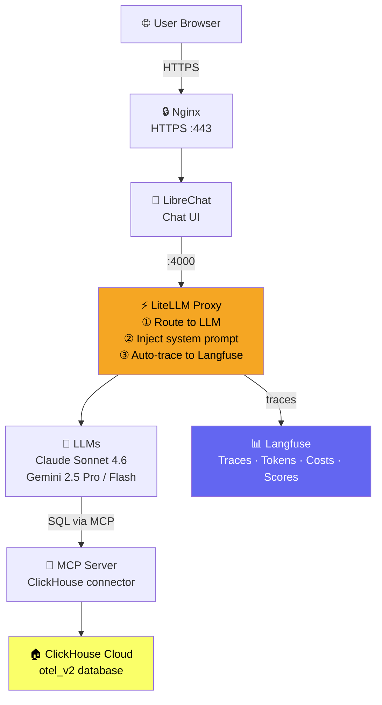

# AI-Powered Observability Workshop

A 75-minute hands-on workshop where participants use natural language to query OpenTelemetry data in ClickHouse, with every AI interaction automatically traced to Langfuse.

**Duration:** 75 min &nbsp;|&nbsp; **Level:** Intermediate &nbsp;|&nbsp; **Repo:** [ClickHouse/ClickHouse_Demos](https://github.com/ClickHouse/ClickHouse_Demos)

---

## Architecture



**Flow:** Browser → Nginx (TLS) → LibreChat → **LiteLLM** (traces to Langfuse) → LLM → MCP → ClickHouse

---

## Stack

| Component | Purpose |
|-----------|---------|
| **LibreChat** | Chat UI with user auth and conversation history |
| **LiteLLM** | LLM proxy — routes requests, injects system prompt, auto-traces to Langfuse |
| **MCP Server** | Bridges the LLM to ClickHouse via tool calls |
| **ClickHouse Cloud** | Stores OpenTelemetry traces, metrics, and logs (`otel_v2`) |
| **Langfuse** | Observes the AI — every token, cost, latency, and quality score |

---

## Quick Start (Deploying Your Own)

**Prerequisites:** EC2 t3.medium+, Docker, API keys for an LLM provider, Langfuse account.

```bash
# 1. Install Docker
curl -fsSL https://get.docker.com | sudo sh
sudo usermod -aG docker $USER && newgrp docker

# 2. Clone repo
git clone https://github.com/ClickHouse/ClickHouse_Demos.git
cd ClickHouse_Demos/agent_stack_builds/clickhouse_ai_obserability/workshop_files

# 3. Configure
cp .env.example .env
nano .env   # Set GOOGLE_KEY or ANTHROPIC_KEY, LANGFUSE_PUBLIC_KEY, LANGFUSE_SECRET_KEY

# 4. Start
make start
```

Access LibreChat at `https://your-ec2-ip` (HTTPS via Nginx).

Key `.env` variables:

```bash
GOOGLE_KEY=...              # Gemini API key
ANTHROPIC_KEY=...           # Anthropic API key
LANGFUSE_PUBLIC_KEY=pk-lf-...
LANGFUSE_SECRET_KEY=sk-lf-...
LANGFUSE_HOST=https://us.cloud.langfuse.com
LITELLM_MASTER_KEY=sk-...   # Any secret string
```

---

## Workshop Lab

Participant handouts with step-by-step lab instructions are in [`handouts/`](handouts/).

Each handout covers:
1. **LibreChat AI Agent** — natural language → SQL → results
2. **Langfuse** — viewing traces, token usage, quality scores
3. **Direct SQL** — 8 guided queries at `sql-clickhouse.clickhouse.com`
4. **Clickstack** — 10 search exercises at `play-clickstack.clickhouse.com`

---

## Data Model (`otel_v2`)

| Table | Contents |
|-------|---------|
| `otel_traces` | Distributed trace spans — latency, status, service names |
| `otel_metrics` | Time-series metrics by service |
| `otel_logs` | Structured logs with severity and trace correlation |
| `otel_services` | Service catalog with SLA targets |

> Duration fields are stored in **nanoseconds** — divide by `1,000,000` for milliseconds.

---

## Resources

- [ClickHouse Docs](https://clickhouse.com/docs) · [LiteLLM Docs](https://docs.litellm.ai) · [Langfuse Docs](https://langfuse.com/docs) · [LibreChat Docs](https://docs.librechat.ai)
- [Sample Questions](questions/sample_questions.md) — 60+ example queries
- Issues: [github.com/ClickHouse/ClickHouse_Demos/issues](https://github.com/ClickHouse/ClickHouse_Demos/issues)
