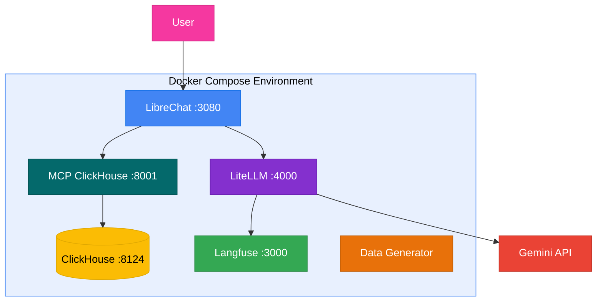
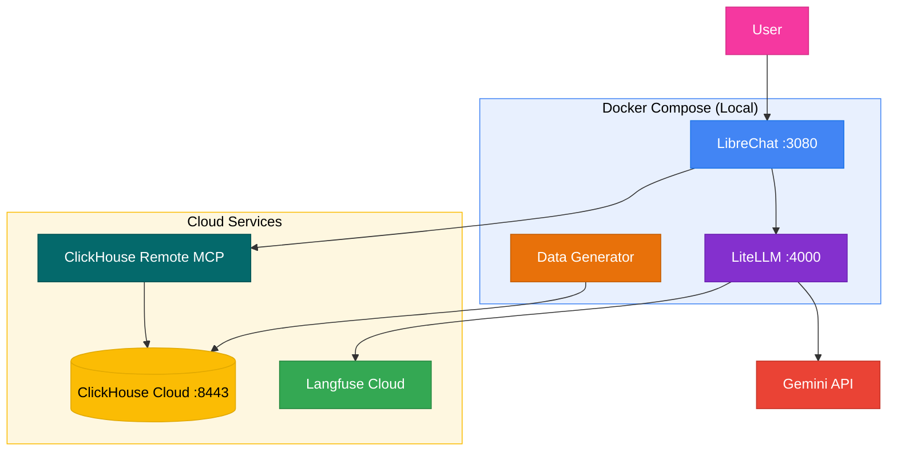
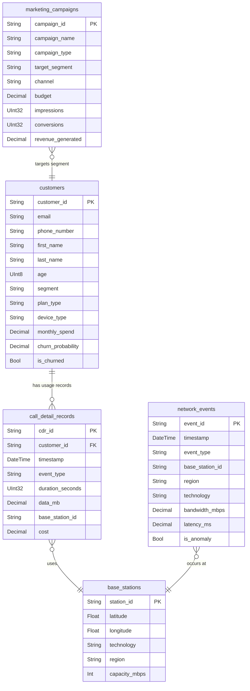
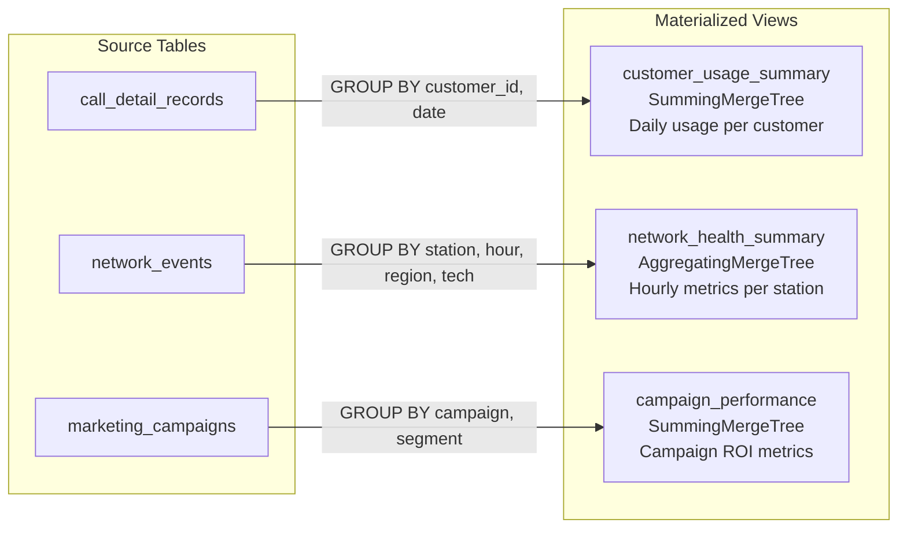

# End-to-End Telco Workshop: From Data to Actionable Intelligence

Welcome to the Telco Workshop! This guide covers everything you need to set up and run a hands-on workshop demonstrating a modern data stack for telecommunications companies, featuring ClickHouse, LibreChat with MCP, and optional Langfuse observability.

---

## Table of Contents

- [Overview](#overview)
- [Important: LLM Provider Flexibility](#important-llm-provider-flexibility)
- [Business Scenarios](#business-scenarios)
- [Architecture](#architecture)
  - [Local Mode](#local-mode)
  - [Hybrid Mode](#hybrid-mode)
  - [Core Components](#core-components)
- [Quick Start](#quick-start)
  - [Local Deployment](#local-deployment)
  - [Hybrid Deployment](#hybrid-deployment)
- [Setup Guide](#setup-guide)
  - [Prerequisites](#prerequisites)
  - [Local Installation Steps](#local-installation-steps)
  - [Hybrid Installation Steps](#hybrid-installation-steps)
- [Post-Setup Verification & Data Exploration](#post-setup-verification--data-exploration)
- [Using LibreChat](#using-librechat)
- [Langfuse Tracing (LLMOps)](#langfuse-tracing-llmops)
- [Data Schema Reference](#data-schema-reference)
  - [Database Structure](#database-structure)
  - [Table Schemas](#table-schemas)
  - [Materialized Views](#materialized-views)
  - [Data Relationships (ER Diagram)](#data-relationships-er-diagram)
  - [Materialized View Data Flow](#materialized-view-data-flow)
- [Data Volume Configuration](#data-volume-configuration)
- [Sample Questions](#sample-questions)
  - [Top 20 Quick Reference Questions](#top-20-quick-reference-questions)
  - [Complete Scenario Questions (80+)](#complete-scenario-questions-80)
- [External MCP Clients (Claude Desktop, Others)](#external-mcp-clients-claude-desktop-others)
- [Troubleshooting](#troubleshooting)
- [Makefile Commands](#makefile-commands)
- [Workshop Materials](#workshop-materials)

---

## Overview

This workshop demonstrates a complete, production-ready data stack for telecommunications companies, covering real-time analytics, AI-powered insights via MCP, and full observability.

### What You'll Learn

- **ClickHouse 25.8**: High-performance, column-oriented SQL database for real-time analytics on massive datasets
- **LibreChat**: Open-source AI chat frontend supporting multiple LLM providers and MCP integrations
- **Model Context Protocol (MCP)**: Standardized protocol enabling LLMs to securely query ClickHouse
- **LiteLLM**: LLM proxy that routes all model calls through a single point for Langfuse tracing
- **Langfuse** (local mode): Open-source LLMOps platform for tracing, debugging, and monitoring LLM applications
- **Docker**: Easy, reproducible setup of all components
- **Two Deployment Modes**: Run entirely local or connect to ClickHouse Cloud (with remote MCP) and Langfuse Cloud

[Back to Top](#table-of-contents)

---

## Important: LLM Provider Flexibility

> **All LLM calls are routed through a LiteLLM proxy for full Langfuse tracing.**

The default configuration uses Google Gemini models (gemini-2.5-pro, gemini-2.5-flash, gemini-2.5-flash-lite) defined in `litellm_config.yaml`. Set your `GOOGLE_KEY` in `.env` to get started.

To use a different provider, edit `litellm_config.yaml` and update the model list. LiteLLM supports 100+ LLM providers. See the [LiteLLM documentation](https://docs.litellm.ai/docs/providers) for details.

### Vertex AI Support

LiteLLM also supports **Google Vertex AI** as an alternative to direct API keys. To use Vertex AI, update the model entries in `litellm_config.yaml` to use the `vertex_ai/` prefix instead of `gemini/` and configure the appropriate credentials. See the [LiteLLM Vertex AI docs](https://docs.litellm.ai/docs/providers/vertex) for details.

The MCP integration (ClickHouse queries) works identically regardless of which LLM provider you use.

[Back to Top](#table-of-contents)

---

## Business Scenarios

This workshop explores three key business areas in telecommunications:

1. **Marketing Analytics**: Proactive churn reduction and hyper-personalized marketing campaigns
2. **Network Observability**: Real-time anomaly detection and predictive maintenance
3. **Full-Cycle LLMOps**: Complete traceability from natural language question to SQL query to final insight

[Back to Top](#table-of-contents)

---

## Architecture

The workshop supports two deployment modes. Choose based on your environment.

### Local Mode

All services run in Docker on your machine.



### Hybrid Mode

ClickHouse Cloud (with its remote MCP server) and Langfuse Cloud run remotely. LibreChat connects directly to the ClickHouse Cloud remote MCP server -- no local MCP container is needed.



### Core Components

| Component               | Technology                  | Role                                                                        |
| :---------------------- | :-------------------------- | :-------------------------------------------------------------------------- |
| **Chat Frontend**       | LibreChat                   | Open-source AI chat UI with MCP support, multi-provider LLM switching       |
| **Database**            | ClickHouse                  | High-performance column-oriented SQL database for real-time analytics       |
| **MCP Bridge (local)**  | mcp/clickhouse              | Translates MCP tool calls into ClickHouse SQL queries (local mode only)     |
| **MCP Bridge (hybrid)** | ClickHouse Cloud Remote MCP | Fully managed MCP server at mcp.clickhouse.cloud (hybrid mode)              |
| **LLM Proxy**           | LiteLLM                     | Routes all LLM calls through a proxy for Langfuse tracing                   |
| **LLMOps**              | Langfuse (optional)         | Tracing, debugging, and monitoring LLM interactions                         |
| **Data Generator**      | Python                      | Generates realistic telco data (customers, CDRs, network events, campaigns) |
| **Orchestration**       | Docker Compose              | Multi-container application with base + local overlay pattern               |

[Back to Top](#table-of-contents)

---

## Quick Start

### Local Deployment

Get up and running with everything in Docker:

```bash
cd agent_stack_builds/telco_marketing
make setup-local
# (Optional) Edit .env to set your LLM API key
make start
make generate-data
make check-db
```

After `make start`, the following services are available:

| Service    | URL                   | Credentials                     |
| :--------- | :-------------------- | :------------------------------ |
| LibreChat  | http://localhost:3080 | admin@telco.local / workshop123 |
| Langfuse   | http://localhost:3000 | admin@telco.local / admin123    |
| LiteLLM    | http://localhost:4000 | --                              |
| ClickHouse | http://localhost:8124 | default / clickhouse            |

### Hybrid Deployment

Connect to ClickHouse Cloud (with remote MCP server) and Langfuse Cloud:

```bash
cd agent_stack_builds/telco_marketing
make setup-hybrid
# Edit .env with your cloud credentials and LLM API key
# Enable Remote MCP Server in ClickHouse Cloud console (Connect > Remote MCP Server)
make init-schema
make start
make generate-data
make check-db
```

After `make start`, the following services are available:

| Service   | URL                   | Credentials                     |
| :-------- | :-------------------- | :------------------------------ |
| LibreChat | http://localhost:3080 | admin@telco.local / workshop123 |
| LiteLLM   | http://localhost:4000 | --                              |

[Back to Top](#table-of-contents)

---

## Setup Guide

### Prerequisites

Before you begin, ensure you have the following installed:

- **Docker and Docker Compose**: For running the containerized services. [Install Docker](https://docs.docker.com/get-docker/)
- **Git**: For cloning the workshop repository. [Install Git](https://git-scm.com/book/en/v2/Getting-Started-Installing-Git)
- **make and openssl**: For running Makefile commands (pre-installed on macOS and most Linux distros)
- **An LLM API key**: At least one of Anthropic, OpenAI, or Google API key

**Windows users**: Use [WSL2](https://learn.microsoft.com/en-us/windows/wsl/install) (Windows Subsystem for Linux) with Ubuntu. Install [Docker Desktop for Windows](https://docs.docker.com/desktop/install/windows-install/) with WSL2 backend enabled. All `make` commands run inside the WSL terminal. Ensure `make`, `openssl`, and `git` are installed in WSL (`sudo apt install make openssl git`).

For **hybrid mode** you also need:

- A **ClickHouse Cloud** instance with **Remote MCP Server enabled** ([sign up](https://clickhouse.cloud/))
- A **Langfuse Cloud** account (optional, [sign up](https://cloud.langfuse.com/))

### Local Installation Steps

#### Step 1: Clone and Set Up

```bash
git clone https://github.com/ClickHouse/ClickHouse_Demos.git
cd ClickHouse_Demos/agent_stack_builds/telco_marketing
make setup-local
```

This creates a `.env` file from `.env.local.example` and auto-generates all security keys.

#### Step 2: Configure LLM API Key

Edit `.env` and set your Google API key:

```bash
GOOGLE_KEY=your-google-api-key
```

#### Step 3: Start Services

```bash
make start
```

This launches ClickHouse, Langfuse, LibreChat, LiteLLM, MCP server, and supporting services.

#### Step 4: Generate Data

```bash
make generate-data
```

Populates ClickHouse with realistic telco data (takes 2-5 minutes for the default medium dataset).

#### Step 5: Verify

```bash
make check-db
```

Confirms the database is running and all tables have data.

#### Step 6: Use LibreChat

Open **http://localhost:3080**, create an account (first-time only), and start asking questions about your telco data.

Langfuse is available at **http://localhost:3000** for LLM observability.

### Hybrid Installation Steps

#### Step 1: Clone and Set Up

```bash
git clone https://github.com/ClickHouse/ClickHouse_Demos.git
cd ClickHouse_Demos/agent_stack_builds/telco_marketing
make setup-hybrid
```

#### Step 2: Configure Cloud Credentials

Edit `.env` and fill in:

- **ClickHouse Cloud**: `CLICKHOUSE_HOST`, `CLICKHOUSE_PORT`, `CLICKHOUSE_USER`, `CLICKHOUSE_PASSWORD`
- **Langfuse Cloud** (optional): `LANGFUSE_PUBLIC_KEY`, `LANGFUSE_SECRET_KEY`, `LANGFUSE_HOST`
- **LLM API key**: At least one provider

#### Step 2b: Enable ClickHouse Cloud Remote MCP Server

The hybrid deployment uses ClickHouse Cloud's fully managed remote MCP server instead of a local MCP container.

1. Open your ClickHouse Cloud service console.
2. Click the **Connect** button.
3. Enable the **Remote MCP Server**.
4. The MCP endpoint (`https://mcp.clickhouse.cloud/mcp`) is pre-configured in `librechat.yaml`.

Authentication is handled via OAuth -- LibreChat will prompt you to authenticate through ClickHouse Cloud on first use.

#### Step 3: Initialize Schema

Push the database schema to your ClickHouse Cloud instance:

```bash
make init-schema
```

#### Step 4: Start Services

```bash
make start
```

This launches LibreChat, LiteLLM, and supporting services locally. The MCP connection to ClickHouse Cloud is handled by the remote MCP server.

#### Step 5: Generate Data

```bash
make generate-data
```

The data generator connects to your ClickHouse Cloud instance and populates it.

#### Step 6: Use LibreChat

Open **http://localhost:3080**, create an account, and start querying.

[Back to Top](#table-of-contents)

---

## Post-Setup Verification & Data Exploration

After completing the setup and generating data, use these commands to verify everything is working and explore your dataset.

### Verify the Database (`make check-db`)

Run the quick health check to confirm ClickHouse is accessible and tables are populated:

```bash
make check-db
```

This will:

- Test connectivity to ClickHouse
- List databases and tables
- Show row counts for all four tables

### Explore the Data (`make explore-data`)

Get a guided tour of the loaded data with sample rows and aggregate summaries:

```bash
make explore-data
```

This runs a curated set of queries showing sample rows from each table, customer segment distribution, and network event summaries.

### Interactive SQL Shell (`make query`)

Drop into a live ClickHouse SQL session to run your own queries:

```bash
make query
```

This opens an interactive `clickhouse-client` connected to the `telco` database. Type SQL queries directly and use `Ctrl+D` or `exit` to quit.

### Exploration Queries to Try

Here are some queries you can copy-paste into the interactive shell:

**Show databases and tables:**

```sql
SHOW DATABASES;
SHOW TABLES FROM telco;
```

**Row counts per table:**

```sql
SELECT 'customers' AS table_name, count() AS rows FROM telco.customers
UNION ALL SELECT 'call_detail_records', count() FROM telco.call_detail_records
UNION ALL SELECT 'network_events', count() FROM telco.network_events
UNION ALL SELECT 'marketing_campaigns', count() FROM telco.marketing_campaigns
ORDER BY table_name;
```

**Segment distribution:**

```sql
SELECT segment, count() AS customers, round(avg(monthly_spend), 2) AS avg_spend
FROM telco.customers
GROUP BY segment
ORDER BY customers DESC;
```

**Top base stations by event count:**

```sql
SELECT base_station_id, count() AS events, countIf(is_anomaly) AS anomalies
FROM telco.network_events
GROUP BY base_station_id
ORDER BY events DESC
LIMIT 10;
```

**Daily CDR volume over time:**

```sql
SELECT toDate(timestamp) AS day, count() AS records
FROM telco.call_detail_records
GROUP BY day
ORDER BY day;
```

**Anomaly rate by region:**

```sql
SELECT region,
       count() AS total_events,
       countIf(is_anomaly) AS anomalies,
       round(countIf(is_anomaly) / count() * 100, 2) AS anomaly_pct
FROM telco.network_events
GROUP BY region
ORDER BY anomaly_pct DESC;
```

**Campaign ROI summary:**

```sql
SELECT campaign_name, campaign_type, target_segment,
       budget, revenue_generated,
       round(revenue_generated - budget, 2) AS roi
FROM telco.marketing_campaigns
ORDER BY roi DESC;
```

[Back to Top](#table-of-contents)

---

## Using LibreChat

LibreChat is the AI chat frontend for this workshop. It connects to ClickHouse via the MCP server, allowing any supported LLM to query your telco data.

### First-Time Setup

1. Open **http://localhost:3080** in your browser.
2. Click **Sign up** and create a local account (email + password).
3. Log in.

### Using the ClickHouse MCP Tool

1. Start a new conversation.
2. The ClickHouse MCP tool is automatically pre-configured and associated with the model (via `modelSpecs` in `librechat.yaml`).
3. **Hybrid mode only**: On first use, you will be prompted to authenticate via OAuth with your ClickHouse Cloud credentials.
4. Ask a question like: _"Show me the top 10 customers with the highest churn probability"_
5. The LLM will use the MCP tool to query ClickHouse and return results with analysis.

### Model Configuration

Three Gemini models are available as presets in the LibreChat sidebar: Gemini 2.5 Pro, Gemini 2.5 Flash, and Gemini 2.5 Flash-Lite. All calls route through the LiteLLM proxy for Langfuse tracing.

To change the available models, edit `litellm_config.yaml` and the corresponding `librechat.local.yaml` or `librechat.hybrid.yaml` template. Then restart: `make restart`

### System Prompt (Prompt Engineering)

The librechat yaml templates include a built-in system prompt (`promptPrefix`) that:

- Tells the LLM it is a telco analytics assistant
- Describes the ClickHouse database schema (tables, columns, materialized views)
- Provides guidelines for using MCP tools, writing ClickHouse SQL, and presenting results
- Encourages structured, analytical responses with actionable recommendations

Additionally, each MCP server has `serverInstructions` that inject database schema context when tools are active.

To customize the system prompt, edit the `promptPrefix` and `serverInstructions` fields in `librechat.local.yaml` or `librechat.hybrid.yaml`.

[Back to Top](#table-of-contents)

---

## Langfuse Tracing (LLMOps)

Langfuse provides observability for LLM interactions -- tracing every agent run, LLM generation, and tool invocation. This is critical for debugging, monitoring costs, and understanding how the model uses MCP tools.

### How Tracing Works

All LLM calls are routed through a **LiteLLM proxy** which automatically logs every request and response to Langfuse. This means ALL conversations are traced -- both the Gemini model presets and the Agents endpoint.

- **Gemini presets** (Gemini 2.5 Pro, Flash, Flash-Lite): Calls go through LiteLLM, which logs to Langfuse automatically.
- **Agents endpoint**: Traced via both the LangChain/LangGraph pipeline (detailed agent traces) and LiteLLM (LLM call-level traces).

Both paths are available simultaneously -- users switch between them via the sidebar endpoint menu.

### Accessing Langfuse

- **Local mode**: `make setup-local` auto-generates Langfuse API keys and `make start` auto-creates the Langfuse organization, project, and admin user via headless initialization. Tracing is enabled automatically -- no manual key copying required. Log in at **http://localhost:3000** with **admin@telco.local** / **admin**.
- **Hybrid mode**: Use your Langfuse Cloud account at the URL configured in `LANGFUSE_BASE_URL`.

### Creating an Agent for Traced Queries

To get Langfuse traces, create an agent in LibreChat's Agent Builder:

1. Open LibreChat at **http://localhost:3080**.
2. Click **Agents** in the left sidebar (the endpoint menu is now visible).
3. Click **Create Agent** (or the "+" button).
4. Configure the agent:
   - **Name**: `Telco Analyst`
   - **Model Provider**: Select `Google`
   - **Model**: Choose `gemini-2.5-flash` (or `gemini-2.5-pro` for complex analysis)
   - **Tools**: Click **Add Tools**, then select the **clickhouse-telco** MCP server (local mode) or **clickhouse-cloud** (hybrid mode). This gives the agent access to ClickHouse query tools.
   - **System Prompt**: Paste the core instructions so the agent knows the database schema and SQL rules. A minimal example:
     ```
     You are a telco analytics assistant. Query the ClickHouse database 'telco' using MCP tools.
     Tables: telco.customers, telco.call_detail_records, telco.network_events, telco.marketing_campaigns.
     ALWAYS prefix tables with 'telco.' and NEVER end queries with a semicolon.
     ```
5. Click **Save**.

### Querying Through the Agent

1. Start a new conversation using the agent you just created.
2. Ask a question, for example: _"How many customers do we have in each segment?"_
3. The agent will use MCP tools to query ClickHouse and return results.
4. Each agent conversation produces a Langfuse trace.

### Viewing Traces in Langfuse

Open Langfuse (http://localhost:3000 for local mode) and look for:

- **Traces**: Each agent conversation appears as a trace (named "AgentRun" or similar). Click a trace to see the full execution timeline.
- **Generations**: Individual LLM calls within a trace. Shows the prompt, completion, token counts, and latency.
- **Tool Calls**: MCP tool invocations (SQL queries sent to ClickHouse) appear as spans within the trace.
- **Sessions**: Traces are grouped by conversation, so you can see the full history of a multi-turn session.

Use Langfuse to debug unexpected SQL queries, monitor token usage, and understand how the model reasons about your data.

[Back to Top](#table-of-contents)

---

## Data Schema Reference

This section describes the data schema used in the telco workshop, including all tables, fields, and the patterns generated by the data generator.

### Database Structure

The workshop uses a ClickHouse database named `telco` with four main tables and three materialized views.

#### Tables Overview

| Table                 | Purpose                              | Typical Row Count (medium)                                |
| :-------------------- | :----------------------------------- | :-------------------------------------------------------- |
| `customers`           | Customer profiles and attributes     | 10,000 (configurable)                                     |
| `call_detail_records` | Usage records (calls, data sessions) | ~3,000,000 (30 days x 10,000 customers x ~10 records/day) |
| `network_events`      | Network performance and anomalies    | ~300,000 (30 days x 10,000 events/day)                    |
| `marketing_campaigns` | Campaign metadata and performance    | 100 (configurable)                                        |

See [Data Volume Configuration](#data-volume-configuration) for t-shirt sizing options (small through 2xl).

### Table Schemas

#### 1. customers

Stores customer profile information, segmentation, and churn indicators.

| Field               | Type          | Description                                                   |
| :------------------ | :------------ | :------------------------------------------------------------ |
| `customer_id`       | String        | Unique customer identifier (UUID)                             |
| `email`             | String        | Customer email address                                        |
| `phone_number`      | String        | Customer phone number                                         |
| `first_name`        | String        | Customer first name                                           |
| `last_name`         | String        | Customer last name                                            |
| `age`               | UInt8         | Customer age (18-75)                                          |
| `gender`            | String        | Gender (M, F, Other)                                          |
| `address`           | String        | Full street address                                           |
| `city`              | String        | City name                                                     |
| `state`             | String        | State abbreviation                                            |
| `zip_code`          | String        | ZIP/postal code                                               |
| `signup_date`       | Date          | Date customer signed up                                       |
| `plan_type`         | String        | Current plan (see Plan Types below)                           |
| `device_type`       | String        | Primary device model                                          |
| `segment`           | String        | Customer segment (see Segments below)                         |
| `monthly_spend`     | Decimal(10,2) | Average monthly spend ($20-$200)                              |
| `lifetime_value`    | Decimal(10,2) | Total customer lifetime value ($500-$10,000)                  |
| `churn_probability` | Decimal(5,3)  | Probability of churning (0.0-1.0)                             |
| `is_churned`        | Bool          | Whether customer has churned (always false in generated data) |
| `created_at`        | DateTime      | Record creation timestamp                                     |

**Customer Segments:**

The data generator creates five distinct customer segments with different behavior patterns:

| Segment               | Churn Probability | Data Sessions/Day | Voice Calls/Day | Behavior Pattern                             |
| :-------------------- | :---------------- | :---------------- | :-------------- | :------------------------------------------- |
| `heavy_data_streamer` | 5% +/- 5%         | 20-50             | 1-5             | High data usage, low voice, active all hours |
| `voice_centric`       | 15% +/- 5%        | 2-10              | 10-30           | Low data usage, high voice, business hours   |
| `night_surfer`        | 10% +/- 5%        | 5-15              | 2-8             | Moderate usage, primarily 10 PM - 6 AM       |
| `low_usage`           | 30% +/- 5%        | 1-5               | 1-5             | Minimal usage, highest churn risk            |
| `hybrid_power_user`   | 3% +/- 5%         | 15-40             | 10-25           | High data and voice, lowest churn risk       |

**Plan Types:**

- `prepaid_basic` - Basic prepaid plan
- `prepaid_unlimited` - Unlimited prepaid plan
- `postpaid_5gb` - Postpaid with 5GB data
- `postpaid_20gb` - Postpaid with 20GB data
- `postpaid_unlimited` - Unlimited postpaid plan
- `enterprise` - Enterprise/business plan

#### 2. call_detail_records

Stores individual usage events (voice calls and data sessions).

| Field              | Type          | Description                                    |
| :----------------- | :------------ | :--------------------------------------------- |
| `cdr_id`           | String        | Unique CDR identifier (UUID)                   |
| `customer_id`      | String        | Foreign key to customers table                 |
| `timestamp`        | DateTime      | When the event occurred                        |
| `event_type`       | String        | Type of event (`voice_call` or `data_session`) |
| `duration_seconds` | UInt32        | Duration of the event in seconds               |
| `data_mb`          | Decimal(10,2) | Data consumed in MB (0 for voice calls)        |
| `base_station_id`  | String        | Base station used (e.g., BS00001)              |
| `cost`             | Decimal(10,2) | Cost of the event in dollars                   |
| `created_at`       | DateTime      | Record creation timestamp                      |

**Event Patterns:**

- **Voice Calls**: Duration 1-45 minutes, cost $0.05/minute, primarily 8 AM - 10 PM
- **Data Sessions**: Duration 1-120 minutes, data 10-500 MB, cost $0.01/MB, timing varies by segment

#### 3. network_events

Stores network performance metrics and anomalies.

| Field             | Type          | Description                                           |
| :---------------- | :------------ | :---------------------------------------------------- |
| `event_id`        | String        | Unique event identifier (UUID)                        |
| `timestamp`       | DateTime      | When the event occurred                               |
| `event_type`      | String        | Type of network event (see Event Types below)         |
| `base_station_id` | String        | Base station identifier (BS00000-BS00099)             |
| `region`          | String        | Geographic region (north, south, east, west, central) |
| `technology`      | String        | Network technology (4G, 5G)                           |
| `bandwidth_mbps`  | Decimal(10,2) | Bandwidth utilization in Mbps                         |
| `latency_ms`      | Decimal(10,2) | Network latency in milliseconds                       |
| `packet_loss_pct` | Decimal(5,3)  | Packet loss percentage                                |
| `severity`        | String        | Event severity (low, high)                            |
| `is_anomaly`      | Bool          | Whether this is an anomaly                            |
| `created_at`      | DateTime      | Record creation timestamp                             |

**Event Types:**

- `call_drop` - Call was dropped
- `data_session_start` - Data session started
- `data_session_end` - Data session ended
- `sms_sent` - SMS message sent
- `sms_received` - SMS message received
- `network_handover` - Handover between base stations
- `bandwidth_spike` - Unusual bandwidth increase
- `latency_increase` - Unusual latency increase
- `packet_loss` - Packet loss detected

**Anomaly Patterns:**

The data generator creates realistic anomaly patterns:

- **Normal Conditions**: Bandwidth 50-400 Mbps, Latency 10-100 ms, Packet Loss 0-2%
- **Anomaly Conditions**: Bandwidth 800-1200 Mbps, Latency 200-500 ms, Packet Loss 5-20%
- **Anomaly Rate**: 5% during peak hours (9 AM - 5 PM), lower at other times
- **Severity**: Anomalies are marked as "high" severity

#### 4. marketing_campaigns

Stores marketing campaign metadata and performance metrics.

| Field               | Type          | Description                                            |
| :------------------ | :------------ | :----------------------------------------------------- |
| `campaign_id`       | String        | Unique campaign identifier (UUID)                      |
| `campaign_name`     | String        | Human-readable campaign name                           |
| `campaign_type`     | String        | Type of campaign (see Campaign Types below)            |
| `start_date`        | Date          | Campaign start date                                    |
| `end_date`          | Date          | Campaign end date                                      |
| `target_segment`    | String        | Target customer segment                                |
| `channel`           | String        | Marketing channel (email, sms, app_notification, call) |
| `budget`            | Decimal(12,2) | Campaign budget ($10,000-$100,000)                     |
| `impressions`       | UInt32        | Number of impressions (10,000-100,000)                 |
| `clicks`            | UInt32        | Number of clicks (500-10,000)                          |
| `conversions`       | UInt32        | Number of conversions (50-1,000)                       |
| `revenue_generated` | Decimal(12,2) | Revenue from campaign ($5,000-$50,000)                 |
| `created_at`        | DateTime      | Record creation timestamp                              |

**Campaign Types:**

- `churn_prevention` - Campaigns to retain at-risk customers
- `upsell_data_plan` - Campaigns to upgrade data plans
- `device_upgrade` - Campaigns for device upgrades
- `seasonal_promotion` - Seasonal promotional campaigns
- `referral_bonus` - Referral incentive campaigns

### Materialized Views

The workshop includes three materialized views for optimized analytics:

#### 1. customer_usage_summary

Aggregates daily usage per customer.

| Field                 | Description                    |
| :-------------------- | :----------------------------- |
| `customer_id`         | Customer identifier            |
| `date`                | Date of usage                  |
| `total_calls`         | Total voice calls              |
| `total_call_duration` | Total call duration in seconds |
| `total_data_sessions` | Total data sessions            |
| `total_data_mb`       | Total data consumed in MB      |
| `total_cost`          | Total cost in dollars          |

#### 2. network_health_summary

Aggregates hourly network performance per base station.

| Field             | Description                     |
| :---------------- | :------------------------------ |
| `base_station_id` | Base station identifier         |
| `hour`            | Hour timestamp                  |
| `region`          | Geographic region               |
| `technology`      | Network technology              |
| `avg_bandwidth`   | Average bandwidth in Mbps       |
| `avg_latency`     | Average latency in ms           |
| `avg_packet_loss` | Average packet loss percentage  |
| `anomaly_count`   | Number of anomalies in the hour |
| `total_events`    | Total events in the hour        |

#### 3. campaign_performance

Aggregates campaign performance metrics.

| Field               | Description                             |
| :------------------ | :-------------------------------------- |
| `campaign_id`       | Campaign identifier                     |
| `campaign_name`     | Campaign name                           |
| `campaign_type`     | Campaign type                           |
| `target_segment`    | Target segment                          |
| `channel`           | Marketing channel                       |
| `budget`            | Campaign budget                         |
| `impressions`       | Total impressions                       |
| `clicks`            | Total clicks                            |
| `conversions`       | Total conversions                       |
| `revenue_generated` | Revenue generated                       |
| `roi`               | Return on investment (revenue - budget) |

### Data Relationships (ER Diagram)

The following diagram shows the relationships between tables. Note that `base_stations` is a logical entity generated in-memory by the data generator (100 stations with coordinates, technology, and region) and is referenced by `base_station_id` in both CDRs and network_events, but is not persisted as a separate table.



### Materialized View Data Flow

This diagram shows how the three materialized views aggregate data from the source tables:



### Sample Queries

Here are some useful queries to explore the data:

**Get customer with usage:**

```sql
SELECT
    c.*,
    sum(cdr.data_mb) as total_data,
    count(*) as total_events
FROM telco.customers c
LEFT JOIN telco.call_detail_records cdr ON c.customer_id = cdr.customer_id
GROUP BY c.customer_id
LIMIT 10;
```

**Get base station health:**

```sql
SELECT
    base_station_id,
    region,
    avg(bandwidth_mbps) as avg_bandwidth,
    avg(latency_ms) as avg_latency,
    countIf(is_anomaly) as anomaly_count
FROM telco.network_events
WHERE timestamp >= now() - INTERVAL 24 HOUR
GROUP BY base_station_id, region
ORDER BY anomaly_count DESC;
```

**Get campaign ROI:**

```sql
SELECT
    campaign_name,
    budget,
    revenue_generated,
    revenue_generated - budget as roi,
    (revenue_generated / budget) * 100 as roi_percentage
FROM telco.marketing_campaigns
ORDER BY roi DESC;
```

[Back to Top](#table-of-contents)

---

## Data Volume Configuration

You can customize the data generation volume using either t-shirt size presets or individual environment variables.

### T-Shirt Size Presets

Set the `DATA_SIZE` environment variable to use a preset profile. When `DATA_SIZE` is set, individual `NUM_*` variables are ignored.

| Size     | Customers | Days | Campaigns | Events/Day | ~CDRs       | ~Network Events |
| :------- | :-------- | :--- | :-------- | :--------- | :---------- | :-------------- |
| `small`  | 1,000     | 7    | 10        | 500        | ~70,000     | 3,500           |
| `medium` | 10,000    | 30   | 100       | 10,000     | ~3,000,000  | 300,000         |
| `large`  | 50,000    | 60   | 500       | 25,000     | ~30,000,000 | 1,500,000       |
| `2xl`    | 100,000   | 90   | 1,000     | 50,000     | ~90,000,000 | 4,500,000       |

**Usage with preset:**

```bash
export DATA_SIZE=small
make generate-data
```

### Individual Variables

When `DATA_SIZE` is not set, you can control each dimension independently:

| Variable         | Default | Description                       |
| :--------------- | :------ | :-------------------------------- |
| `NUM_CUSTOMERS`  | 10,000  | Number of customers to generate   |
| `NUM_DAYS`       | 30      | Number of days of historical data |
| `NUM_CAMPAIGNS`  | 100     | Number of marketing campaigns     |
| `EVENTS_PER_DAY` | 10,000  | Network events per day            |

**Usage with individual variables:**

```bash
export NUM_CUSTOMERS=5000
export NUM_DAYS=90
make generate-data
```

### Additional Configuration

| Variable            | Default | Description                                                                                                                 |
| :------------------ | :------ | :-------------------------------------------------------------------------------------------------------------------------- |
| `DATA_SEED`         | 42      | Random seed for reproducible data generation. Change to get a different dataset.                                            |
| `GENERATE_DATASETS` | `all`   | Which datasets to generate: `all` (everything), `network` (network_events only), `marketing` (customers + CDRs + campaigns) |

**Generate only network data for observability testing:**

```bash
export GENERATE_DATASETS=network
export DATA_SIZE=small
make generate-data
```

**Generate a different reproducible dataset:**

```bash
export DATA_SEED=123
make generate-data
```

### Performance Notes

- The batch size for inserts automatically scales up for larger data volumes (10,000 rows per batch when total estimated rows exceed 1 million).
- The `small` preset is recommended for quick testing and demos.
- The `large` and `2xl` presets require more memory and time. Ensure Docker has adequate resources allocated.

[Back to Top](#table-of-contents)

---

## Sample Questions

This section provides natural language questions you can ask in LibreChat or any LLM interface connected to ClickHouse via MCP.

### Top 20 Quick Reference Questions

These are the most impactful questions for demonstrating the workshop scenarios.

#### Marketing Analytics (Top 10)

<details>
<summary><strong>Churn Prevention</strong></summary>

1. **"Show me the top 10 customers with the highest churn probability."**
   - Demonstrates: Basic churn identification
   - Expected: List of at-risk customers with details

2. **"Which customer segment has the highest average churn probability?"**
   - Demonstrates: Segment analysis
   - Expected: Comparison across segments

3. **"Find customers with churn probability above 30% who have been with us for more than 2 years."**
   - Demonstrates: Complex filtering, high-value churn risk
   - Expected: Long-term customers at risk

</details>

<details>
<summary><strong>Customer Segmentation</strong></summary>

4. **"How many customers are in each segment and what is their average monthly spend?"**
   - Demonstrates: Segmentation overview
   - Expected: Segment distribution with revenue metrics

5. **"Show me 'heavy_data_streamer' customers who are on a plan with less than 20GB."**
   - Demonstrates: Upsell opportunity identification
   - Expected: Customers who need plan upgrades

</details>

<details>
<summary><strong>Campaign Performance</strong></summary>

6. **"Show me all marketing campaigns and their ROI."**
   - Demonstrates: Campaign effectiveness tracking
   - Expected: List of campaigns with ROI calculations

7. **"Which campaign had the highest conversion rate and why?"**
   - Demonstrates: Campaign analysis with insights
   - Expected: Best-performing campaign with context

</details>

<details>
<summary><strong>Usage Patterns</strong></summary>

8. **"What are the usage patterns for 'night_surfer' customers? What time of day are they most active?"**
   - Demonstrates: Behavioral analysis
   - Expected: Time-based usage patterns

9. **"Find customers who have decreased their usage by more than 50% in the last 30 days."**
   - Demonstrates: Early churn warning signals
   - Expected: Customers with declining engagement

10. **"Compare the lifetime value of customers with high churn risk versus low churn risk."**
    - Demonstrates: Revenue impact analysis
    - Expected: Financial impact of churn

</details>

#### Network Observability (Top 10)

<details>
<summary><strong>Anomaly Detection</strong></summary>

11. **"Show me all network anomalies detected in the last 24 hours."**
    - Demonstrates: Real-time monitoring
    - Expected: List of recent anomalies

12. **"Which base stations have experienced the most anomalies in the past week?"**
    - Demonstrates: Problem area identification
    - Expected: Ranking of problematic base stations

13. **"Show me high-severity anomalies that occurred during peak hours (9 AM - 5 PM)."**
    - Demonstrates: Impact-based filtering
    - Expected: Critical incidents during business hours

</details>

<details>
<summary><strong>Network Performance</strong></summary>

14. **"What is the average bandwidth, latency, and packet loss across all base stations?"**
    - Demonstrates: Overall network health
    - Expected: Key performance indicators

15. **"Compare network performance between 4G and 5G base stations."**
    - Demonstrates: Technology comparison
    - Expected: Performance metrics by technology

16. **"Show me base stations where packet loss exceeded 5% in the last 48 hours."**
    - Demonstrates: Quality threshold monitoring
    - Expected: Stations with poor performance

</details>

<details>
<summary><strong>Predictive Maintenance</strong></summary>

17. **"Which base stations have had increasing anomaly rates over the last 30 days?"**
    - Demonstrates: Trend analysis for maintenance
    - Expected: Stations with degrading performance

18. **"Show me base stations that have had more than 50 anomalies in the last week."**
    - Demonstrates: Maintenance prioritization
    - Expected: High-risk stations needing attention

</details>

<details>
<summary><strong>Regional Analysis</strong></summary>

19. **"Which region has the highest number of network anomalies?"**
    - Demonstrates: Geographic analysis
    - Expected: Regional performance comparison

20. **"Show me base stations operating near capacity (bandwidth above 80% of max)."**
    - Demonstrates: Capacity planning
    - Expected: Stations needing expansion

</details>

#### Pro Tips

Add these phrases to get better insights:

- **"...and explain why this matters"** - Gets business context
- **"...and suggest what action to take"** - Gets recommendations
- **"...and show me the trend over time"** - Gets historical context
- **"...and calculate the potential revenue impact"** - Gets financial implications
- **"...and compare this to industry benchmarks"** - Gets competitive context

#### Cross-Functional Questions

These questions combine marketing and network data for powerful insights:

21. **"Are customers in regions with high network anomalies more likely to churn?"**
22. **"Show me high-value customers who are experiencing network issues."**
23. **"Which base stations serve the most customers with high churn probability?"**
24. **"Calculate the potential revenue at risk from customers using base stations with poor performance."**
25. **"If we improve network performance in the top 5 worst-performing regions, what would be the expected impact on customer churn?"**

### Complete Scenario Questions (80+)

<details>
<summary><strong>Marketing Analytics Scenarios (30 questions)</strong></summary>

#### Scenario 1: Customer Churn Analysis

**Basic Churn Queries:**

1. "Show me the top 10 customers with the highest churn probability."
2. "How many customers have a churn probability above 20%?"
3. "Which customer segment has the highest average churn probability?"
4. "List customers who are likely to churn and are in the 'low_usage' segment."
5. "What is the average monthly spend for customers with high churn risk (above 25%) compared to low churn risk (below 10%)?"

**Advanced Churn Analysis:**

6. "Identify customers with churn probability above 30% who have been with us for more than 2 years. These are valuable customers we should prioritize."
7. "Show me customers in the 'heavy_data_streamer' segment with churn probability above 15%. What are their usage patterns in the last 30 days?"
8. "Compare the lifetime value of customers with high churn risk versus low churn risk. How much revenue are we at risk of losing?"
9. "Which plan types have the highest churn rates? Is there a correlation between plan type and churn?"
10. "Find customers who have decreased their usage by more than 50% in the last 30 days compared to their average. These might be early churn indicators."

#### Scenario 2: Customer Segmentation & Targeting

**Segment Analysis:**

11. "How many customers are in each segment (heavy_data_streamer, voice_centric, night_surfer, low_usage, hybrid_power_user)?"
12. "What is the average monthly spend for each customer segment?"
13. "Which segment has the highest lifetime value?"
14. "Show me the usage patterns for 'night_surfer' customers. What time of day are they most active?"
15. "Compare data usage versus voice call usage across all segments."

**Targeting Opportunities:**

16. "Find 'heavy_data_streamer' customers who are on a plan with less than 20GB. They might be good candidates for an upgrade."
17. "Identify 'low_usage' customers who are paying more than $50 per month. They might benefit from a cheaper plan."
18. "Which customers in the 'hybrid_power_user' segment have the lowest churn probability? These are our most loyal high-value customers."
19. "Show me customers who make frequent international calls (proxy: high voice call usage) but are not on an enterprise plan."
20. "Find customers who use more than 10GB of data per month but are on a prepaid plan. They might convert to postpaid."

#### Scenario 3: Campaign Performance Analysis

**Campaign Metrics:**

21. "Show me all marketing campaigns and their ROI (return on investment)."
22. "Which campaign had the highest conversion rate?"
23. "What is the average click-through rate (CTR) across all campaigns?"
24. "Compare the performance of email campaigns versus SMS campaigns."
25. "Which customer segment responds best to marketing campaigns?"

**Campaign Insights:**

26. "Show me campaigns that had negative ROI. What went wrong?"
27. "Which campaign type (churn_prevention, upsell_data_plan, device_upgrade, etc.) generates the most revenue?"
28. "What is the cost per conversion for each campaign?"
29. "Identify the most cost-effective channel for reaching 'voice_centric' customers."
30. "Show me campaigns targeting 'heavy_data_streamer' customers. What was their average conversion rate?"

</details>

<details>
<summary><strong>Network Observability Scenarios (30 questions)</strong></summary>

#### Scenario 4: Real-time Anomaly Detection

**Anomaly Detection:**

31. "Show me all network anomalies detected in the last 24 hours."
32. "Which base stations have experienced the most anomalies in the past week?"
33. "What types of network events are most commonly flagged as anomalies?"
34. "Show me high-severity anomalies that occurred during peak hours (9 AM - 5 PM)."
35. "Which region has the highest number of network anomalies?"

**Anomaly Analysis:**

36. "For base station BS00001, show me the average bandwidth, latency, and packet loss over the last 24 hours. Are there any concerning trends?"
37. "Compare network performance between 4G and 5G base stations. Which technology has more anomalies?"
38. "Show me base stations where packet loss exceeded 5% in the last 48 hours."
39. "Identify patterns: Do anomalies occur more frequently at certain times of day?"
40. "Which base stations have both high latency and high packet loss? These need immediate attention."

#### Scenario 5: Network Performance Monitoring

**Performance Metrics:**

41. "What is the average bandwidth utilization across all base stations?"
42. "Show me the top 10 base stations with the highest average latency."
43. "Which base stations are operating near capacity (bandwidth above 80% of max)?"
44. "What is the average packet loss percentage across the network?"
45. "Compare network performance across different regions (north, south, east, west, central)."

**Performance Trends:**

46. "Show me the daily trend of network anomalies over the last 30 days. Are things getting better or worse?"
47. "Which base stations have shown improving performance over the last week?"
48. "Identify base stations where latency has increased by more than 50% in the last 7 days."
49. "Show me base stations with consistently high performance (low anomalies, low latency, low packet loss)."
50. "What percentage of network events are anomalies? Is this within acceptable limits?"

#### Scenario 6: Predictive Maintenance

**Maintenance Prediction:**

51. "Which base stations have had increasing anomaly rates over the last 30 days?"
52. "Show me base stations that have had more than 50 anomalies in the last week. These might need maintenance."
53. "Identify base stations where bandwidth spikes are becoming more frequent."
54. "Which base stations have not had any anomalies in the last 30 days? These are our most reliable assets."
55. "Show me base stations with degrading performance (increasing latency or packet loss over time)."

**Capacity Planning:**

56. "Which base stations are experiencing the highest traffic volume?"
57. "Identify regions where we might need to add more capacity based on bandwidth utilization."
58. "Show me 5G base stations with lower performance than 4G base stations in the same region."
59. "Which base stations handle the most data sessions per day?"
60. "Predict which base stations might experience capacity issues in the next 30 days based on current trends."

</details>

<details>
<summary><strong>Cross-Functional Scenarios (20 questions)</strong></summary>

#### Scenario 7: Customer Experience & Network Correlation

**Customer-Network Analysis:**

61. "Show me customers who are experiencing network issues (based on anomalies at their frequently used base stations)."
62. "Which base stations serve the most high-value customers (lifetime value > $5000)?"
63. "Are customers in regions with high network anomalies more likely to churn?"
64. "Identify customers who might be experiencing poor service quality based on the base stations they use."
65. "Show me the correlation between network performance and customer satisfaction (proxy: churn probability)."

#### Scenario 8: Revenue & Network Investment

**ROI Analysis:**

66. "Which regions generate the most revenue? Should we prioritize network improvements there?"
67. "Show me base stations serving high-value customer segments. These should have the best performance."
68. "Calculate the potential revenue at risk from customers using base stations with poor performance."
69. "Which base stations serve the most customers? Improving these would have the biggest impact."
70. "Compare network investment (proxy: number of 5G vs 4G stations) with revenue generation by region."

#### Scenario 9: Time-Based Analysis

**Temporal Patterns:**

71. "What are the peak usage hours across the network?"
72. "Show me the difference in network performance between weekdays and weekends."
73. "Identify customers who primarily use data during night hours (10 PM - 6 AM)."
74. "When do most network anomalies occur? Is there a pattern?"
75. "Show me the busiest day of the week for voice calls versus data usage."

#### Scenario 10: Predictive & Prescriptive Analytics

**Predictive Questions:**

76. "Based on current trends, which customers are most likely to churn in the next 30 days?"
77. "Predict which base stations will need maintenance in the next month based on their anomaly patterns."
78. "Which customer segments are growing fastest? Should we adjust our marketing focus?"
79. "Estimate the potential revenue from converting all 'low_usage' customers to appropriate plans."
80. "If we reduce network anomalies by 50%, what would be the expected impact on customer churn?"

</details>

### Data Schema Quick Reference

**Key Tables:**

- `telco.customers` - Customer profiles and churn data
- `telco.call_detail_records` - Usage data (calls, data sessions)
- `telco.network_events` - Network performance and anomalies
- `telco.marketing_campaigns` - Campaign performance data

**Key Fields:**

**Customers:**

- `segment`: heavy_data_streamer, voice_centric, night_surfer, low_usage, hybrid_power_user
- `plan_type`: prepaid_basic, prepaid_unlimited, postpaid_5gb, postpaid_20gb, postpaid_unlimited, enterprise
- `churn_probability`: 0.0 to 1.0 (higher = more likely to churn)

**Network Events:**

- `event_type`: call_drop, bandwidth_spike, latency_increase, packet_loss, etc.
- `severity`: low, high
- `is_anomaly`: true/false

**Campaigns:**

- `campaign_type`: churn_prevention, upsell_data_plan, device_upgrade, seasonal_promotion, referral_bonus
- `channel`: email, sms, app_notification, call

### Getting Started with Questions

1. **Start with Question #1** to see basic data
2. **Try Question #4** to understand segments
3. **Ask Question #11** to see network health
4. **Experiment with enhanced questions** using the pro tips
5. **Ask follow-up questions** based on the results

[Back to Top](#table-of-contents)

---

## External MCP Clients (Claude Desktop, Others)

Beyond LibreChat, you can connect to ClickHouse using any MCP-compatible client.

**Local mode:** The MCP ClickHouse server exposes an SSE endpoint at `http://localhost:8001/sse`.

**Hybrid mode:** Use the ClickHouse Cloud remote MCP server directly at `https://mcp.clickhouse.cloud/mcp` (OAuth-authenticated).

### Claude Desktop

1. Install Claude Desktop from [claude.ai](https://claude.ai/download).
2. Install the MCP server: `pip install mcp-clickhouse`
3. Add to your Claude Desktop config (`~/Library/Application Support/Claude/claude_desktop_config.json`):

```json
{
  "mcpServers": {
    "clickhouse-telco": {
      "command": "python3",
      "args": ["-m", "mcp_clickhouse.main"],
      "env": {
        "CLICKHOUSE_HOST": "localhost",
        "CLICKHOUSE_PORT": "8124",
        "CLICKHOUSE_USER": "default",
        "CLICKHOUSE_PASSWORD": "clickhouse",
        "CLICKHOUSE_SECURE": "false",
        "CLICKHOUSE_VERIFY": "false"
      }
    }
  }
}
```

4. Restart Claude Desktop and ask questions about your telco data.

### Claude Desktop (Hybrid Mode)

For hybrid mode, configure Claude Desktop to use the ClickHouse Cloud remote MCP server:

```json
{
  "mcpServers": {
    "clickhouse-cloud": {
      "url": "https://mcp.clickhouse.cloud/mcp"
    }
  }
}
```

Authentication is handled via OAuth -- Claude Desktop will open a browser window for you to authenticate with ClickHouse Cloud.

### Any MCP-Compatible Client

**Local mode:** Connect to the SSE endpoint:

- **URL**: `http://localhost:8001/sse`
- **Protocol**: Server-Sent Events (SSE)

Or use the stdio transport by installing `mcp-clickhouse` locally.

**Hybrid mode:** Connect to the ClickHouse Cloud remote MCP:

- **URL**: `https://mcp.clickhouse.cloud/mcp`
- **Protocol**: Streamable HTTP (OAuth-authenticated)

[Back to Top](#table-of-contents)

---

## Troubleshooting

### Setup Issues

#### Issue: "Cannot connect to ClickHouse"

**Solution**: Ensure services are running:

```bash
docker ps | grep clickhouse  # local mode
make check-db                # both modes
```

If not running:

```bash
make start
```

#### Issue: "No databases found" or schema missing

**Solution**: For local mode, the schema is auto-created on first start. For hybrid mode, run:

```bash
make init-schema
```

Then generate data:

```bash
make generate-data
```

#### Issue: "LibreChat not accessible at localhost:3080"

**Solution**: Check if the container is running:

```bash
docker ps | grep librechat
docker logs telco-librechat
```

Ensure `.env` has valid LibreChat configuration (CREDS_KEY, JWT_SECRET, etc.). Re-run `make setup-local` or `make setup-hybrid` to regenerate keys.

#### Issue: "MCP tool not appearing in LibreChat"

**Local mode:** Check that the MCP server container is running:

```bash
docker ps | grep mcp-clickhouse
docker logs telco-mcp-clickhouse
```

**Hybrid mode:** Verify the remote MCP server is enabled in your ClickHouse Cloud console (Connect > Remote MCP Server). Check that `librechat.yaml` points to `https://mcp.clickhouse.cloud/mcp`.

In both modes, verify `librechat.yaml` is mounted correctly and contains the MCP server configuration.

### Data Generation Issues

#### Issue: "Data generation fails"

**Solution**: Check Docker logs:

```bash
make logs
```

For local mode, ensure ClickHouse is healthy before generating data:

```bash
make check-db
```

#### Issue: "Out of memory during data generation"

**Solution**: Reduce the data volume:

```bash
export DATA_SIZE=small
make generate-data
```

### General Issues

#### Issue: "Port already in use"

**Solution**: Check what's using the port:

```bash
lsof -i :3080  # LibreChat
lsof -i :4000  # LiteLLM proxy
lsof -i :8124  # ClickHouse (local mode)
lsof -i :3000  # Langfuse (local mode)
lsof -i :8001  # MCP server (local mode)
```

Stop the conflicting service or change the port in `.env` / `docker-compose.yml`.

#### Issue: "Docker out of disk space"

**Solution**: Clean up Docker resources:

```bash
docker system prune -a
```

#### Issue: "Services won't stop"

**Solution**: Force remove containers:

```bash
make clean
docker rm -f $(docker ps -aq)
```

### Getting Help

If you encounter issues not covered here:

1. Check the logs: `make logs`
2. Review Docker Compose config: `docker-compose.yml` and `docker-compose.local.yml`
3. Verify all environment variables in `.env`
4. Check the test output: `make test`

[Back to Top](#table-of-contents)

---

## Makefile Commands

A `Makefile` is provided for easy management of the workshop environment. All commands are mode-aware and adapt based on `DEPLOY_MODE` in `.env`.

### Setup

| Command             | Description                                                                            |
| :------------------ | :------------------------------------------------------------------------------------- |
| `make help`         | Show all available commands and current mode                                           |
| `make setup-local`  | Initialize `.env` for local deployment (all services in Docker)                        |
| `make setup-hybrid` | Initialize `.env` for hybrid deployment (ClickHouse Cloud remote MCP + Langfuse Cloud) |

### Lifecycle

| Command              | Description                                                                       |
| :------------------- | :-------------------------------------------------------------------------------- |
| `make start`         | Start all services (mode-aware)                                                   |
| `make stop`          | Stop all services                                                                 |
| `make restart`       | Restart all services                                                              |
| `make generate-data` | Run the data generator to populate ClickHouse                                     |
| `make init-schema`   | Push `clickhouse/init.sql` to ClickHouse (needed for hybrid; automatic for local) |

### Cleanup

| Command           | Description                                                               |
| :---------------- | :------------------------------------------------------------------------ |
| `make clean-data` | Truncate all telco tables for a fresh data reload (services stay running) |
| `make clean`      | Stop all services, remove Docker volumes, and delete generated files      |

### Verification & Exploration

| Command             | Description                                            |
| :------------------ | :----------------------------------------------------- |
| `make check-db`     | Verify database connectivity and show table row counts |
| `make explore-data` | Run curated sample queries to explore the loaded data  |
| `make query`        | Open an interactive ClickHouse SQL shell               |

### Diagnostics

| Command         | Description                                         |
| :-------------- | :-------------------------------------------------- |
| `make test`     | Validate the workshop setup (mode-aware)            |
| `make test-all` | Run end-to-end test suite in Docker (no local deps) |
| `make logs`     | View real-time logs from all services               |

### Usage Examples

**Local deployment:**

```bash
make setup-local
# (Optional) Edit .env for LLM API keys
make start
make generate-data
make check-db
# Open http://localhost:3080
```

**Hybrid deployment:**

```bash
make setup-hybrid
# Edit .env with cloud credentials + LLM API keys
make init-schema
make start
make generate-data
make check-db
# Open http://localhost:3080
```

**Explore the data:**

```bash
make explore-data
make query
```

**View logs:**

```bash
make logs
```

**Reload data from scratch (services stay running):**

```bash
make clean-data
make generate-data
make check-db
```

**Tear down the entire setup:**

```bash
make clean
```

[Back to Top](#table-of-contents)

---

## Workshop Materials

This repository contains the following components:

| Directory/File                 | Description                                                                |
| :----------------------------- | :------------------------------------------------------------------------- |
| **`data-generator/`**          | Python script to generate realistic telco data                             |
| **`clickhouse/`**              | ClickHouse database initialization script                                  |
| **`docker-compose.yml`**       | Base Docker Compose file (LibreChat, LiteLLM, data-generator, and supporting services) |
| **`docker-compose.local.yml`** | Local overlay (ClickHouse, MCP server, Langfuse)               |
| **`litellm_config.yaml`**      | LiteLLM proxy config: Gemini models + Langfuse callback                    |
| **`librechat.local.yaml`**     | LibreChat MCP config for local mode (local MCP container)                  |
| **`librechat.hybrid.yaml`**    | LibreChat MCP config for hybrid mode (ClickHouse Cloud remote MCP)         |
| **`.env.local.example`**       | Environment template for local deployment                                  |
| **`.env.hybrid.example`**      | Environment template for hybrid deployment                                 |
| **`test/telco_marketing/`**    | Test suite (in repo root `test/` directory)                                |
| **`Makefile`**                 | Mode-aware management commands                                             |
| **`Makefile.local.mk`**        | Local-mode variables and init-schema target                                |
| **`Makefile.hybrid.mk`**       | Hybrid-mode variables and init-schema target                               |
| **`README.md`**                | This documentation                                                         |

### Component Details

#### data-generator/

Contains the Python-based data generator that creates realistic telco data including:

- Customer profiles with segments and churn probabilities
- Call detail records (CDRs) for voice and data usage
- Network events with anomalies
- Marketing campaigns with performance metrics

#### clickhouse/

Contains initialization scripts for ClickHouse:

- Table definitions
- Materialized view definitions
- Initial database setup

#### LibreChat + MCP

LibreChat serves as the AI chat frontend. It connects to ClickHouse through MCP, configured in `librechat.yaml` (generated by the setup target from the mode-specific template):

- **Local mode**: Uses a local `mcp/clickhouse` Docker container (`librechat.local.yaml`)
- **Hybrid mode**: Uses ClickHouse Cloud's fully managed remote MCP server at `https://mcp.clickhouse.cloud/mcp` (`librechat.hybrid.yaml`)

---

## Conclusion

We hope you find this workshop valuable! This comprehensive guide should help you:

- Set up a complete telco analytics stack in local or hybrid mode
- Generate and query realistic telco data at configurable volumes
- Use LibreChat with MCP to ask natural language questions about your data
- Explore marketing analytics and network observability scenarios
- Connect any MCP-compatible client to your data

For questions or feedback, please refer to the [Troubleshooting](#troubleshooting) section.

[Back to Top](#table-of-contents)
