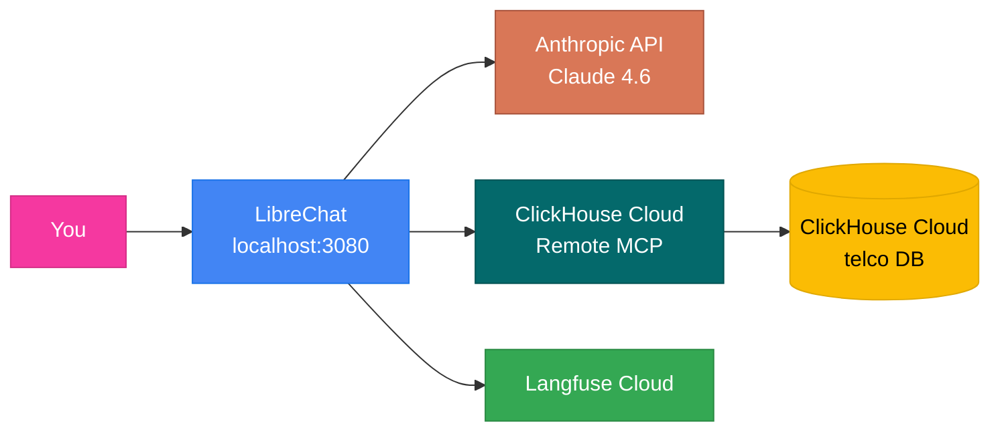

# Telco Marketing — Hybrid Setup Workshop Guide

**Duration:** ~25 minutes &nbsp;|&nbsp; **Level:** Intermediate &nbsp;|&nbsp; **Mode:** Hybrid (Cloud)

By the end of this guide you'll have a local LibreChat instance talking to your own ClickHouse Cloud service via the remote MCP server, traced into Langfuse Cloud, with telco data loaded and ready to query.

---

## What you'll build



Only LibreChat, MongoDB, Meilisearch, and the data generator run locally in Docker. The database, MCP server, and observability stack all run in the cloud.

---

## Prerequisites

Before you start, make sure you have:

- [ ] **Docker Desktop** running (4.x or newer). On Windows, use the WSL2 backend.
- [ ] **git**, **make**, and **openssl** on your PATH. macOS and Linux: built in. Windows: use a WSL2 Ubuntu shell.
- [ ] A **terminal** open to a directory where you can clone repos.

You also need accounts/keys for three cloud services. Open these tabs now:

1. **ClickHouse Cloud** — https://clickhouse.cloud (free tier works)
2. **Langfuse Cloud** — https://cloud.langfuse.com (free tier works)
3. **Anthropic Console** — https://console.anthropic.com (paid; you'll add ~$5 of credit)

If you don't have one or more of these, sign up before the workshop — sign-up flows can take a few minutes and aren't worth burning workshop time on.

---

## Step 1 — Collect cloud credentials (5–8 min)

You'll need eight values total. Write them in a scratch buffer as you go.

### 1a. ClickHouse Cloud service

1. Log in to https://console.clickhouse.cloud.
2. Create a new service (or pick an existing one). Free **Development** tier is fine.
3. Once it's running, click **Connect** in the left sidebar.
4. Pick the **HTTPS** tab. Note:
   - `CLICKHOUSE_HOST` — the hostname like `xxxxxxxxxx.region.aws.clickhouse.cloud`
   - `CLICKHOUSE_PASSWORD` — shown once at service creation (or reset under Settings → Connections)
5. From the URL of the service page, grab the two UUIDs:
   ```
   https://console.clickhouse.cloud/organizations/<ORG_UUID>/services/<SERVICE_UUID>
   ```
   Save **both**. They go straight into `librechat.hybrid.yaml` (Step 6) — not `.env`. They pin the remote MCP server to your one service so the LLM doesn't enumerate every org/service before querying.

### 1b. Langfuse Cloud

1. Log in to https://cloud.langfuse.com (or https://us.cloud.langfuse.com if you're in the US region).
2. Create a project (e.g. `telco-workshop`).
3. Open **Settings → API Keys** and click **Create new API keys**.
4. Save:
   - `LANGFUSE_PUBLIC_KEY` — starts with `pk-lf-`
   - `LANGFUSE_SECRET_KEY` — starts with `sk-lf-`
   - Note your region's base URL: `https://cloud.langfuse.com` (EU) or `https://us.cloud.langfuse.com` (US).

### 1c. Anthropic API key

1. Log in to https://console.anthropic.com.
2. Add ~$5 of credits if your account is new (Settings → Billing).
3. Open **API Keys** and click **Create Key**.
4. Save the `ANTHROPIC_API_KEY` (starts with `sk-ant-api...`). You won't be able to view it again after this page closes.

> ✅ **Checkpoint:** You should now have eight values: `CLICKHOUSE_HOST`, `CLICKHOUSE_PASSWORD`, organization UUID, service UUID, `LANGFUSE_PUBLIC_KEY`, `LANGFUSE_SECRET_KEY`, `LANGFUSE_BASE_URL`, and `ANTHROPIC_API_KEY`. Six land in `.env` (Step 4); the two UUIDs land in `librechat.hybrid.yaml` (Step 6).

---

## Step 2 — Clone the repo (1 min)

```bash
git clone https://github.com/ClickHouse/ClickHouse_Demos.git
cd ClickHouse_Demos/agent_stack_builds/telco_marketing
```

All remaining commands run from this directory.

---

## Step 3 — Run hybrid setup (1 min)

```bash
make setup-hybrid
```

What this does:
- Copies `.env.hybrid.example` to `.env`.
- Generates random values for `CREDS_KEY`, `CREDS_IV`, `JWT_SECRET`, `JWT_REFRESH_SECRET`, `MEILI_MASTER_KEY` (the LibreChat security keys).
- Prints "Next steps".

It does **not** touch your cloud credentials — those you fill in next.

---

## Step 4 — Fill in `.env` (4 min)

Open `.env` in your editor. Find each line and paste your values from Step 1.

```bash
# ClickHouse Cloud
CLICKHOUSE_HOST=<your-instance>.region.aws.clickhouse.cloud
CLICKHOUSE_PASSWORD=<your-password>

# Langfuse Cloud
LANGFUSE_PUBLIC_KEY=pk-lf-...
LANGFUSE_SECRET_KEY=sk-lf-...
LANGFUSE_BASE_URL=https://cloud.langfuse.com    # or us.cloud.langfuse.com

# Anthropic
ANTHROPIC_API_KEY=sk-ant-api03-...
```

Leave everything else (ports, users, data-generator settings) at defaults.

> ⚠️ **Your org/service UUIDs do NOT go in `.env`** — LibreChat can't substitute them into `serverInstructions`. They're pasted directly into `librechat.hybrid.yaml` in Step 6.

---

## Step 5 — Enable the Remote MCP Server (1 min)

1. In the ClickHouse Cloud console, open your service.
2. Click **Connect** in the left sidebar.
3. Toggle on **Remote MCP Server** (under the AI/MCP section).
4. The endpoint `https://mcp.clickhouse.cloud/mcp` is already wired into `librechat.hybrid.yaml` — nothing to copy here.

Authentication is OAuth-gated; LibreChat will prompt you in the browser the first time it calls the MCP server.

---

## Step 6 — Pin the MCP target in `librechat.hybrid.yaml` (2 min)

LibreChat's `serverInstructions` block doesn't do `${VAR}` substitution, so the org/service IDs need to be pasted into the YAML directly. Open `librechat.hybrid.yaml` and find the `serverInstructions:` block (around line 54). Replace the two UUIDs at the top with **your own**:

```yaml
serverInstructions: |
  TARGET (skip discovery; pass these IDs directly to every tool call):
  - organization_id: <YOUR-ORG-UUID>
  - service_id: <YOUR-SERVICE-UUID>
  Do NOT call get_organizations or get_services_list ...
```

Without this step, Claude will burn 1–2 extra turns calling `list_organizations` and `list_services` before it can query — slow and noisy in the trace view.

---

## Step 7 — Initialize the ClickHouse schema (1 min)

```bash
make init-schema
```

This runs an ephemeral `clickhouse-client` container that connects to your Cloud service over HTTPS and applies `clickhouse/init.sql` — four tables and three materialized views in the `telco` database.

You should see `[OK] Schema initialized`. If you see an SSL or auth error, double-check `CLICKHOUSE_HOST` and `CLICKHOUSE_PASSWORD` in `.env`.

---

## Step 8 — Generate data (1–2 min)

```bash
make generate-data
```

The data generator container builds, connects to ClickHouse Cloud over HTTPS, and inserts the **medium** preset by default:

- 10,000 customers
- ~7.8M call detail records (30 days × 26 CDRs/customer/day)
- 300,000 network events
- 100 marketing campaigns

Generation takes ~20 seconds; the insert over HTTPS to Cloud takes another ~30–60 seconds depending on region. Total: under 2 minutes.

> 🛠️ Want a smaller dataset for a demo? Add `DATA_SIZE=small` to `.env` (1,000 customers, 7 days, finishes in seconds).

---

## Step 9 — Start LibreChat (2 min)

```bash
make start
```

This brings up four containers: LibreChat, MongoDB (conversation history), Meilisearch (chat search), and the data-generator placeholder (already finished — stays exited). The wait loop blocks until LibreChat's health check passes (~30s on first start; ~10s on subsequent starts), then auto-creates the default workshop user.

When it finishes you'll see:

```
[OK] Default user created: admin@telco.local / workshop123
```

> ✅ **Checkpoint:** Run `docker ps` — you should see `telco-librechat` with status `(healthy)`, plus `telco-mongodb` and `telco-meilisearch` running.

---

## Step 10 — Verify (1 min)

```bash
make check-db
```

Confirms all four telco tables are populated. Expected output:

```
customers              10000
call_detail_records    ~7800000
network_events         300000
marketing_campaigns    100
```

---

## Step 11 — Open LibreChat and chat (3 min)

1. Browse to **http://localhost:3080**.
2. Log in: `admin@telco.local` / `workshop123`.
3. The default preset (**Claude Opus 4.6**) is preselected with the **ClickHouse Cloud Telco Database** MCP tool attached.
4. First message: pick from the greeting suggestions or ask:

   ```
   Show me the top 10 customers with the highest churn probability.
   ```

5. **First OAuth prompt:** Claude's first tool call will trigger an OAuth flow to ClickHouse Cloud — a browser window will open. Approve it, return to the tab. Subsequent calls reuse the token.
6. Watch the response: Claude calls `run_select_query` with the pinned `organization_id` and `service_id` (you can verify this in the tool call detail panel), and renders the answer as a markdown table + Chart.js artifact.

### Demo prompts that show off the stack

| Prompt | What it shows |
| :--- | :--- |
| "Which region has the most network anomalies?" | Single aggregation, bar chart artifact |
| "What is the ROI of our marketing campaigns?" | Joins + computed columns |
| "Build me a dashboard of customer segments and ARPU" | Multi-query infographic artifact (4 KPIs + 4 charts + findings) |
| "Find customers likely to churn and recommend retention campaigns" | Multi-step reasoning, cross-table joins |

---

## Step 12 — See traces in Langfuse (1 min)

1. Open https://cloud.langfuse.com (or the US region URL).
2. Pick your project.
3. **Traces** → you'll see one trace per chat message, each with:
   - The full system + user messages
   - The Claude tool calls and SQL produced
   - The MCP responses
   - Token counts and latency

Click any trace to drill into the generations and tool calls. This is the LLMOps view your team would use in production.

---

## Tear-down (optional)

```bash
make stop       # stop containers; keep MongoDB volume + .env
make clean      # stop + remove volumes (asks for confirmation)
```

ClickHouse Cloud and Langfuse data persist regardless — clean those up in their respective consoles when you're done.

---

## Presenter notes

- **Total budget:** 25 minutes hands-on + 5 minutes demo prompts. Aim to be at "first chat reply" by minute 20.
- **The slowest step in practice** is Step 1 (sign-ups). Pre-share the prerequisites the day before so attendees arrive with the eight values in hand.
- **The most common stuck point** is Step 6 (manual UUID edit). Live-demo this on screen; it's two values to paste.
- **The "wow" moment** is the first Chart.js infographic artifact. Drop the "Build me a dashboard…" prompt around minute 25 once everyone's chat is working.
- After the workshop, attendees can swap to **local mode** (`make setup-local`) to run the whole stack — including Langfuse and ClickHouse — offline with Ollama + Qwen3.5 2B. Mention this if anyone asks about air-gapped use.

---

## What's next?

- Workshop attendees can extend the system prompt in `librechat.hybrid.yaml` (`promptPrefix`) to add their own domain rules.
- The data generator (`data-generator/generator.py`) is the place to add new tables or change the data distribution.
- For an air-gapped variant of the same workshop, see `WORKSHOP_LOCAL_SETUP.md` _(separate guide)_.
