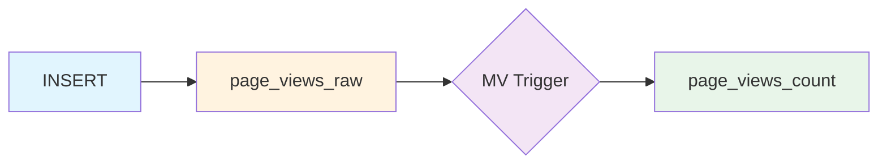
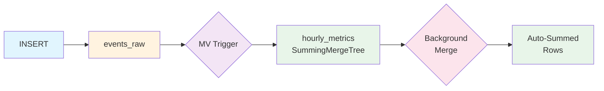
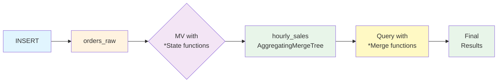
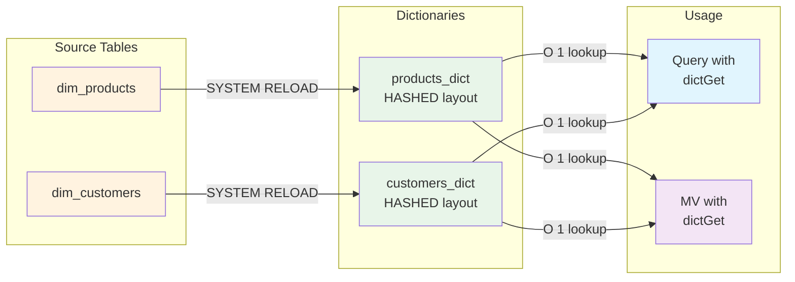
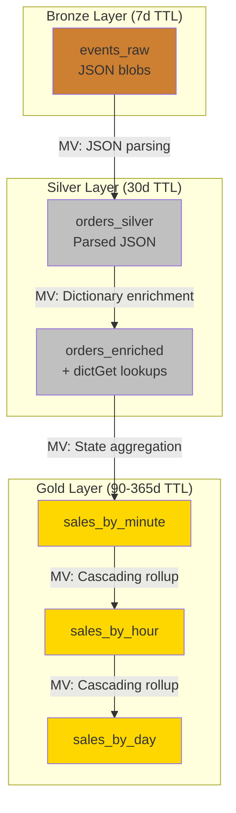
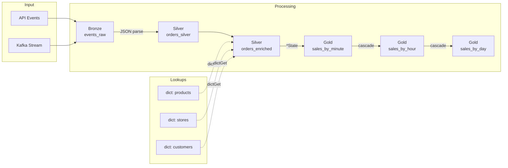
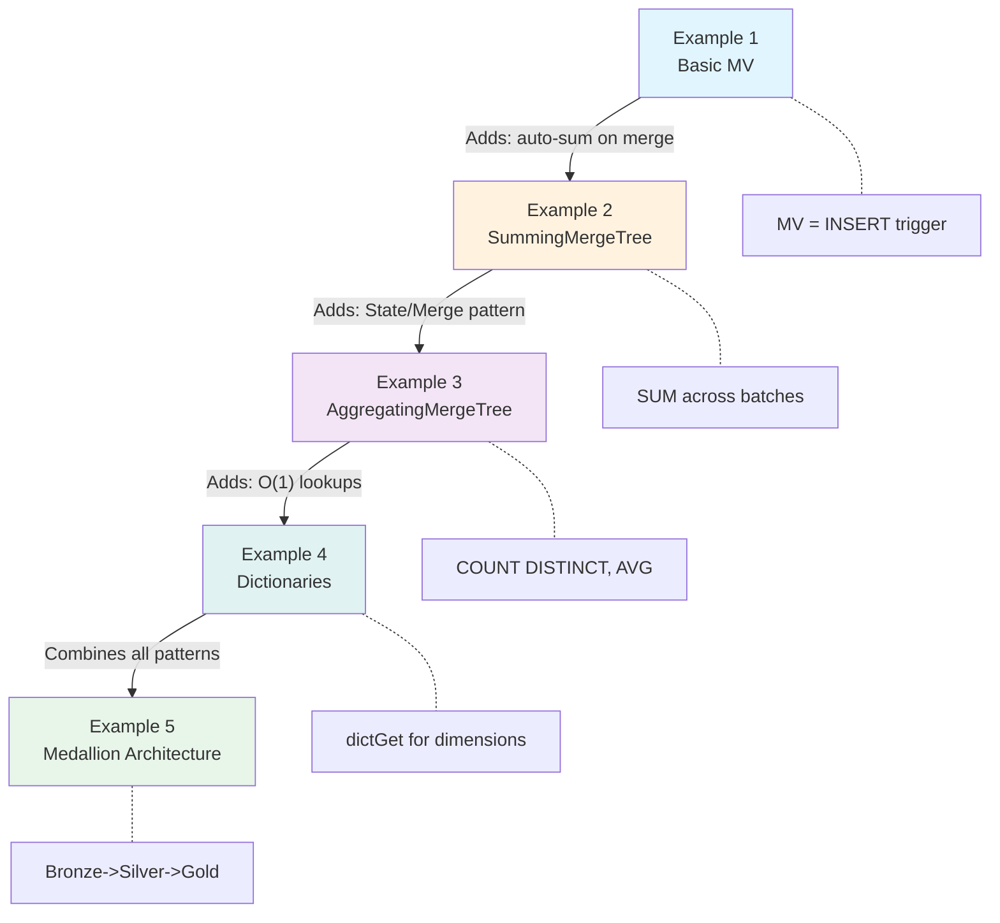

# Incremental Materialized Views

Progressive tutorial: basic MVs to full Medallion Architecture.

---

## Setup

### 1. Configure Environment

```bash
cp .env.example .env
# Edit .env with your connection details
```

### 2. Source Environment and Create Alias

```bash
source .env
```

**Choose ONE alias based on your setup:**

```bash
# Local ClickHouse (no password)
alias ch="clickhouse-client --host=$CLICKHOUSE_HOST --user=$CLICKHOUSE_USER"

# Local ClickHouse (with password)
alias ch="clickhouse-client --host=$CLICKHOUSE_HOST --user=$CLICKHOUSE_USER --password=$CLICKHOUSE_PASSWORD"

# ClickHouse Cloud
alias ch="clickhouse-client --host=$CLICKHOUSE_HOST --port=9440 --user=$CLICKHOUSE_USER --password=$CLICKHOUSE_PASSWORD --secure"
```

### 3. Verify Connection

```bash
ch --query "SELECT version()"
```

---

## Quick Start

**Run all examples with validation:**

```bash
./run_tests.sh
```

**Clean up everything:**

```bash
ch --queries-file MASTER_CLEANUP.sql
```

---

## Example 1: Basic Incremental MVs

**Database**: `mv_demo_basic` | **Scenario**: Page view tracking

**Key Concept**: A Materialized View in ClickHouse is an INSERT trigger, not a cached query.



<details>
<summary><strong>Step-by-Step Instructions</strong></summary>

### Step 1: Create Database and Source Table

```bash
ch --queries-file 01_basic_incremental_mvs/00_setup.sql
```

This creates:
- Database `mv_demo_basic`
- Source table `page_views_raw` (MergeTree)

### Step 2: Create Materialized View

```bash
ch --queries-file 01_basic_incremental_mvs/01_basic_mv.sql
```

This creates:
- Target table `page_views_count` (MergeTree)
- Materialized View that counts page views by URL

### Step 3: Run Demo Queries

```bash
ch --queries-file 01_basic_incremental_mvs/02_queries.sql
```

Demonstrates:
- Inserting raw page view events
- Querying aggregated counts (no computation at query time)

### Step 4: Cleanup (Optional)

```bash
ch --queries-file 01_basic_incremental_mvs/99_cleanup.sql
```

</details>

### What You Learn

- MVs trigger automatically on every INSERT
- Results stored in target table - no query-time computation
- Zero orchestration - no Airflow, no cron, no batch jobs

**Limitation**: MV creates new rows for each INSERT batch. Need manual `GROUP BY` for totals.

---

## Example 2: SummingMergeTree

**Database**: `mv_demo_summing` | **Scenario**: Website metrics

**Key Concept**: SummingMergeTree automatically sums numeric columns when rows with the same ORDER BY key are merged.



<details>
<summary><strong>Step-by-Step Instructions</strong></summary>

### Step 1: Create Database and Source Table

```bash
ch --queries-file 02_summing_merge_tree/00_setup.sql
```

This creates:
- Database `mv_demo_summing`
- Source table `events_raw` (MergeTree)

### Step 2: Create SummingMergeTree Target Table

```bash
ch --queries-file 02_summing_merge_tree/01_summing_tables.sql
```

This creates:
- Target table `hourly_metrics` (SummingMergeTree)
- ORDER BY (hour, page) defines the merge key

### Step 3: Create Materialized View

```bash
ch --queries-file 02_summing_merge_tree/02_mvs.sql
```

This creates:
- MV that aggregates events into hourly metrics

### Step 4: Run Demo Queries

```bash
ch --queries-file 02_summing_merge_tree/03_queries.sql
```

Demonstrates:
- Multiple INSERT batches creating duplicate keys
- Using `FINAL` to see merged results before background merge
- Using `OPTIMIZE TABLE` to force immediate merge

### Step 5: Cleanup (Optional)

```bash
ch --queries-file 02_summing_merge_tree/99_cleanup.sql
```

</details>

### What You Learn

- Rows with same ORDER BY key automatically combine
- Use `FINAL` or `GROUP BY` for accurate results before merge completes
- Great for counters and simple summations

**Limitation**: Only handles SUM. Cannot do COUNT DISTINCT or AVG.

---

## Example 3: AggregatingMergeTree

**Database**: `mv_demo_aggregating` | **Scenario**: E-commerce metrics with unique customers

**Key Concept**: AggregateFunction columns store intermediate STATE, enabling COUNT DISTINCT and AVG across INSERT batches.



### State/Merge Pattern

| INSERT Time | QUERY Time |
|-------------|------------|
| `countState()` | `countMerge()` |
| `sumState()` | `sumMerge()` |
| `avgState()` | `avgMerge()` |
| `uniqState()` | `uniqMerge()` |

<details>
<summary><strong>Step-by-Step Instructions</strong></summary>

### Step 1: Create Database and Source Table

```bash
ch --queries-file 03_aggregating_merge_tree/00_setup.sql
```

This creates:
- Database `mv_demo_aggregating`
- Source table `orders_raw` (MergeTree)

### Step 2: Create AggregatingMergeTree Target Table

```bash
ch --queries-file 03_aggregating_merge_tree/01_aggregating_tables.sql
```

This creates:
- Target table `hourly_sales` with AggregateFunction columns:
  - `total_orders AggregateFunction(count, UInt64)`
  - `total_revenue AggregateFunction(sum, Decimal(10,2))`
  - `avg_order_value AggregateFunction(avg, Decimal(10,2))`
  - `unique_customers AggregateFunction(uniq, String)`

### Step 3: Create Materialized View with State Functions

```bash
ch --queries-file 03_aggregating_merge_tree/02_state_merge_mvs.sql
```

This creates:
- MV using `countState()`, `sumState()`, `avgState()`, `uniqState()`

### Step 4: Run Demo Queries

```bash
ch --queries-file 03_aggregating_merge_tree/03_queries.sql
```

Demonstrates:
- Inserting orders with same customer across multiple batches
- Querying with `countMerge()`, `sumMerge()`, `avgMerge()`, `uniqMerge()`
- Correct COUNT DISTINCT even across separate INSERT batches

### Step 5: Cleanup (Optional)

```bash
ch --queries-file 03_aggregating_merge_tree/99_cleanup.sql
```

</details>

### What You Learn

- `*State()` functions create mergeable intermediate state
- `*Merge()` functions finalize results at query time
- Enables accurate COUNT DISTINCT across multiple INSERT batches
- Foundation for cascading aggregations

---

## Example 4: Dictionaries

**Database**: `mv_demo_dictionaries` | **Scenario**: E-commerce order enrichment

**Key Concept**: Dictionaries provide O(1) in-memory lookups, replacing expensive JOINs for dimension data.



### dictGet() Functions

| Function | Description |
|----------|-------------|
| `dictGet(dict, attr, key)` | Get attribute value by key |
| `dictGetOrDefault(dict, attr, key, default)` | Get with fallback for missing keys |
| `dictHas(dict, key)` | Check if key exists |

<details>
<summary><strong>Step-by-Step Instructions</strong></summary>

### Step 1: Create Database and Dimension Tables

```bash
ch --queries-file 04_dictionaries/00_setup.sql
```

This creates:
- Database `mv_demo_dictionaries`
- `dim_products` - Product catalog with price/cost
- `dim_customers` - Customer profiles with tier
- `orders_raw` - Fact table for orders
- Sample dimension data (10 products, 10 customers)

### Step 2: Create Dictionaries

```bash
ch --queries-file 04_dictionaries/01_dictionaries.sql
```

This creates:
- `products_dict` - HASHED layout for product lookups
- `customers_dict` - HASHED layout for customer lookups
- Dictionaries are loaded into memory for O(1) access

### Step 3: Learn dictGet() Usage

```bash
ch --queries-file 04_dictionaries/02_dictget_examples.sql
```

Demonstrates:
- Basic `dictGet()` for single attribute lookup
- Multiple attribute lookups in one query
- `dictGetOrDefault()` for handling missing keys
- Calculated fields using dictionary values

### Step 4: Compare JOIN vs dictGet()

```bash
ch --queries-file 04_dictionaries/03_join_vs_dictget.sql
```

Demonstrates:
- Traditional JOIN approach (slower)
- dictGet() approach (faster, preferred)
- Why dictionaries are better for dimension lookups

### Step 5: Materialized View with Dictionaries

```bash
ch --queries-file 04_dictionaries/04_mv_with_dictionaries.sql
```

This creates:
- `orders_enriched` - Target table with enriched data
- MV that auto-enriches orders using dictGet()
- Analytics queries on enriched data

### Step 6: Cleanup (Optional)

```bash
ch --queries-file 04_dictionaries/99_cleanup.sql
```

</details>

### What You Learn

- Dictionaries are in-memory key-value stores
- O(1) lookup performance vs O(n) for JOINs
- `dictGet()` works seamlessly in Materialized Views
- Auto-refresh keeps dictionaries in sync with source tables
- Foundation for real-time data enrichment

**Key Insight**: Use dictionaries for dimension tables, use JOINs only when you need to join fact tables.

---

## Example 5: Medallion Architecture

**Database**: `fastmart_demo` | **Scenario**: FastMart e-commerce

**Key Concept**: Full Bronze -> Silver -> Gold pipeline combining all patterns from Examples 1-4.



<details>
<summary><strong>Step-by-Step Instructions</strong></summary>

### Prerequisites

```bash
pip install -r 05_medallion_architecture/scripts/requirements.txt
```

### Step 1: Create Database and Configuration

```bash
ch --queries-file 05_medallion_architecture/01_setup/00_config.sql
```

This creates:
- Database `fastmart_demo`
- Common settings and configurations

### Step 2: Create Dimension Tables

```bash
ch --queries-file 05_medallion_architecture/01_setup/01_dimensions.sql
```

This creates:
- `dim_products` - Product catalog
- `dim_stores` - Store locations
- `dim_customers` - Customer profiles

### Step 3: Generate Dimension Data

```bash
python3 05_medallion_architecture/scripts/generate_dimensions.py
```

Populates dimension tables with sample data.

### Step 4: Create Bronze Layer

```bash
ch --queries-file 05_medallion_architecture/02_bronze/10_bronze_tables.sql
```

This creates:
- `events_raw` - Raw JSON event storage with 7-day TTL

### Step 5: Create Silver Layer Tables

```bash
ch --queries-file 05_medallion_architecture/03_silver/20_silver_tables.sql
```

This creates:
- `orders_silver` - Parsed order data
- `orders_enriched` - Orders with dimension lookups

### Step 6: Create Silver Layer MVs

```bash
ch --queries-file 05_medallion_architecture/03_silver/21_incremental_mvs.sql
```

This creates:
- MV for JSON parsing (Bronze -> Silver)
- MV for enrichment with dictGet()

### Step 7: Create Dictionaries

```bash
ch --queries-file 05_medallion_architecture/03_silver/22_dictionaries.sql
```

This creates:
- Dictionaries for O(1) dimension lookups

### Step 8: Create Gold Layer - Minute Aggregations

```bash
ch --queries-file 05_medallion_architecture/04_gold/30_gold_minute.sql
```

This creates:
- `sales_by_minute` with State functions
- MV from Silver -> Gold minute

### Step 9: Create Gold Layer - Hourly/Daily Rollups

```bash
ch --queries-file 05_medallion_architecture/04_gold/31_gold_hourly.sql
```

This creates:
- `sales_by_hour` - Cascading from minute
- `sales_by_day` - Cascading from hour

### Step 10: Generate Test Events

```bash
python3 05_medallion_architecture/scripts/generate_events.py --count 100000
```

Generates and inserts 100,000 test events.

### Step 11: (Optional) Stream Real-Time Events

```bash
python3 05_medallion_architecture/scripts/stream_simulator.py --rate 500
```

Continuously streams events at 500/second.

### Step 12: Cleanup (Optional)

```bash
ch --queries-file 05_medallion_architecture/06_cleanup/99_cleanup.sql
```

</details>

### Data Flow Diagram



### Key Patterns

| Pattern | File | Description |
|---------|------|-------------|
| JSON parsing | `03_silver/21_incremental_mvs.sql` | Extract fields from raw JSON |
| Dictionary enrichment | `03_silver/22_dictionaries.sql` | O(1) lookups via dictGet() |
| State functions | `04_gold/30_gold_minute.sql` | Aggregate with *State() |
| Cascading aggregation | `04_gold/31_gold_hourly.sql` | Rollup minute->hour->day |

---

## ClickHouse Cloud

Update `.env` for cloud connections:

```bash
CLICKHOUSE_HOST=abc123.us-east-1.aws.clickhouse.cloud
CLICKHOUSE_PORT=8443
CLICKHOUSE_USER=default
CLICKHOUSE_PASSWORD=your-password
CLICKHOUSE_SECURE=true
```

Then source and create alias:

```bash
source .env
alias ch="clickhouse-client --host=$CLICKHOUSE_HOST --port=9440 --user=$CLICKHOUSE_USER --password=$CLICKHOUSE_PASSWORD --secure"
```

---

## Project Structure

```
incremental_materialized_views/
|-- 01_basic_incremental_mvs/
|-- 02_summing_merge_tree/
|-- 03_aggregating_merge_tree/
|-- 04_dictionaries/
|-- 05_medallion_architecture/
|   |-- 01_setup/
|   |-- 02_bronze/
|   |-- 03_silver/
|   |-- 04_gold/
|   |-- 05_queries/
|   |-- 06_cleanup/
|   |-- scripts/
|-- .env.example
|-- .env
|-- MASTER_CLEANUP.sql
|-- run_tests.sh
|-- README.md
```

---

## Progression Summary


