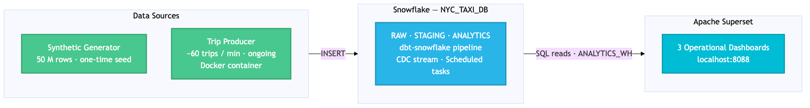
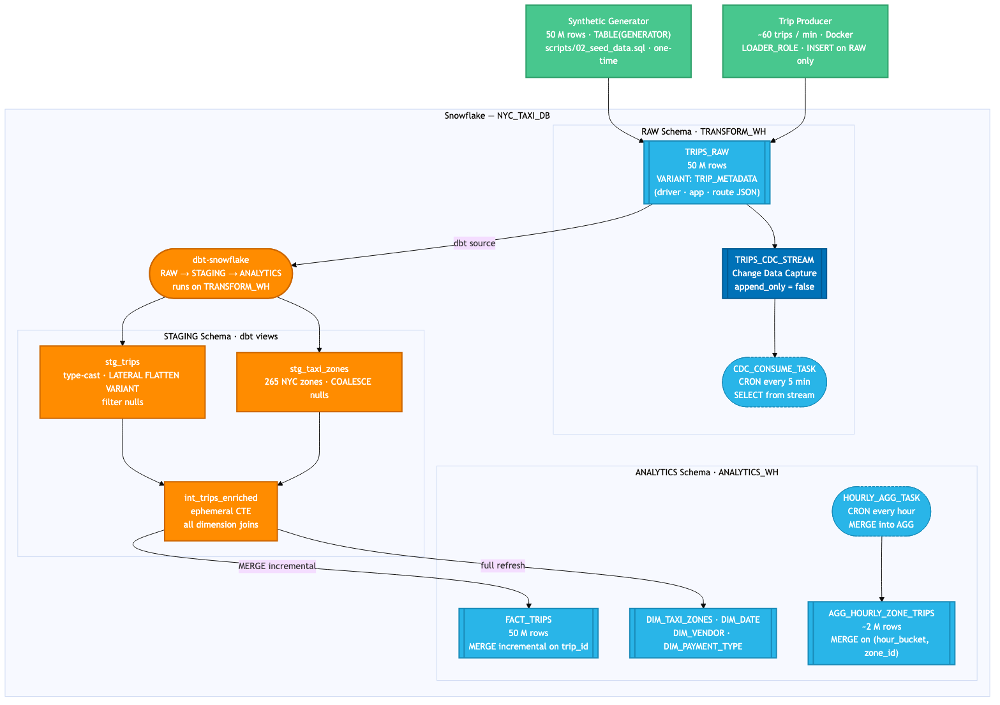
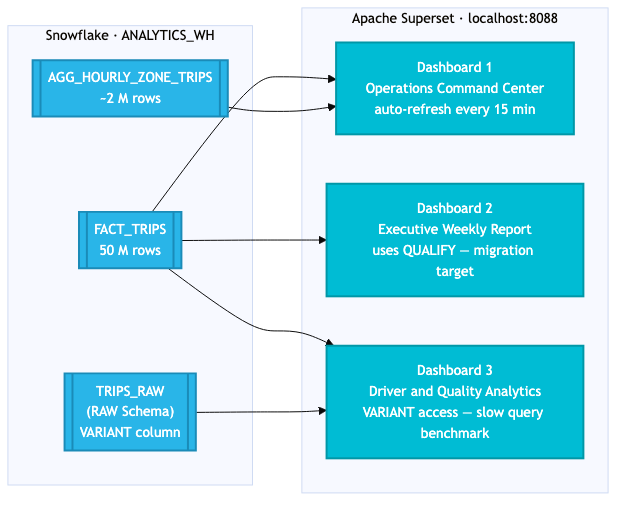

# NYC Taxi Snowflake Migration Lab — Part 1: Source Environment Setup

This directory sets up a realistic Snowflake environment that mirrors production-grade customer deployments. You'll use it to understand the existing workload before planning your migration in Part 2 and executing it in Part 3.

## Architecture

### Overview



### Snowflake — Internal Structure



RAW → STAGING → ANALYTICS layers, dbt pipeline, CDC stream, and scheduled tasks.

### Superset — Dashboard Data Sources



> **Colour legend (detail diagrams):**
> - **Green** — data sources (synthetic seed + Docker trip producer)
> - **Blue** — Snowflake tables and streams
> - **Blue dashed** — Snowflake scheduled tasks
> - **Orange** — dbt models and pipeline
> - **Cyan** — Apache Superset dashboards

> Diagram sources: [`docs/`](docs/) — regenerate from this directory:
> ```bash
> # Overview
> ../common/scripts/render_diagram.sh
> # Snowflake detail
> ../common/scripts/render_diagram.sh docs/architecture_snowflake.mmd
> # Superset detail
> ../common/scripts/render_diagram.sh docs/architecture_superset.mmd
> # All at once
> ../common/scripts/render_diagram.sh --all
> ```

## Prerequisites

| Tool | Version | Install |
|------|---------|---------|
| Terraform | >= 1.5 | [terraform.io](https://developer.hashicorp.com/terraform/downloads) |
| SnowSQL CLI | >= 1.2 | [Snowflake docs](https://docs.snowflake.com/en/user-guide/snowsql-install-config) |
| Python | **3.11 – 3.13** | [python.org](https://www.python.org/downloads/) — see note below |
| dbt-snowflake | >= 1.7 | see venv setup below |
| Docker + Compose | any | [docker.com](https://docs.docker.com/get-docker/) |
| Snowflake account | — | Register your own Snowflake [trial account](https://docs.snowflake.com/en/user-guide/admin-trial-account). Start your 30-day trial with $400 in free credits. No credit card required |

> **Python version matters:** dbt-snowflake requires Python **3.11, 3.12, or 3.13**. Python 3.14 breaks dbt's `mashumaro` dependency and causes import errors on `dbt run`. If your system Python is 3.14+, install 3.13 separately (e.g. `brew install python@3.13`) and use the venv setup below.

### dbt venv setup (recommended)

Install dbt into an isolated virtualenv inside the project directory. `setup.sh` automatically prefers `.venv/bin/dbt` over any system-level `dbt`, so no manual activation is needed when running the setup script.

```bash
cd 01-snowflake-migration-lab/01-setup-snowflake

# Use python3.13 explicitly if your system default is 3.14+
python3.13 -m venv .venv          # or: python3 -m venv .venv
source .venv/bin/activate
pip install "dbt-snowflake>=1.7,<2.0"
deactivate
```

## Quickstart

```bash
# 1. Clone and navigate
cd 01-snowflake-migration-lab/01-setup-snowflake

# 2. Configure credentials
cp .env.example .env
# Edit .env with your Snowflake credentials

# 3. Configure dbt profile
cp dbt/nyc_taxi_dbt/profiles.yml.example ~/.dbt/profiles.yml
# Edit ~/.dbt/profiles.yml with your account details

# 4. Run full setup (~5-10 minutes including synthetic data generation)
source .env && ./setup.sh

# 5. Validate
# Open Snowflake UI → NYC_TAXI_DB → run queries in queries/
```

### Setup flags

| Flag | When to use |
|------|-------------|
| _(none)_ | First run. Provisions everything and generates 50M synthetic rows (~12 min total). |
| `--skip-seed` | Infrastructure already exists and `TRIPS_RAW` already has data. Skips the synthetic data generation (~8 min saved). |
| `--skip-dbt` | Snowflake objects exist but you don't need to re-run dbt transforms (e.g. testing Terraform changes). |
| `--skip-superset` | Docker is not running or you don't need the BI layer yet. |
| `--full-refresh` | Force dbt to rebuild all incremental models from scratch (e.g. after a schema change). |

Flags can be combined. Common combinations:

```bash
# Re-run after a Terraform or SQL change — skip the ~10 min data load
./setup.sh --skip-seed

# Iterate on dbt models only — skip everything else
./setup.sh --skip-seed --skip-superset

# Full re-run after a dbt model schema change
./setup.sh --skip-seed --full-refresh
```

### Superset & Producer
The `setup.sh` automatically brings up Docker Compose with the correct environment, registers the Snowflake connection, and imports all three dashboards.

If you need to restart Superset manually:
```bash
cd superset
docker-compose --env-file ../.env up -d
```

The `--env-file ../.env` flag ensures the environment variables are loaded from the parent directory.

### Keeping dbt current

The trip producer continuously inserts ~60 trips/minute into `TRIPS_RAW`. To keep `FACT_TRIPS` and `AGG_HOURLY_ZONE_TRIPS` up to date, run the dbt refresh script in a separate terminal:

```bash
# Default: refresh every 5 minutes (auto-sources .env)
./scripts/run_dbt.sh

# Custom interval
./scripts/run_dbt.sh --interval 15m

# Run once and exit
./scripts/run_dbt.sh --once

# Include dbt tests after each run
./scripts/run_dbt.sh --test
```

| Flag | Effect |
|------|--------|
| `--interval <n>` | Time between runs: `30s`, `5m`, `1h`, or plain seconds (default: `5m`) |
| `--once` | Run a single refresh and exit |
| `--test` | Run `dbt test` after each `dbt run` |

The script always runs **incrementally** — it never does a `--full-refresh`, so producer-inserted rows are preserved. Press Ctrl-C at any time to stop.

## What Gets Created

### Infrastructure (Terraform)
- **Warehouses**: `TRANSFORM_WH` (SMALL, ELT) + `ANALYTICS_WH` (MEDIUM, BI)
- **Database**: `NYC_TAXI_DB` with schemas `RAW` | `STAGING` | `ANALYTICS`
- **Roles**: `TRANSFORMER_ROLE`, `ANALYST_ROLE`, `DBT_ROLE`, `LOADER_ROLE`
- **Resource Monitor**: `ANALYTICS_WH_MONITOR` (50 credits/month cap)

### Data (SQL Scripts)
- `TRIPS_RAW` — 50M **synthetic** NYC Taxi trip records generated via TABLE(GENERATOR)
  - Date range: rolling 4-year window ending at seed time (always ends near today)
  - Location IDs: 1-265 (real TLC zones)
  - Realistic distributions: fares, distances, passenger counts
  - Mirrors TLC Yellow Taxi dataset patterns
- `TRIP_METADATA` — Synthetic JSON column simulating app telemetry (the VARIANT migration challenge)
- `DIM_TAXI_ZONES` — 265 real NYC zones (borough + service zone from TLC)
- `DIM_PAYMENT_TYPE`, `DIM_VENDOR` — reference tables
- `TRIPS_CDC_STREAM` — Change Data Capture stream on `TRIPS_RAW`
- `CDC_CONSUME_TASK` — Reads from stream every 5 min (RAW schema, resumed during setup)
- `HOURLY_AGG_TASK` — MERGE aggregate refresh every hour (STAGING schema, resumed after dbt)

### dbt Models
| Model | Layer | Type | Notes |
|-------|-------|------|-------|
| `stg_trips` | STAGING | View | Cleans types, flattens VARIANT |
| `stg_taxi_zones` | STAGING | View | Zone dimension passthrough |
| `int_trips_enriched` | STAGING | Ephemeral | All dimension joins |
| `fact_trips` | ANALYTICS | Incremental | 50M rows, MERGE strategy |
| `dim_*` | ANALYTICS | Table | 4 dimension tables |
| `agg_hourly_zone_trips` | ANALYTICS | Incremental | MERGE aggregate |

### BI Layer (Superset — http://localhost:8088)
- **Dashboard 1**: Operations Command Center (refreshes every 15m)
- **Dashboard 2**: Executive Weekly Report
- **Dashboard 3**: Driver & Quality Analytics (intentionally slow — ClickHouse benchmark target)

## Verification

After `setup.sh` completes successfully, verify the environment with the verification script:

```bash
source .env && ./scripts/verify_environment.sh
```

This will check:
1. **Database & Schemas** — NYC_TAXI_DB exists with RAW, STAGING, ANALYTICS schemas
2. **Tables & Data** — TRIPS_RAW has ~50M rows, FACT_TRIPS populated, dimensions exist
3. **CDC Stream** — TRIPS_CDC_STREAM created on TRIPS_RAW
4. **Scheduled Tasks** — CDC_CONSUME_TASK and HOURLY_AGG_TASK are in `started` state
5. **CDC Activity** — Tasks have executed recently
6. **Producer Feed** — Trip producer inserting data continuously
7. **Superset** — BI dashboards accessible at http://localhost:8088

### Manual SnowSQL Verification (optional)

If you prefer to run individual queries manually:

```bash
source .env
SNOWSQL_CMD="/Applications/SnowSQL.app/Contents/MacOS/snowsql"  # or just 'snowsql' if in PATH

# Check task status (requires ACCOUNTADMIN — tasks are owned by that role)
SNOWSQL_PWD="${SNOWFLAKE_PASSWORD}" "${SNOWSQL_CMD}" \
  -a "${SNOWFLAKE_ORG}-${SNOWFLAKE_ACCOUNT}" \
  -u "${SNOWFLAKE_USER}" \
  --rolename ACCOUNTADMIN \
  -q "SHOW TASKS LIKE '%TASK' IN DATABASE NYC_TAXI_DB;" \
  --option output_format=plain --option friendly=false
```

## Query Library

The `queries/` directory contains 7 annotated queries, each with:
- The Snowflake version
- The migration challenge (what construct needs translation)
- The ClickHouse equivalent (commented out)

| Query | Construct | Migration Challenge |
|-------|-----------|---------------------|
| Q1 | DATE_TRUNC, DATEADD | Minor syntax diff |
| Q2 | Window ROWS BETWEEN | Nearly identical |
| Q3 | QUALIFY | **No equivalent — rewrite as subquery** |
| Q4 | LATERAL FLATTEN | **No equivalent — use JSONExtract or pre-flatten** |
| Q5 | VARIANT colon path | Replace with JSONExtractFloat/String |
| Q6 | MERGE INTO | **No equivalent — use ReplacingMergeTree** |
| Q7 | Snowflake Streams | Retired at cutover — live writes go directly to ClickHouse via producer |

## Estimated Costs

| Activity | Duration | Credits | Est. USD |
|----------|----------|---------|----------|
| Data seeding (TABLE(GENERATOR)) | ~12 min | 2 | ~$6 |
| dbt build (all models) | ~8 min | 1.5 | ~$5 |
| Partner lab session (8hr) | 8 hrs | ~12 | ~$36 |
| Warehouse idle (auto-suspend) | — | 0 | $0 |
| **TOTAL per partner per day** | | **~16** | **~$47** |

## Tear Down

```bash
source .env && ./teardown.sh
```

This destroys all Snowflake resources (stops credit consumption) and removes Docker volumes. Local files (queries, dbt models, scripts) are preserved.

## Lab Objectives

By the end of Part 1, you should be able to:

1. **Describe** the existing Snowflake architecture: Medallion layers, warehouse sizing, role hierarchy
2. **Run** all 7 queries and explain the Snowflake-specific constructs used
3. **Explain** how dbt incremental models with MERGE strategy work in Snowflake
4. **Identify** which SQL constructs require translation to ClickHouse (QUALIFY, LATERAL FLATTEN, MERGE, VARIANT syntax)
5. **Identify** the migration path for each Snowflake object and SQL construct — ready to proceed to Part 2.

## Troubleshooting

**`terraform init` fails with provider error**
Ensure you're using Terraform >= 1.5 and have internet access to the Terraform registry.

**`snowsql` connection refused**
Verify `SNOWFLAKE_ORG` and `SNOWFLAKE_ACCOUNT` are correct. Test with: `snowsql -a ${SNOWFLAKE_ORG}-${SNOWFLAKE_ACCOUNT} -u ${SNOWFLAKE_USER}`

**dbt run fails with `relation not found`**
Run `./setup.sh --skip-seed` first, which creates the database structure. Ensure your `profiles.yml` points to `NYC_TAXI_DB`.

**Superset shows `connection refused`**
Wait 60 seconds after `docker-compose up` — Superset takes time to initialize. Check logs: `docker logs nyc_taxi_superset`.

**Data seed takes longer than expected**
The `TABLE(GENERATOR)` INSERT generates 50M rows in roughly 10-12 minutes. The follow-up UPDATE that populates `TRIP_METADATA` JSON on all 50M rows can take an additional 15-20 minutes on a SMALL warehouse — this is normal Snowflake behaviour for large VARIANT column updates.
