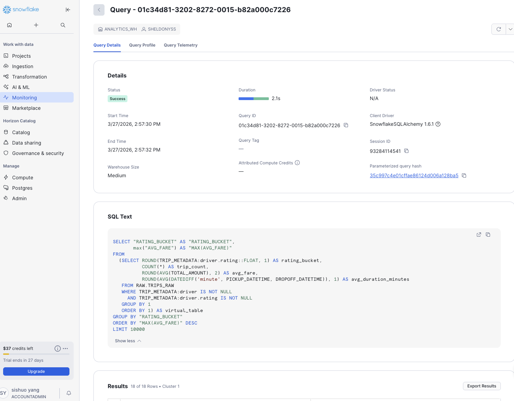

# Superset Dashboard Setup Guide

This guide walks through creating all three dashboards in Apache Superset at http://localhost:8088 (admin / admin).

**Order of operations:**
1. Start Superset and register the Snowflake connection
2. Create all datasets (SQL queries saved as named datasets)
3. Build charts and assemble dashboards

---

## Step 1: Start Superset and Connect to Snowflake

### Start Superset

The Superset image is customised to include the Snowflake and ClickHouse drivers. Use `--build` on first run so Docker builds it:

```bash
cd 01-snowflake-migration-lab/01-setup-snowflake/superset
source ../.env
docker compose up -d --build
```

### Register the database connection (automated)

From the `superset/` directory, run:

```bash
source ../.env && ./init_superset.sh
```

The script waits for Superset to be ready, then registers `NYC Taxi — Snowflake (Source)` automatically. Expected output:

```
>>> Superset is up.
>>> Authenticated.
>>> CSRF token obtained.
>>> Registering: NYC Taxi — Snowflake (Source)
    Registered successfully.
```

### Register the database connection (manual alternative)

If you prefer to register through the UI:

1. Go to **Settings → Database Connections → + Database**
2. Select **Snowflake**
3. Fill in the SQLAlchemy URI — **URL-encode any special characters** in your password (`#` → `%23`, `!` → `%21`, `@` → `%40`, etc.):

```
snowflake://<USER>:<URL_ENCODED_PASSWORD>@<SNOWFLAKE_ORG>-<SNOWFLAKE_ACCOUNT>/NYC_TAXI_DB/ANALYTICS?warehouse=ANALYTICS_WH&role=ANALYST_ROLE
```

4. Set **Display Name**: `NYC Taxi — Snowflake (Source)`
5. Under **Advanced → SQL Lab**: enable **Allow this database to be explored** and **Allow DML**
6. Click **Test Connection** → should show "Connection looks good!"
7. Click **Connect**

---

## Step 2: Create All Datasets

All charts use virtual datasets — SQL queries saved as named datasets.

**How to create each dataset:**
1. Go to **Datasets → + Dataset**
2. Select database: `NYC Taxi — Snowflake (Source)`
3. Click **Create dataset from SQL query** and paste the SQL below
4. Save with the name shown
5. **After saving**: go to **Datasets → pencil icon → Columns tab → "Sync columns from source" → Save**. Without this step the chart builder will show 0 columns.

---

### Dashboard 1 Datasets

#### `ops_hourly_revenue` — Hourly revenue by borough

Schema: `ANALYTICS`

```sql
SELECT
    DATE_TRUNC('hour', pickup_at)                      AS hour_bucket,
    pickup_borough,
    COUNT(*)                                           AS trip_count,
    SUM(total_amount_usd)                              AS total_revenue,
    AVG(tip_amount_usd / NULLIF(fare_amount_usd, 0))  AS avg_tip_rate,
    AVG(trip_distance_miles)                           AS avg_distance_miles
FROM ANALYTICS.FACT_TRIPS
WHERE pickup_at >= DATEADD('day', -7, CURRENT_TIMESTAMP())
  AND pickup_borough IS NOT NULL
GROUP BY 1, 2
ORDER BY 1 DESC, total_revenue DESC
```

#### `ops_zone_agg` — Zone aggregates

Schema: `ANALYTICS`

```sql
SELECT
    hour_bucket,
    zone_id,
    trips,
    revenue,
    avg_distance
FROM ANALYTICS.AGG_HOURLY_ZONE_TRIPS
WHERE hour_bucket >= DATEADD('day', -7, CURRENT_TIMESTAMP())
```

#### `ops_payment_split` — Payment type split

Schema: `ANALYTICS`

```sql
SELECT
    payment_type,
    COUNT(*)              AS trip_count,
    SUM(total_amount_usd) AS total_revenue
FROM ANALYTICS.FACT_TRIPS
WHERE pickup_at >= DATEADD('day', -7, CURRENT_TIMESTAMP())
GROUP BY 1
```

---

### Dashboard 2 Datasets

#### `exec_rolling_avg` — Rolling 7-day averages

Schema: `ANALYTICS`

```sql
SELECT
    pickup_at::DATE                                          AS trip_date,
    COUNT(*)                                                 AS daily_trip_count,
    AVG(trip_distance_miles)                                 AS daily_avg_distance,
    AVG(AVG(trip_distance_miles)) OVER (
        ORDER BY pickup_at::DATE
        ROWS BETWEEN 6 PRECEDING AND CURRENT ROW
    )                                                        AS rolling_7d_avg_distance,
    SUM(total_amount_usd)                                    AS daily_revenue,
    SUM(SUM(total_amount_usd)) OVER (
        ORDER BY pickup_at::DATE
        ROWS BETWEEN 6 PRECEDING AND CURRENT ROW
    )                                                        AS rolling_7d_revenue
FROM ANALYTICS.FACT_TRIPS
GROUP BY 1
ORDER BY 1 DESC
LIMIT 365
```

#### `exec_top_trips` — Top 10 highest-value trips per borough

Schema: `ANALYTICS`

> Uses Snowflake's `QUALIFY` — a key migration challenge. The ClickHouse rewrite requires a subquery.

```sql
SELECT
    trip_id,
    pickup_at,
    pickup_borough,
    total_amount_usd,
    tip_amount_usd,
    trip_distance_miles,
    ROW_NUMBER() OVER (
        PARTITION BY pickup_borough
        ORDER BY total_amount_usd DESC
    ) AS rank_in_borough
FROM ANALYTICS.FACT_TRIPS
WHERE pickup_at::DATE = CURRENT_DATE() - 1
QUALIFY rank_in_borough <= 10
ORDER BY pickup_borough, rank_in_borough
```

#### `exec_surge` — Surge pricing impact

Schema: `ANALYTICS`

```sql
SELECT
    CASE
        WHEN surge_multiplier >= 2.0 THEN 'High Surge (2x+)'
        WHEN surge_multiplier >= 1.5 THEN 'Medium Surge (1.5–2x)'
        WHEN surge_multiplier > 1.0  THEN 'Low Surge (1–1.5x)'
        ELSE 'No Surge (1x)'
    END                                    AS surge_category,
    COUNT(*)                               AS trip_count,
    ROUND(AVG(total_amount_usd), 2)        AS avg_total_fare,
    ROUND(AVG(fare_amount_usd), 2)         AS avg_base_fare,
    ROUND(AVG(surge_multiplier), 2)        AS avg_surge
FROM ANALYTICS.FACT_TRIPS
WHERE surge_multiplier IS NOT NULL
GROUP BY 1
ORDER BY avg_surge DESC
```

---

### Dashboard 3 Datasets

#### `dqa_rating_dist` — Driver rating distribution

Schema: `RAW` ← change this when creating the dataset

> Queries `RAW.TRIPS_RAW` directly via VARIANT colon-path syntax. This is the intentionally slow query — the ClickHouse benchmark target.

```sql
SELECT
    ROUND(TRIP_METADATA:driver.rating::FLOAT, 1)                           AS rating_bucket,
    COUNT(*)                                                               AS trip_count,
    ROUND(AVG(TOTAL_AMOUNT), 2)                                            AS avg_fare,
    ROUND(AVG(DATEDIFF('minute', PICKUP_DATETIME, DROPOFF_DATETIME)), 1)   AS avg_duration_minutes
FROM RAW.TRIPS_RAW
WHERE TRIP_METADATA:driver IS NOT NULL
  AND TRIP_METADATA:driver.rating IS NOT NULL
GROUP BY 1
ORDER BY 1
```

#### `dqa_vehicle` — Vehicle type revenue

Schema: `ANALYTICS`

```sql
SELECT
    vehicle_type,
    COUNT(*)                 AS trip_count,
    SUM(total_amount_usd)    AS total_revenue,
    AVG(total_amount_usd)    AS avg_fare,
    AVG(trip_distance_miles) AS avg_distance
FROM ANALYTICS.FACT_TRIPS
WHERE vehicle_type IS NOT NULL
GROUP BY 1
ORDER BY total_revenue DESC
```

#### `dqa_traffic` — Traffic level vs trip duration

Schema: `ANALYTICS`

```sql
SELECT
    traffic_level,
    COUNT(*)                   AS trip_count,
    AVG(duration_minutes)      AS avg_duration_minutes,
    AVG(trip_distance_miles)   AS avg_distance_miles,
    AVG(total_amount_usd)      AS avg_fare
FROM ANALYTICS.FACT_TRIPS
WHERE traffic_level IS NOT NULL
GROUP BY 1
ORDER BY avg_duration_minutes DESC
```

#### `dqa_platform` — App platform trends

Schema: `ANALYTICS`

```sql
SELECT
    pickup_at::DATE       AS trip_date,
    app_platform,
    COUNT(*)              AS trip_count,
    AVG(surge_multiplier) AS avg_surge
FROM ANALYTICS.FACT_TRIPS
WHERE app_platform IS NOT NULL
  AND pickup_at >= DATEADD('day', -30, CURRENT_TIMESTAMP())
GROUP BY 1, 2
ORDER BY 1 DESC
```

---

## Step 3: Build Dashboards

All 10 datasets are now ready. Create charts and add them to dashboards.

---

### Dashboard 1: Operations Command Center

**Purpose:** Real-time operational view showing the last 7 days. This is the first dashboard partners repoint to ClickHouse in Part 2.

**Create the dashboard:**
1. **Dashboards → + Dashboard**
2. Title: `Operations Command Center`
3. Auto-refresh: every 15 minutes (`···` → Edit dashboard → Auto-refresh)

#### Chart 1: Trips per Hour (Line chart)

- **Chart type**: Line Chart
- **Dataset**: `ops_hourly_revenue`
- **X-axis**: `hour_bucket`
- **Metrics**: `SUM(trip_count)`
- **Series**: `pickup_borough`
- **Title**: `Trips per Hour — Last 7 Days`

#### Chart 2: Revenue by Borough (Bar chart)

- **Chart type**: Bar Chart
- **Dataset**: `ops_hourly_revenue`
- **X-axis**: `pickup_borough`
- **Metrics**: `SUM(total_revenue)`
- **Sort**: descending by metric
- **Title**: `Total Revenue by Borough — Last 7 Days`

#### Chart 3: Payment Type Split (Pie chart)

- **Chart type**: Pie Chart
- **Dataset**: `ops_payment_split`
- **Dimension**: `payment_type`
- **Metric**: `SUM(trip_count)`
- **Show labels**: on
- **Title**: `Trip Count by Payment Type`

#### Chart 4: Total Trips (Big Number)

- **Chart type**: Big Number with Trendline
- **Dataset**: `ops_hourly_revenue`
- **Metric**: `SUM(trip_count)`
- **Title**: `Total Trips (Last 7 Days)`

#### Chart 5: Borough Performance Summary (Table)

- **Chart type**: Table
- **Dataset**: `ops_hourly_revenue`
- **Columns**: `pickup_borough`, `SUM(trip_count)`, `SUM(total_revenue)`, `AVG(avg_tip_rate)`
- **Row limit**: 10
- **Sort**: `SUM(total_revenue)` descending
- **Title**: `Borough Performance Summary`

**Layout:**
```
[ Total Trips — Big Number ]  [ Total Revenue — Big Number (add 2nd)  ]
[ Trips per Hour — Line chart (full width)                            ]
[ Revenue by Borough — Bar ]  [ Payment Type Split — Pie             ]
[ Borough Performance — Table (full width)                            ]
```

---

### Dashboard 2: Executive Weekly Report

**Purpose:** Strategic view for weekly business review. Showcases window functions and Snowflake-specific syntax (`QUALIFY`) that require rewrites in ClickHouse.

**Create the dashboard:**
1. **Dashboards → + Dashboard**
2. Title: `Executive Weekly Report`
3. Auto-refresh: 1 hour

#### Chart 6: Rolling 7-Day Revenue Trend (Line chart)

- **Chart type**: Line Chart
- **Dataset**: `exec_rolling_avg`
- **X-axis**: `trip_date`
- **Metrics**: `MAX(daily_revenue)`, `MAX(rolling_7d_revenue)`
- **Title**: `Daily Revenue with 7-Day Rolling Average`

#### Chart 7a: Daily Trip Volume (Big Number)

- **Chart type**: Big Number with Trendline
- **Dataset**: `exec_rolling_avg`
- **Metric**: `MAX(daily_trip_count)`
- **Title**: `Daily Trip Volume (Last Year)`

#### Chart 7b: Rolling 7-Day Average Distance (Line chart)

- **Chart type**: Line Chart
- **Dataset**: `exec_rolling_avg`
- **X-axis**: `trip_date`
- **Metrics**: `MAX(rolling_7d_avg_distance)`
- **Title**: `Rolling 7-Day Average Distance (miles)`

#### Chart 8: Top 10 Trips per Borough (Table)

- **Chart type**: Table
- **Dataset**: `exec_top_trips`
- **Query Mode**: **RAW RECORDS** ← important: the dataset uses `QUALIFY` so Superset must not re-aggregate
- **Columns**: `pickup_borough`, `rank_in_borough`, `total_amount_usd`, `tip_amount_usd`, `trip_distance_miles`, `pickup_at`
- **Sort By**: `total_amount_usd` descending
- **Row limit**: 60
- **Title**: `Top 10 Trips per Borough — Yesterday`
- **Note**: Uses `QUALIFY` — Snowflake-specific, must be rewritten as a subquery for ClickHouse

#### Chart 9: Surge Pricing Breakdown (Mixed chart)

- **Chart type**: Mixed Chart ← use this, not Bar Chart; Bar Chart has no secondary axis support
- **Dataset**: `exec_surge`
- **X-axis**: `surge_category`
- **Query A — Bar**: metric `SUM(trip_count)`, label `Trip Count`
- **Query B — Line**: metric `MAX(avg_total_fare)`, label `Avg Total Fare`, Y-axis: **Right**
- **Sort**: `SUM(trip_count)` descending
- **Title**: `Trip Volume and Average Fare by Surge Category`

#### Chart 10: Surge Distribution (Pie chart)

- **Chart type**: Pie Chart
- **Dataset**: `exec_surge`
- **Dimension**: `surge_category`
- **Metric**: `SUM(trip_count)`
- **Title**: `Surge Pricing Distribution`

**Layout:**
```
[ Rolling Revenue — Line chart (full width)                              ]
[ Daily Trip Volume — Big Number (50%) ]  [ Avg Distance — Line (50%)   ]
[ Top 10 Trips — Table (60%) ]  [ Surge Distribution — Pie (40%)        ]
[ Surge Breakdown — Bar chart (full width)                               ]
```

---

### Dashboard 3: Driver & Quality Analytics

**Purpose:** Deep-dive on driver performance and trip quality. Intentionally the slowest dashboard — queries `RAW.TRIPS_RAW` directly via VARIANT access. Record the query time here as the baseline for the ClickHouse performance benchmark in Part 2.

**Create the dashboard:**
1. **Dashboards → + Dashboard**
2. Title: `Driver & Quality Analytics`
3. Auto-refresh: 1 hour

#### Chart 11: Trip Count by Driver Rating (Bar chart)

- **Chart type**: Bar Chart
- **Dataset**: `dqa_rating_dist`
- **X-axis**: `rating_bucket`
- **Metrics**: `SUM(trip_count)`
- **Title**: `Trip Count by Driver Rating`
- **Note**: Scans `RAW.TRIPS_RAW` with VARIANT access — observe query time vs ClickHouse

#### Chart 12: Average Fare by Rating (Line chart)

- **Chart type**: Line Chart
- **Dataset**: `dqa_rating_dist`
- **X-axis**: `rating_bucket`
- **Metrics**: `MAX(avg_fare)`
- **Title**: `Average Fare by Driver Rating`

#### Chart 13: Revenue by Vehicle Type (Horizontal bar)

- **Chart type**: Bar Chart (horizontal)
- **Dataset**: `dqa_vehicle`
- **X-axis**: `vehicle_type`
- **Metrics**: `SUM(total_revenue)`, `SUM(trip_count)` (secondary axis)
- **Title**: `Revenue and Trip Count by Vehicle Type`

#### Chart 14: Traffic Level Impact (Bar chart)

- **Chart type**: Bar Chart
- **Dataset**: `dqa_traffic`
- **X-axis**: `traffic_level`
- **Metrics**: `MAX(avg_duration_minutes)`, `MAX(avg_distance_miles)` (secondary axis)
- **Title**: `Average Trip Duration and Distance by Traffic Level`

#### Chart 15: Daily Trips by App Platform (Line chart)

- **Chart type**: Line Chart
- **Dataset**: `dqa_platform`
- **X-axis**: `trip_date`
- **Metrics**: `SUM(trip_count)`
- **Series**: `app_platform`
- **Title**: `Daily Trips by App Platform — Last 30 Days`

#### Chart 16: Surge by Platform (Table)

- **Chart type**: Table
- **Dataset**: `dqa_platform`
- **Columns**: `app_platform`, `SUM(trip_count)`, `AVG(avg_surge)`
- **Row limit**: 10
- **Title**: `Surge by Platform`

**Layout:**
```
[ Trip Count by Rating — Bar ]  [ Avg Fare by Rating — Line            ]
[ Revenue by Vehicle Type — Horizontal bar (full width)                ]
[ Traffic Level Impact — Bar (50%) ]  [ Surge by Platform — Table (50%)]
[ Daily Trips by Platform — Line chart (full width)                    ]
```

---

## Step 4: Verify

1. Open each dashboard and confirm all charts load without errors
2. For Dashboard 3, note the `dqa_rating_dist` query execution time in **Snowflake UI → Activity → Query History** — save this as your migration benchmark



## Step 5: Export for Reuse

Once dashboards are complete, export them so future runs can auto-import:

1. Open each dashboard → `···` → **Export** (saves as `.zip`)
2. Place the files in `superset/dashboards/`:
   - `01_operations_command_center.zip`
   - `02_executive_weekly_report.zip`
   - `03_driver_quality_analytics.zip`
3. Re-run `./init_superset.sh` — it will import them automatically on future setups
