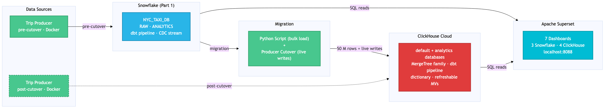
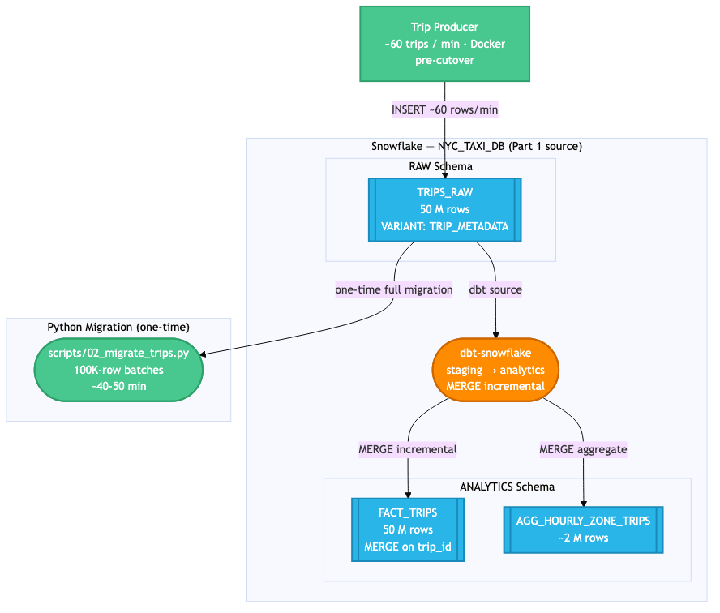
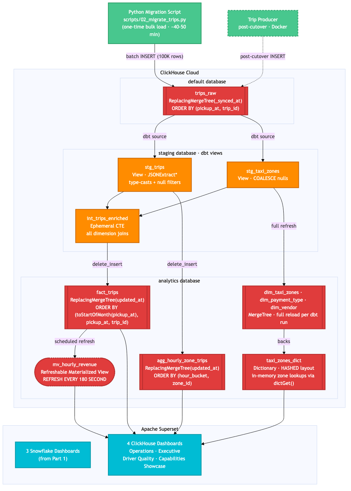

# NYC Taxi ClickHouse Migration Lab — Part 3: Migrate to ClickHouse Cloud

This directory executes the NYC Taxi migration from Snowflake (Part 1) to ClickHouse Cloud. You will provision a ClickHouse Cloud service, migrate 50M rows via a Python batch script, validate parity, rebuild the dbt pipeline with ClickHouse-native engines, recreate the Superset dashboards, and run a quantified benchmark comparing query performance between the two systems.

> **Part 2 required:** Before running anything here, complete `02-plan-and-design/` and produce a filled-in `migration-plan.md`. The architecture decisions made there — engine selection, ORDER BY design, schema translation — are exactly what this lab implements. `setup.sh` checks for that file and warns if it's missing.

---

## 1. Lab Objectives

By the end of Part 3, you should be able to:

1. **Provision** a ClickHouse Cloud service with Terraform using the `ClickHouse/clickhouse` provider
2. **Explain** why the engine and ORDER BY choices in this lab match the decisions from your Part 2 migration plan
3. **Migrate** 50M rows from Snowflake using a Python batch script and validate parity
4. **Translate** all 7 SQL dialect challenges to ClickHouse equivalents (QUALIFY, LATERAL FLATTEN, MERGE, VARIANT, etc.)
5. **Rebuild** a dbt pipeline using the dbt-clickhouse adapter with `delete_insert` incremental strategy
6. **Demonstrate** ClickHouse-specific features: Refreshable MVs, approximate functions (`uniq`, `quantileTDigest`), dictionaries, and SAMPLE
7. **Run** a quantified benchmark showing ~6-9x query speedups across 7 queries
8. **Execute** a scripted producer cutover from Snowflake to ClickHouse

---

## 2. Architecture

### 2.1 Overview



### 2.2 Snowflake — Source Side



Snowflake schemas and the Python migration path to ClickHouse.

### 2.3 ClickHouse — Target Side



MergeTree engines, dbt pipeline, dictionary, refreshable MV, and Superset dashboards.

> **Colour legend (detail diagrams):**
> - **Green** — data sources (trip producer, pre- and post-cutover)
> - **Blue** — Snowflake tables
> - **Orange** — dbt models and pipeline
> - **Red** — ClickHouse tables and materialized views
> - **Cyan** — Apache Superset dashboards
> - **Dashed arrows** — post-cutover flows

> Regenerate diagrams from this directory: `../common/scripts/render_diagram.sh --all`

### 2.4 Migration Approach: Why a Python Script?

Several methods exist for moving data from Snowflake to ClickHouse. This lab uses a Python batch script. Here is why, compared with the common alternatives:

| Method | How it works | Why not used here |
|--------|-------------|-------------------|
| **ClickPipes (Snowflake source)** | Native ClickHouse Cloud connector — zero-ETL, managed UI | **Snowflake is not a supported ClickPipes source.** ClickPipes supports Kafka, S3, Kinesis, PostgreSQL CDC, MySQL CDC, and object storage. |
| **S3 export → ClickPipes S3** | `COPY INTO @stage` exports Parquet/CSV to S3; ClickPipes S3 connector loads it into ClickHouse | Requires an S3 bucket, IAM role, Snowflake stage, and AWS account. Adds ~3 setup steps before any data moves. Viable in production but too much infrastructure for a lab. |
| **S3 export → `clickhouse-client`** | Same S3 export, but loaded with `INSERT INTO ... SELECT FROM s3(...)` | Same S3 prerequisites. Also requires the partner to manage file chunking and resumability manually. |
| **Snowflake → Kafka → ClickHouse** | Snowflake CDC stream feeds a Kafka topic; ClickPipes Kafka connector ingests it | Full streaming pipeline — appropriate for sub-minute latency requirements in production. Kafka cluster is far too heavy for a lab environment. |
| **Python script (this lab)** | `snowflake-connector-python` reads in 100K-row cursor batches; `clickhouse-connect` inserts directly | Zero additional infrastructure beyond packages the lab already needs. Resumable via `--resume` (`max(pickup_at)` watermark). Real-time progress output. ~40–50 min for 50M rows at ~20K rows/s — acceptable for a one-time migration exercise. |

**Why the Python script is the right call for this lab:**

- **No AWS account required.** S3-based approaches require bucket creation, IAM policies, and a Snowflake external stage — three setup steps that have nothing to do with ClickHouse.
- **Self-contained.** The two packages (`snowflake-connector-python`, `clickhouse-connect`) are installed into the same venv as dbt. No new services, no new credentials.
- **Resumable.** `--resume` makes the script safe to interrupt and restart. `ReplacingMergeTree(_synced_at)` ensures duplicate inserts on retry are automatically deduplicated.
- **Transparent.** Partners can read the script, understand the column mapping, and adapt it for their own schema — which is more educational than clicking through a UI wizard.

**Handling the migration gap:**

The Snowflake producer keeps running while the migration script runs (~40-50 min). Any trips written to Snowflake during that window are not in ClickHouse. This lab closes the gap with a two-pass approach at cutover time (section 7.7):

1. Stop the Snowflake producer to freeze the dataset
2. Run `python scripts/02_migrate_trips.py --resume` — only the delta rows are transferred (seconds, not minutes)
3. Start the ClickHouse producer

The same `ReplacingMergeTree(_synced_at)` dedup that handles migration retries also handles this: if any rows overlap between the original run and the `--resume` pass, the later `_synced_at` wins.

**When you would choose S3 in production:**

If the dataset is > 500M rows, or if the Snowflake warehouse query cost of a full table scan is significant, the S3 export path is preferable: Snowflake exports compressed Parquet in parallel (much faster than a single cursor), and ClickHouse can load from S3 in parallel as well. The Python script approach here works well for lab scale.

---

## 3. Decision Alignment

Part 2 asked you to reason through the following architecture decisions. Here is what this lab implements and why — compare against your `migration-plan.md`:

| Decision | This Lab Implements | Why |
|----------|---------------------|-----|
| `trips_raw` engine | `ReplacingMergeTree(_synced_at)` | The Python migration script uses batch INSERTs that may be retried if interrupted. `_synced_at DateTime DEFAULT now()` is set on every INSERT, so a retried row arrives later and has a higher `_synced_at` value — the later row wins during RMT dedup, making retries idempotent. Post-cutover producer retries are also safe for the same reason. `stg_trips` queries with `FINAL` to guarantee one row per trip. |
| `fact_trips` engine | `ReplacingMergeTree(updated_at)` | Trips can be corrected (fare adjustments); `updated_at` is the version column |
| `agg_hourly_zone_trips` engine | `ReplacingMergeTree(updated_at)` | Rolling recalculation = upsert pattern |
| `dim_*` tables engine | `MergeTree()` | Full reload on every dbt run; no upserts |
| `fact_trips` ORDER BY | `(toStartOfMonth(pickup_at), pickup_at, trip_id)` | Q1–Q7 all filter on `pickup_at`; `trip_id` ensures uniqueness at the leaf level |
| `agg_hourly_zone_trips` ORDER BY | `(hour_bucket, zone_id)` | Both columns appear in all aggregation queries |
| VARIANT → | `String` + `JSONExtract*` | Preserves raw JSON; extraction happens at query time |
| QUALIFY → | Subquery wrapping `ROW_NUMBER()` | ClickHouse has no `QUALIFY` clause |
| MERGE INTO → | `delete_insert` incremental in dbt | dbt-clickhouse's idiomatic upsert strategy; avoids full-table rewrites |

---

## 4. What Gets Created

This section lists every artifact the lab produces. Use it before starting to understand the full scope, and after completing section 7 to verify nothing was missed. **Section** references point to where each item is created.

### 4.1 Infrastructure

**How:** `./setup.sh` runs `terraform apply` — fully automated, no manual steps.
**When:** Section 6, before any migration work begins.

| Resource | Description |
|----------|-------------|
| ClickHouse Cloud service | Development tier, single region |
| IP access list | Permits connections from your local IP |
| `.clickhouse_state` | Auto-generated after `terraform apply`; exports `CLICKHOUSE_HOST` and `CLICKHOUSE_PORT` |

### 4.2 ClickHouse Tables

Tables are created in two phases. **Section 7.1** runs `dbt run` once to create empty schemas — no data yet. **Section 7.3** runs `dbt run` a second time to populate them after the bulk load. Two objects — the zone dictionary and the refreshable MV — are created by standalone SQL scripts in **section 7.4** and require `dim_taxi_zones` to be populated first.

| Table | Engine | Schema | Data | How |
|-------|--------|--------|------|-----|
| `default.trips_raw` | ReplacingMergeTree(_synced_at) | 7.1 — SQL script | 7.2 — Python migration script | Pre-created with explicit DDL (see 7.1); `_synced_at DEFAULT now()` is the version column; 50M rows loaded by `scripts/02_migrate_trips.py` |
| `analytics.fact_trips` | ReplacingMergeTree(updated_at) | 7.1 — `dbt run` | 7.3 — `dbt run` | `delete_insert` incremental; use `FINAL` at query time |
| `analytics.agg_hourly_zone_trips` | ReplacingMergeTree(updated_at) | 7.1 — `dbt run` | 7.7 — post-cutover `dbt run` | Rolling 2-hour window; only populated by the live producer — empty until after cutover |
| `analytics.dim_taxi_zones` | MergeTree | 7.1 — `dbt run` | 7.3 — `dbt run` | Full reload per run; 265 NYC zones |
| `analytics.dim_payment_type` | MergeTree | 7.1 — `dbt run` | 7.3 — `dbt run` | Full reload per run; 6 payment types |
| `analytics.dim_vendor` | MergeTree | 7.1 — `dbt run` | 7.3 — `dbt run` | Full reload per run; 3 vendors |
| `analytics.taxi_zones_dict` | Dictionary | — | 7.4 — SQL script | In-memory; backed by `dim_taxi_zones`; 265 zones |
| `analytics.mv_hourly_revenue` | Refreshable MV | — | 7.4 — SQL script | Re-executes `SELECT … FROM fact_trips FINAL` every 3 min |

### 4.3 dbt Models

**How:** All models are materialized by `dbt run` — no manual SQL required.
**When:** Run twice. **Section 7.1** creates empty table DDL (incremental models detect no prior state and skip the WHERE filter). **Section 7.3** runs again after the bulk load to populate all analytics tables with data.

| Model | Layer | Materialization | When populated | Notes |
|-------|-------|-----------------|----------------|-------|
| `stg_trips` | staging | View | 7.1 (rebuilt each run) | Type-casts, `JSONExtract*` for TRIP_METADATA |
| `stg_taxi_zones` | staging | View | 7.1 (rebuilt each run) | Zone dimension passthrough |
| `int_trips_enriched` | staging | Ephemeral | — (inlined as CTE) | All dimension joins; no physical table |
| `fact_trips` | analytics | Incremental | 7.1 (DDL) / 7.3 (data) | `delete_insert` on `pickup_at` range; ORDER BY (pickup_at, trip_id) |
| `agg_hourly_zone_trips` | analytics | Incremental | 7.1 (DDL) / 7.7 (data) | Rolling 2-hour window — empty until producer cutover; incremental filter `pickup_at >= now() - 2h` only matches live trips |
| `dim_taxi_zones` | analytics | Table | 7.1 (DDL) / 7.3 (data) | Full reload per run; source for `taxi_zones_dict` |
| `dim_payment_type` | analytics | Table | 7.1 (DDL) / 7.3 (data) | Full reload per run |
| `dim_vendor` | analytics | Table | 7.1 (DDL) / 7.3 (data) | Full reload per run |

### 4.4 BI Layer

**How:** `bash superset/add_clickhouse_connection.sh` calls the Superset REST API — no manual steps in the Superset UI.
**When:** Section 7.5, after the analytics tables and dictionary are populated.

Four ClickHouse dashboards are added alongside the three existing Snowflake dashboards (7 total after this step):

| Dashboard | Mirrors | What it demonstrates |
|-----------|---------|----------------------|
| CH — Operations Command Center | Snowflake Dashboard 1 | Live fact_trips data (post-cutover); same KPIs, faster queries |
| CH — Executive Weekly Report | Snowflake Dashboard 2 | QUALIFY → ROW_NUMBER() subquery rewrite |
| CH — Driver & Quality Analytics | Snowflake Dashboard 3 | JSONExtractString vs Snowflake LATERAL FLATTEN |
| CH — Capabilities Showcase | *(new — no SF equivalent)* | Approximate functions, dictionary joins, SAMPLE clause |

---

## 5. Prerequisites

### 5.1 Required Tools

| Tool | Version | Install |
|------|---------|---------|
| Terraform | >= 1.5 | [developer.hashicorp.com/terraform/downloads](https://developer.hashicorp.com/terraform/downloads) |
| Python | **3.11 – 3.13** | [python.org](https://www.python.org/downloads/) |
| dbt-clickhouse | >= 1.8 | see venv setup below |
| Docker + Compose | any | [docs.docker.com/get-docker](https://docs.docker.com/get-docker/) |
| ClickHouse Cloud account | — | [cloud.clickhouse.com](https://cloud.clickhouse.com) — create an organization and generate an API key |

> **Python version matters:** dbt-clickhouse requires Python **3.11, 3.12, or 3.13**. Python 3.14 breaks dbt's `mashumaro` dependency. If your system Python is 3.14+, install 3.13 separately (`brew install python@3.13`) and use the venv below.

### 5.2 dbt venv Setup

```bash
cd 01-snowflake-migration-lab/03-migrate-to-clickhouse
python3.13 -m venv .venv
source .venv/bin/activate
pip install "dbt-clickhouse>=1.8,<2.0" snowflake-connector-python clickhouse-connect
deactivate
```

### 5.3 Estimated Costs

| Activity | Duration | Est. USD |
|----------|----------|----------|
| ClickHouse Cloud (development tier) | per day | ~$5-10 |
| Snowflake (Part 1 still running) | per day | ~$47 |
| **Total per partner per day** | | **~$52-57** |

> Tear down both environments when not actively working to avoid unnecessary charges.

---

## 6. Provision the ClickHouse Cluster

`setup.sh` does one thing: run `terraform apply` and write the connection details to `.clickhouse_state`.

```bash
cd 01-snowflake-migration-lab/03-migrate-to-clickhouse

# Configure credentials
cp .env.example .env
vim .env
# Fill in: CLICKHOUSE_ORG_ID, CLICKHOUSE_TOKEN_KEY, CLICKHOUSE_TOKEN_SECRET, CLICKHOUSE_PASSWORD

# Provision
source .env && ./setup.sh
```

**Expected output:** Terraform creates 2 resources (service + IP access list) in approximately 2–3 minutes:

```
Apply complete! Resources: 2 added, 0 changed, 0 destroyed.

Outputs:
clickhouse_host = "abc123xyz.us-east-1.aws.clickhouse.cloud"
clickhouse_port = 8443
```

The host and port are saved to `.clickhouse_state`. Source it in any terminal to pick up the connection:

```bash
source .clickhouse_state
```

Smoke-test the connection:

```bash
curl "https://${CLICKHOUSE_HOST}:${CLICKHOUSE_PORT}/?query=SELECT+1" \
  --user "default:${CLICKHOUSE_PASSWORD}"
# Expected: 1
```

---

## 7. Migration Steps

Complete sections 7.1 through 7.8 in order. Each section includes the commands to run and a verification check before moving to the next.

### 7.1 Create Empty Tables

First, manually create `trips_raw` with the correct engine. The migration script will load data into this table in 7.2 — it must already exist with `ReplacingMergeTree` so the version column is in place before any rows arrive.

```sql
-- Run in the ClickHouse SQL console (cloud.clickhouse.com → SQL console)
CREATE TABLE IF NOT EXISTS default.trips_raw (
    trip_id               String,
    vendor_id             UInt8,
    pickup_at             DateTime64(3, 'UTC'),
    dropoff_at            DateTime64(3, 'UTC'),
    passenger_count       UInt8,
    trip_distance_miles   Float32,
    pickup_location_id    UInt16,
    dropoff_location_id   UInt16,
    payment_type_id       UInt8,
    rate_code_id          UInt8,
    store_fwd_flag        String,
    fare_amount_usd       Float32,
    extra_amount_usd      Float32,
    mta_tax_usd           Float32,
    tip_amount_usd        Float32,
    tolls_amount_usd      Float32,
    total_amount_usd      Float32,
    ingested_at           DateTime64(3, 'UTC'),
    trip_metadata         String,
    _synced_at            DateTime DEFAULT now()
)
ENGINE = ReplacingMergeTree(_synced_at)
ORDER BY (pickup_at, trip_id);
```

`_synced_at` is set automatically on every INSERT. If the migration script is interrupted and re-run with `--resume`, duplicate rows for the same `trip_id` may briefly exist — RMT keeps the later row (higher `_synced_at`). `stg_trips` queries `trips_raw FINAL` to force deduplication before any downstream model sees the data.

Next, seed the zone reference data. This is static data (265 NYC TLC zones) that dbt's `stg_taxi_zones` reads as a source. Run in the ClickHouse SQL console:

```sql
-- Run scripts/00_seed_zones.sql in the ClickHouse SQL console
-- (paste the file contents, or use clickhouse-client)
```

```bash
# Or run via clickhouse-client:
clickhouse-client --host "${CLICKHOUSE_HOST}" --port 9440 --secure \
  --user default --password "${CLICKHOUSE_PASSWORD}" \
  --multiquery < scripts/00_seed_zones.sql
```

Then run `dbt run` to create the analytics tables and staging views:

```bash
cd dbt/nyc_taxi_dbt_ch
source ../../.clickhouse_state
source ../../.env

dbt deps   # install packages (first run only)
dbt run    # creates analytics tables and staging views; all empty at this point
```

**Expected:** ~8 models created in under 2 minutes (all tables empty).

**Verify:**

```bash
# Check analytics tables were created
curl "https://${CLICKHOUSE_HOST}:${CLICKHOUSE_PORT}/?query=SHOW+TABLES+IN+analytics" \
  --user "default:${CLICKHOUSE_PASSWORD}"
# Expected: agg_hourly_zone_trips, dim_date, dim_payment_type, dim_vendor, dim_taxi_zones, fact_trips

# Check staging views were created
curl "https://${CLICKHOUSE_HOST}:${CLICKHOUSE_PORT}/?query=SHOW+TABLES+IN+staging" \
  --user "default:${CLICKHOUSE_PASSWORD}"
# Expected: stg_trips, stg_taxi_zones

# Check trips_raw exists with the correct engine
curl "https://${CLICKHOUSE_HOST}:${CLICKHOUSE_PORT}/?query=SELECT+engine+FROM+system.tables+WHERE+database%3D%27default%27+AND+name%3D%27trips_raw%27" \
  --user "default:${CLICKHOUSE_PASSWORD}"
# Expected: ReplacingMergeTree
```

---

### 7.2 Migrate Data to ClickHouse

Load all rows from Snowflake `NYC_TAXI_DB.RAW.TRIPS_RAW` into ClickHouse `default.trips_raw` using the Python batch migration script.

```bash
source .env && source .clickhouse_state
source .venv/bin/activate
python scripts/02_migrate_trips.py
```

**Expected output** (approximately 40–50 minutes for 50M rows):

```
━━━━━━━━━━━━━━━━━━━━━━━━━━━━━━━━━━━━━━━━━━━━━━━━━━━━━━━━━━━━
  NYC Taxi Migration: Snowflake → ClickHouse
━━━━━━━━━━━━━━━━━━━━━━━━━━━━━━━━━━━━━━━━━━━━━━━━━━━━━━━━━━━━

  Rows to migrate: 50,000,000
  Batch size:      100,000

  Rows inserted    Elapsed      ETA                    Rate
  -------------------- ------------ ---------------------- ---------------
  100,000              0m 07s       56m 14s remaining      13,945 rows/s
  200,000              0m 14s       55m 28s remaining      14,021 rows/s
  ...
```

> **Interrupted?** Re-run with `--resume` to continue from the last checkpoint:
> ```bash
> python scripts/02_migrate_trips.py --resume
> ```
> The script reads `max(pickup_at)` from ClickHouse and skips already-loaded rows.

---

### 7.3 Populate the Analytics Layer

Run `dbt run` a second time. Now that `trips_raw` has 50M rows, dbt populates `fact_trips` and all dimension tables.

```bash
cd dbt/nyc_taxi_dbt_ch
source ../../.clickhouse_state
source ../../.env
dbt run
```

**Expected:** ~8 models, approximately 8–12 minutes (50M rows processed by incremental models).

> **Note:** `agg_hourly_zone_trips` will be **empty** after this run — that is expected. Its incremental filter is `WHERE pickup_at >= now() - INTERVAL 2 HOUR`, which only matches trips written by the live producer. Since migrated data is historical, this table stays empty until after producer cutover (step 7.7). Charts backed by this table will show no data until then.

**Verify:**

```bash
dbt test
# All tests should pass
```

Or directly in the ClickHouse SQL console:

```sql
SELECT formatReadableQuantity(count()) FROM analytics.fact_trips FINAL;
-- Expected: ~50 million

SELECT count() FROM analytics.agg_hourly_zone_trips;
-- Expected: 0 (normal — populated after cutover in step 7.7)

SELECT count() FROM analytics.dim_taxi_zones;
-- Expected: 265
```

---

### 7.4 Create the Zone Dictionary

Creates the `analytics.taxi_zones_dict` in-memory dictionary backed by `analytics.dim_taxi_zones`. Enables O(1) zone-to-borough lookups in all dashboard queries.

```bash
source .clickhouse_state

# Via clickhouse-client
clickhouse-client \
  --host "${CLICKHOUSE_HOST}" \
  --port 9440 \
  --user default \
  --password "${CLICKHOUSE_PASSWORD}" \
  --secure \
  --multiquery \
  < scripts/04_create_dictionary.sql

# Or via HTTP API
curl "https://${CLICKHOUSE_HOST}:${CLICKHOUSE_PORT}/" \
  --user "default:${CLICKHOUSE_PASSWORD}" \
  --data-binary @scripts/04_create_dictionary.sql
```

**Verify:**

```sql
-- Should return 'Manhattan' for zone 42
SELECT dictGet('analytics.taxi_zones_dict', 'borough', toUInt16(42));

-- Should show status = LOADED, element_count = 265
SELECT name, status, element_count
FROM system.dictionaries
WHERE name = 'taxi_zones_dict';
```

---

### 7.5 Add ClickHouse Dashboards

Follow **[docs/superset_datasets_guide.md](docs/superset_datasets_guide.md)** to manually create all datasets, charts, and dashboards step by step. The guide covers:

- **Step 0** — Register the ClickHouse connection
- **Part 1** — 7 datasets (2 table + 5 virtual showcasing `uniqHLL12`, `quantileTDigest`, sampling, window functions, `dictGet`)
- **Part 2** — 18 charts across 4 dashboards
- **Part 3** — Assemble the 4 dashboards

> **Shortcut:** To skip the manual steps and import everything in one shot:
> ```bash
> source .env && source .clickhouse_state
> bash superset/add_clickhouse_connection.sh
> ```

**Verify:**

Open [http://localhost:8088](http://localhost:8088) (admin / admin). Under **Dashboards**, you should see 7 total — 3 Snowflake dashboards and 4 prefixed `CH —`.

---

### 7.6 Run the Benchmark

Execute all 7 queries back-to-back against both Snowflake and ClickHouse and compare wall-clock times.

```bash
source .env && source .clickhouse_state
./scripts/run_benchmark.sh
```

**Expected output:**

```
━━━━━━━━━━━━━━━━━━━━━━━━━━━━━━━━━━━━━━━━━━━━━━━━━━━━━━━━━━━━━━━━━━━━━━━━
  NYC Taxi Lab — Query Benchmark: Snowflake vs ClickHouse
  (median of 3 runs each)
━━━━━━━━━━━━━━━━━━━━━━━━━━━━━━━━━━━━━━━━━━━━━━━━━━━━━━━━━━━━━━━━━━━━━━━━
Query                                   Snowflake     ClickHouse    Speedup
────────────────────────────────────────────────────────────────────────
Q1  Hourly revenue by borough           5.0s          0.7s          6x
Q2  Rolling 7-day avg distance          5.5s          0.8s          6x
Q3  Top 10 trips (QUALIFY→subquery)     5.0s          0.7s          6x
Q4  Driver ratings (JSON flatten)       5.4s          0.8s          6x
Q5  Surge pricing (VARIANT)             5.1s          0.7s          6x
Q6  Hourly aggregation (MERGE→RMT)      5.9s          0.8s          7x
Q7  CDC/live data freshness             7.9s          0.8s          9x
────────────────────────────────────────────────────────────────────────
Total                                   40.1s         5.6s          7x avg
━━━━━━━━━━━━━━━━━━━━━━━━━━━━━━━━━━━━━━━━━━━━━━━━━━━━━━━━━━━━━━━━━━━━━━━━
```

---

### 7.7 Cutover to ClickHouse

> **Migration gap:** The Snowflake producer has been running throughout this lab, writing ~60 trips/min. The migration script (7.2) captured data up to when it ran — but rows written during the ~40-50 min migration and subsequent steps are only in Snowflake. Before cutting over, close this gap by running a `--resume` catch-up pass.

```bash
source .env && source .clickhouse_state
source .venv/bin/activate

# Step 1: Stop the Snowflake producer (freeze the dataset)
docker stop nyc_taxi_producer

# Step 2: Catch up the delta — only migrates rows with pickup_at > max already in ClickHouse
# This runs in seconds to minutes (not 40-50 min) since only the gap rows are transferred
python scripts/02_migrate_trips.py --resume

# Step 3: Run dbt to refresh analytics tables with the newly migrated rows
cd dbt/nyc_taxi_dbt_ch && dbt run && cd ../..

# Step 4: Start the ClickHouse producer
source .env && source .clickhouse_state
./scripts/03_cutover.sh
```

> The `--resume` flag reads `max(pickup_at)` from ClickHouse and adds `WHERE PICKUP_DATETIME > <watermark>` to the Snowflake query, so only the gap rows are transferred. After this, ClickHouse and Snowflake are at parity before the producer switches over.

The cutover script will prompt `Type "cutover" to confirm`, then:

1. Stops the Snowflake producer
2. Runs a final dbt refresh
3. Builds and starts `nyc_taxi_ch_producer` (ClickHouse producer)
4. Waits 30 seconds, verifies new rows appear in `default.trips_raw`, then runs dbt again to populate `agg_hourly_zone_trips`

**Verify:**

```sql
-- Most recent trip should be within the last 60 seconds
SELECT max(pickup_at) AS most_recent_trip FROM default.trips_raw;

-- Row count should be increasing
SELECT count() FROM default.trips_raw;
-- Wait 60 seconds, run again

-- agg_hourly_zone_trips should now have rows (populated by the post-cutover dbt run)
SELECT count() FROM analytics.agg_hourly_zone_trips;
```

```bash
docker ps | grep nyc_taxi_ch_producer   # should show running
```

**Keeping the analytics layer fresh**

`agg_hourly_zone_trips` and `fact_trips` are dbt incremental models — they do not auto-refresh. The cutover script runs dbt once after confirming the producer is live, but the dashboards will show stale data as new trips accumulate.

Re-run dbt whenever you want to see updated aggregations:

```bash
cd dbt/nyc_taxi_dbt_ch
source ../../.clickhouse_state && source ../../.env
dbt run
```

In production you would schedule this (e.g., cron every 10 minutes, Airflow, dbt Cloud). For the lab, running it on demand is sufficient.

> **Note:** `mv_hourly_revenue` is a Refreshable Materialized View and does not need dbt — it re-executes automatically every 3 minutes.

**Reverse cutover:**

```bash
docker stop nyc_taxi_producer_ch
cd ../01-setup-snowflake/superset
docker-compose --env-file ../.env up -d producer
```

---

### 7.8 Verify Data Parity

Now that the `--resume` catch-up pass has run and the ClickHouse producer is active, both systems should be at parity. Run the verification script to confirm:

```bash
source .env && source .clickhouse_state
bash scripts/01_verify_migration.sh
```

**Expected output:**

```
━━━━━━━━━━━━━━━━━━━━━━━━━━━━━━━━━━━━━━━━━━━━━━━━━━━━━━━━━
  Migration Parity Check
━━━━━━━━━━━━━━━━━━━━━━━━━━━━━━━━━━━━━━━━━━━━━━━━━━━━━━━━━

  ✓ ClickHouse default.trips_raw: 50,008,250 rows

  ✓ Snowflake NYC_TAXI_DB.RAW.TRIPS_RAW: 50,008,250 rows
  ✓ Row count parity: PASS  (difference: 0 rows = 0.0000%)

  ✓ trip_metadata populated: 50,008,250 non-empty rows
  pickup_at range: 2022-03-30   2026-03-31

  ✓ ClickHouse has 50,008,250 rows — migration looks complete
━━━━━━━━━━━━━━━━━━━━━━━━━━━━━━━━━━━━━━━━━━━━━━━━━━━━━━━━━
```

> After cutover the Snowflake producer is stopped, so no new rows are being written there. The counts should match exactly (or within a handful of rows if a batch was in-flight during the `--resume` pass — still well within the 0.01% threshold).

**If the parity check fails** (difference > 0.01%):

```bash
# Run --resume again to pick up any remaining gap rows
python scripts/02_migrate_trips.py --resume
# Then re-run the check
bash scripts/01_verify_migration.sh
```

---

## 8. End-State Verification

Run these checks after completing all steps in section 7 to confirm the migration is in a correct final state.

| Check | Command | Expected |
|-------|---------|----------|
| Row count parity | `bash scripts/01_verify_migration.sh` | ≥ 99.9% row count match |
| dbt tests | `cd dbt/nyc_taxi_dbt_ch && dbt test` | All tests pass |
| Superset dashboards | Open http://localhost:8088 | 7 dashboards visible (3 SF + 4 CH) |
| Benchmark results | `cat benchmark_results.csv` | All 7 queries have speedup values |

---

## 9. Teardown

```bash
source .env && ./teardown.sh
```

This destroys the ClickHouse Cloud service (via `terraform destroy`) and the ClickHouse trip producer container if cutover was performed.

> **Part 1 Snowflake resources are NOT torn down by this script.** Run `source .env && ./teardown.sh` from the `01-setup-snowflake/` directory to tear down Snowflake.

---

## 10. Troubleshooting

**Terraform auth fails with 401 Unauthorized**
Verify `CLICKHOUSE_TOKEN_KEY` and `CLICKHOUSE_TOKEN_SECRET` are correct. Keys are in the ClickHouse Cloud UI under **Settings → API keys** and must have **Admin** scope.

**Migration script fails mid-run**
Re-run with `--resume` to continue from the last checkpoint:
```bash
python scripts/02_migrate_trips.py --resume
```
The script uses `max(pickup_at)` in ClickHouse as a watermark and skips already-loaded rows.

**Migration script connection error**
Verify all Snowflake and ClickHouse environment variables are set:
```bash
echo $SNOWFLAKE_ORG $SNOWFLAKE_ACCOUNT $SNOWFLAKE_USER $SNOWFLAKE_PASSWORD
echo $CLICKHOUSE_HOST $CLICKHOUSE_PASSWORD
```
Run `source .env && source .clickhouse_state` first, then retry.

**dbt run fails with `Connection refused` or `Unknown host`**
`CLICKHOUSE_HOST` is not set. Run `source .clickhouse_state` from this directory, then retry `dbt run`.

**Superset shows 403 Forbidden**
Session cookie has expired. Log out, log back in at http://localhost:8088, then re-run `superset/add_clickhouse_connection.sh`.

**Benchmark shows `N/A` for Q7**
The benchmark script could not connect to ClickHouse. Verify `CLICKHOUSE_HOST` is set (`source .clickhouse_state`) and the service is running.
