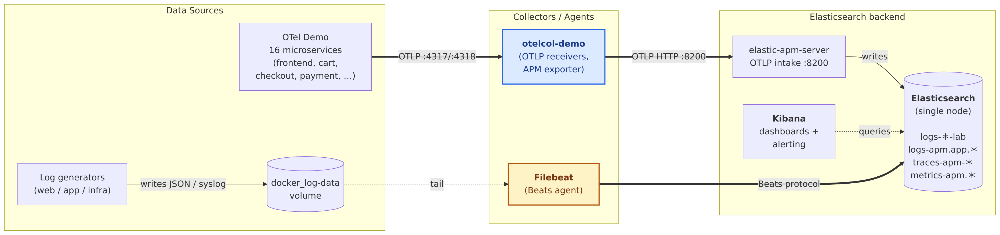
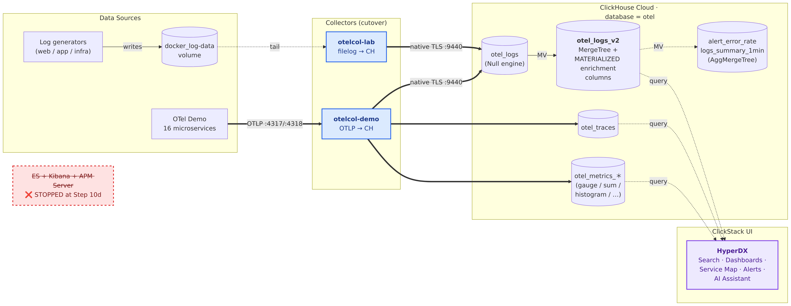

# Observability Migration Lab: Elasticsearch → ClickHouse (ClickStack)

## What You'll Build

In this lab you will migrate a production-realistic Elasticsearch-based observability stack — with data streams, ILM policies, ingest pipelines, and Kibana dashboards — to ClickHouse Cloud using the OpenTelemetry Collector. You will learn how Elasticsearch concepts map to ClickHouse equivalents, design a ClickHouse schema for each log type, validate query parity during a parallel-run period, and finally decommission the Elasticsearch stack entirely.

**Total estimated time:** 4–6 hours (self-paced)
**Audience:** ClickHouse Partner Engineers pursuing the Observability (ClickStack) Competency

> **ClickStack** is the ClickHouse-native observability bundle: ClickHouse for storage + HyperDX for the UI (search, dashboards, alerts, AI Assistant). No separate Grafana or Kibana is required end-to-end.

---

## Prerequisites

Before starting, ensure you have:

| Requirement | Version / Notes |
|---|---|
| **Docker Desktop** | Latest stable. Allocate ≥8 GB RAM to Docker in Preferences → Resources. |
| **Docker Compose** | v2.x (`docker compose version`). Included with Docker Desktop. |
| **Terraform** | ≥ 1.5 ([install](https://developer.hashicorp.com/terraform/install)) — only required for EC2 option |
| **AWS account** | With EC2 + security group permissions — only required for EC2 option |
| **ClickHouse Cloud account** | Free trial is sufficient ([sign up](https://clickhouse.cloud)) — required for Part 3 |
| **ClickHouse CLI** (`clickhouse client`) | **Required for Part 3** — used for schema bootstrap, dictionary loading, and validation queries. [Install instructions](https://clickhouse.com/docs/en/integrations/sql-clients/cli) |
| **curl** + **jq** | Used in validation scripts. Pre-installed on most systems. |

---

## Architecture

The lab progresses through four infrastructure states (matching Part 3's stepwise progression):

| State | Description | Lab Reference |
|---|---|---|
| **Source Environment** | Elasticsearch + Kibana + Filebeat + Elastic APM Server + OTel Demo collector (dual-output to APM) running with realistic data | Part 1 |
| **Target Provisioned** | ClickHouse Cloud service created, schema + dictionaries + materialized views deployed; no data flowing yet | Part 3, Steps 1–2 |
| **Parallel Run** | Both collectors dual-write — file-based logs flow to **ES *and* ClickHouse** (via `otelcol-lab`); OTLP traffic flows to **APM Server *and* ClickHouse** (via `otelcol-demo` parallel-run config). Validation script confirms parity. | Part 3, Steps 3–9 |
| **Cutover Complete** | Elasticsearch + Kibana + APM Server stopped; collectors swapped to ClickHouse-only configs; HyperDX is the sole UI for logs, traces, metrics, and alerts | Part 3, Step 10 |

A detailed rendering of the parallel-run wiring lives at [part3/diagrams/step3-architecture.png](part3/diagrams/step3-architecture.png).

### Source Environment (Elasticsearch)



The OTel Demo's 16 microservices push OTLP into `otelcol-demo`, which forwards to Elastic APM Server. Filebeat ships file-based logs from the log generators directly into Elasticsearch's `logs-*-lab` data streams. Kibana provides the dashboards and alerting rules.

### Target Environment (ClickHouse Cloud + HyperDX)

After Step 10 of Part 3, the entire Elasticsearch + Kibana + APM-Server stack is shut down; ClickHouse Cloud is the sole backend and HyperDX is the sole UI.



Both collectors swap to their `.cutover` configs at Step 10 — `otelcol-lab` writes directly into the `otel.otel_logs` Null table (with a Materialized View enriching rows into `otel_logs_v2`), and `otelcol-demo` writes logs / traces / metrics straight to their respective `otel.otel_*` MergeTree tables. HyperDX queries the same `otel` database for search, dashboards, the Service Map, alerts, and the AI Assistant.

> **Mid-migration view (parallel run):** for a detailed picture of the Part 3 parallel-run state — where both collectors dual-write to ES *and* ClickHouse — see [part3/diagrams/step3-architecture.png](part3/diagrams/step3-architecture.png).

### Re-rendering the diagrams

The PNGs above and inside `part3/diagrams/` are committed to the repo for offline viewing, but the Mermaid sources are the source of truth. Edit any `.mmd` file in `common/diagrams/` or `part3/diagrams/`, then re-render with the matching `render.sh` (uses `minlag/mermaid-cli` via Docker — no Node/npm install required):

```bash
bash common/diagrams/render.sh        # root-README architecture diagrams
bash part3/diagrams/render.sh         # parallel-run architecture diagram
```

---

## Lab Structure

| Part | Title | Duration | Description |
|---|---|---|---|
| [Part 1](part1/) | Source Environment Setup | 20–30 min | Stand up Elasticsearch with realistic observability data flowing through it |
| [Part 2](part2/) | Architectural Analysis | 60–90 min | Inspect the source environment, map ES concepts to ClickHouse, write a migration ADR |
| [Part 3](part3/) | Migration Execution | 2–3 hours | Provision ClickHouse Cloud, run parallel write, validate, cut over, showcase new capabilities |
| [Part 4](part4/) | Knowledge Validation | 60–90 min | Assessment questions to confirm understanding of migration concepts and design decisions |

---

## Getting Started

Start with **[Part 1 →](part1/README.md)**

---

## Cleanup

When you have finished the lab (or want to start over), tear down all resources:

```bash
bash common/cleanup.sh
```

The cleanup script removes Docker containers and volumes for both the source and target stacks, and optionally destroys Terraform-provisioned EC2 resources.
