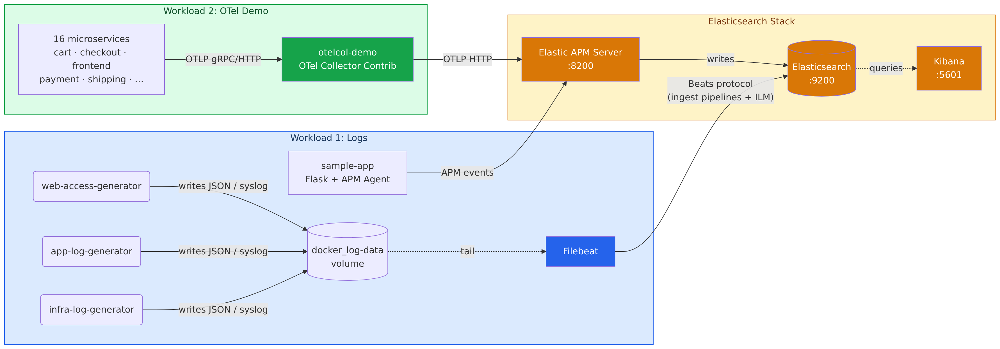

# Part 1: Source Environment Setup
**Estimated time: 20–30 minutes**

## Overview

Stand up a production-realistic Elasticsearch observability stack with **two distinct workloads** — so you have a realistic "before" state with multiple migration paths to analyze in Parts 2–3.

- **Workload 1**: Filebeat-based log collection — three log generators (web access, application, infrastructure) feeding Elasticsearch data streams via Filebeat and ingest pipelines.
- **Workload 2**: OpenTelemetry Demo (Astronomy Shop) — 16 microservices (Go, Java, .NET, Python, Rust, Node.js, PHP, Ruby) instrumented with OTel SDKs, sending traces/metrics/logs through an OTel Collector to Elastic APM Server.



## What You'll Have at the End

- Elasticsearch 8.15 running with security disabled (lab mode), receiving ~300 events/minute across 3 data streams (Workload 1)
- Kibana 8.15 with 6 pre-built dashboards: Web Traffic Overview, Application Health, Infrastructure Overview, OTel Demo — APM Traces, OTel Demo — Latency, OTel Demo — Logs
- Filebeat 8.15 collecting logs from 3 generators: web access (JSON), application (JSON), and infrastructure (syslog)
- Elastic APM Server 8.15 receiving OTLP traces from both the sample Flask app and the full OTel Demo stack
- 4 active ingest pipelines performing geoip enrichment, user-agent parsing, grok extraction, and scripted field normalization
- An ILM policy (`lab-observability-policy`) managing hot/warm/delete lifecycle on all 3 data streams
- OTel Demo storefront accessible at [http://localhost:8090](http://localhost:8090) with 15+ instrumented microservices generating continuous traffic
- All validation checks passing: `bash validation/check.sh`

---

## Prerequisites

| Requirement | Version | Notes |
|---|---|---|
| Docker Engine | ≥24.0 | Included in Docker Desktop 4.x |
| Docker Compose | ≥2.20 | Bundled with Docker Desktop; `docker compose version` to check |
| Available RAM | ≥16 GB (32 GB recommended) | Workload 1 ~3 GB + OTel Demo ~9 GB = ~12 GB total |
| Disk space | ≥5 GB free | For images + data volumes |

> **Note:** For Option B (EC2), you also need Terraform ≥1.5 and an AWS account with an EC2 key pair. See [Step B.1](#step-b1-copy-the-variables-template) for details.

---

## Choosing Your Environment

Pick the option that matches your setup:

| Option | Best for | Requirements |
|---|---|---|
| **Option A — Local (Docker Compose)** | Mac/Linux with 16 GB RAM available, Windows WSL2 | Docker Desktop, 16 GB RAM free |
| **Option B — EC2 (Terraform + Docker Compose)** | AWS environments, insufficient local resources, teams sharing one instance | AWS account, Terraform ≥1.5, SSH key pair |

Both options use the same compose files and produce an identical running environment. The only difference is where the containers run.

---

## Option A: Local (Docker Compose)

### Step A.1: Set the required kernel parameter (Linux and WSL2 only)

Elasticsearch requires `vm.max_map_count=262144` to avoid OOM failures. **macOS users skip this step** — Docker Desktop sets this internally.

**Linux:**

```bash
sudo sysctl -w vm.max_map_count=262144
```

To persist across reboots:

```bash
echo "vm.max_map_count=262144" | sudo tee -a /etc/sysctl.conf
```

**WSL2 (Windows):**

```bash
# Run in WSL2 terminal
sudo sysctl -w vm.max_map_count=262144
```

> **Verify:** `sysctl vm.max_map_count` should output `vm.max_map_count = 262144`.

### Step A.2: Start Workload 1 (Elasticsearch stack)

```bash
cd docker
docker compose -f docker-compose.source.yml up -d --build
```

Expected output (containers starting up):

```
[+] Running 10/10
 ✔ Network docker_default       Created
 ✔ Container elasticsearch      Started
 ✔ Container kibana             Started
 ✔ Container elastic-apm-server Started
 ✔ Container es-bootstrap       Started
 ✔ Container filebeat           Started
 ✔ Container log-generator-web  Started
 ✔ Container log-generator-app  Started
 ✔ Container log-generator-infra Started
 ✔ Container sample-app         Started
```

Allow 2–3 minutes for Elasticsearch to fully start and for the bootstrap container to finish configuring data streams, ILM policies, ingest pipelines, and Kibana dashboards.

### Step A.3: Start Workload 2 (OpenTelemetry Demo)

> **Note:** Workload 2 requires ~9 GB RAM for 16 microservices. Run this after Workload 1 is healthy.

From the same `docker/` directory, add the OTel Demo services to the existing network:

```bash
docker compose -f docker-compose.source.yml -f docker-compose.otel-demo.yml up -d
```

> **How it works:** Both compose files share the same Docker Compose project and network. The `otelcol-demo` container collects all signals from the demo microservices and forwards them to the `elastic-apm-server` container started by Workload 1.

This pulls ~1.5 GB of OTel Demo images on first run. Allow 3–5 minutes for all services to become healthy.

### Step A.4: Monitor the bootstrap

The `es-bootstrap` container creates all data streams, ILM policies, ingest pipelines, composable index templates, and imports Kibana dashboards. Watch it complete:

```bash
docker compose -f docker-compose.source.yml logs -f es-bootstrap
```

Expected final output when the bootstrap is complete:

```
es-bootstrap  | ILM policy created.
es-bootstrap  | ...
es-bootstrap  | Dashboards imported.
es-bootstrap  | Bootstrap complete!
```

Press `Ctrl+C` to stop following logs.

### Step A.5: Verify data is flowing

Check Elasticsearch cluster health:

```bash
curl -s http://localhost:9200/_cluster/health | python3 -m json.tool
```

Expected: `"status": "green"` or `"status": "yellow"` (yellow is normal for a single-node cluster).

Check that all 3 data streams exist and have documents:

```bash
curl -s http://localhost:9200/_data_stream/logs-* | python3 -m json.tool | grep '"name"'
```

Expected output:

```json
"name": "logs-application-lab"
"name": "logs-infrastructure-lab"
"name": "logs-web_access-lab"
```

Check document counts across all data streams:

```bash
curl -s "http://localhost:9200/logs-*/_count" | python3 -m json.tool
```

After 2–3 minutes of data generation, you should see `"count"` in the thousands. If it shows 0, the log generators may still be warming up — wait 1 minute and retry.

Check all 4 ingest pipelines exist:

```bash
curl -s "http://localhost:9200/_ingest/pipeline/web-access-enrichment,app-log-enrichment,infra-log-parsing,default-enrichment" \
  | python3 -m json.tool | grep -E '"web-access|app-log|infra-log|default-enrich"'
```

### Step A.6: Access the OTel Demo storefront

Once Workload 2 is running (3–5 minutes after Step A.3), open the astronomy shop:

- **Storefront:** [http://localhost:8090](http://localhost:8090)
- **Load generator UI:** [http://localhost:8090/loadgen](http://localhost:8090/loadgen) (shows Locust traffic stats)
- **Feature flags:** [http://localhost:8090/feature](http://localhost:8090/feature) (enable chaos engineering)

> **Verify:** You should see the Astronomy Shop storefront. The load generator sends ~5 concurrent users automatically — you will see APM traces appear in Kibana within 1–2 minutes.

To check APM data is flowing to Elasticsearch:

```bash
curl -s "http://localhost:9200/traces-apm-*/_count" | python3 -m json.tool
```

Expected: `"count"` growing above 0 within 2 minutes.

---

## Option B: EC2 (Terraform)

The Terraform configuration in `terraform/` provisions a `t3.2xlarge` EC2 instance (8 vCPU / 32 GB RAM), installs Docker and Docker Compose via user-data, sets `vm.max_map_count=262144` automatically, clones the lab repository, and starts **Workload 1** (the Elasticsearch stack). You do not need to set the kernel parameter manually. You will start Workload 2 (the OpenTelemetry Demo) yourself in Step B.4 after Workload 1 is healthy — the t3.2xlarge is sized for both.

### Step B.1: Copy the variables template

```bash
cd terraform
cp terraform.tfvars.example terraform.tfvars
```

Open `terraform.tfvars` and fill in your values:

```hcl
aws_region       = "us-east-1"          # AWS region to deploy in
instance_type    = "t3.2xlarge"         # 8 vCPU / 32 GB; required for dual-workload stack
ssh_key_name     = "my-key-pair"        # Name of your EC2 key pair in AWS (without .pem extension)
allowed_ssh_cidr = "0.0.0.0/0"         # Restrict to your IP for security: "x.x.x.x/32"
lab_repo_url     = "https://github.com/ClickHouse/clickhouse-partner-labs.git"
```

> **Where to find `ssh_key_name`:** AWS Console → EC2 → Key Pairs. The name shown there (without `.pem`) is what goes here.

> **Finding your IP:** Run `curl -s ifconfig.me` to get your public IP, then use `<YOUR_IP>/32` as `allowed_ssh_cidr`.

### Step B.2: Initialize and apply

```bash
terraform init
terraform plan
terraform apply
```

Review the plan output, then type `yes` when prompted. Provisioning takes approximately 2–3 minutes.

Example output on success:

```
Apply complete! Resources: 5 added, 0 changed, 0 destroyed.

Outputs:

elasticsearch_url    = "http://54.198.12.34:9200"
instance_public_dns  = "ec2-54-198-12-34.compute-1.amazonaws.com"
instance_public_ip   = "54.198.12.34"
kibana_url           = "http://54.198.12.34:5601"
ssh_command          = "ssh -i ~/.ssh/my-key-pair.pem ec2-user@54.198.12.34"
```

### Step B.3: Connect and watch the startup

Get the SSH command from Terraform output and connect:

```bash
# Get the exact SSH command
terraform output ssh_command

# Connect (replace with the actual output from above)
ssh -i ~/.ssh/<key-name>.pem ec2-user@<EC2_PUBLIC_IP>
```

Once connected, first check whether the EC2 user-data script has already started the stack for you:

```bash
cd ~/lab/partner_labs/02-elasticsearch-migration-lab/part1/docker
docker compose -f docker-compose.source.yml ps
```

- **If you see containers listed** (`elasticsearch`, `kibana`, `elastic-apm-server`, etc.) — user-data ran `docker compose up -d` automatically on first boot. Skip ahead.
- **If you see nothing** — user-data is either still running, hasn't started yet, or failed. Wait 60–90 seconds, retry the `ps` command, and if it's still empty, start the stack yourself:

```bash
docker compose -f docker-compose.source.yml up -d
```

Then follow the bootstrap container's logs to confirm initialization completes:

```bash
docker compose -f docker-compose.source.yml logs -f es-bootstrap
```

Expected final line: `es-bootstrap | [INFO] Bootstrap complete!`

Press `Ctrl-C` to stop following once you see it.

### Step B.4: Start Workload 2 (OpenTelemetry Demo)

> **Note:** Workload 2 requires ~9 GB RAM for 16 microservices. Run this only after Workload 1 is healthy and the `es-bootstrap` container has finished (Step B.3).

From the same `docker/` directory inside the SSH session, add the OTel Demo services to the existing network:

```bash
docker compose -f docker-compose.source.yml -f docker-compose.otel-demo.yml up -d
```

> **How it works:** Both compose files share the same Docker Compose project and network. The `otelcol-demo` container collects all signals from the demo microservices and forwards them to the `elastic-apm-server` container started by Workload 1.

This pulls ~1.5 GB of OTel Demo images on first run. Allow 3–5 minutes for all services to become healthy.

### Step B.5: Verify from the EC2 instance

Run these commands from inside the SSH session using `localhost`. From outside the EC2 instance, the security group restricts ports 9200 and 5601 to your allowed CIDR only — they are not open to the broader internet:

```bash
# Cluster health
curl -s http://localhost:9200/_cluster/health | python3 -m json.tool

# Data streams
curl -s http://localhost:9200/_data_stream/logs-* | python3 -m json.tool | grep '"name"'

# Document counts
curl -s "http://localhost:9200/logs-*/_count" | python3 -m json.tool
```

Confirm Workload 2 containers are running and APM traces are flowing:

```bash
# OTel demo containers (should list 16+ services like frontend, cartservice, otelcol-demo, etc.)
docker compose -f docker-compose.source.yml -f docker-compose.otel-demo.yml ps

# APM trace count (should be > 0 and growing 2 minutes after Workload 2 starts)
curl -s "http://localhost:9200/traces-apm-*/_count" | python3 -m json.tool
```

You can also run the ES verification from your laptop using the public IP from `terraform output`:

```bash
curl -s http://<EC2_PUBLIC_IP>:9200/_cluster/health | python3 -m json.tool
```

> **Note on the OTel storefront UI:** The Astronomy Shop UI (port 8090) is not exposed in the default security group. To access it from your laptop, either open port 8090 in `terraform/main.tf` (and re-apply), or use SSH port-forwarding: `ssh -i ~/.ssh/<key-name>.pem -L 8090:localhost:8090 ec2-user@<EC2_PUBLIC_IP>`, then visit [http://localhost:8090](http://localhost:8090).

---

## Step 1.6: Open Kibana (both options)

### Accessing Kibana

- **Local:** [http://localhost:5601](http://localhost:5601)
- **EC2:** `http://<EC2_PUBLIC_IP>:5601` (use the IP from `terraform output kibana_url`)

Kibana may show a loading screen for 30–60 seconds on first access while it initializes.

### Navigating to the dashboards

1. In the Kibana left sidebar, click **Analytics** → **Dashboards**
2. You should see 4 dashboards:
   - **Web Traffic Overview** — request rates, status codes, geographic distribution
   - **Application Health** — log volume by severity, error tracking
   - **Infrastructure Overview** — syslog volume by host, top processes
   - **OTel Demo — APM Traces** — trace volume and top services (appears after Workload 2 starts)
3. Click **Web Traffic Overview** and set the time range to **Last 15 minutes** (top-right)

> **Verify:** The dashboard should show live data with charts updating. If all panels are empty, wait 2 minutes for the log generators to produce enough data, then refresh.

To view APM traces from the OTel Demo in Kibana, navigate to **Observability** → **APM** → **Services** after Workload 2 is running.

---

## Step 1.7: Run the validation script

Run the validation script to confirm all Part 1 components are healthy before proceeding.

**Local:**

```bash
bash validation/check.sh
```

**EC2 (from your laptop):**

```bash
bash validation/check.sh http://<EC2_IP>:9200 http://<EC2_IP>:5601
```

**EC2 (from inside the SSH session):**

```bash
bash ~/lab/partner_labs/02-elasticsearch-migration-lab/part1/validation/check.sh
```

Expected output when all checks pass (run ~5 minutes after starting both workloads):

```
============================================
 Part 1 Validation — Source Environment
 ES:      http://localhost:9200
 Kibana:  http://localhost:5601
 OTelCol: http://localhost:8888
============================================

[PASS] Elasticsearch is reachable
[PASS] Data streams exist (3 found: logs-web_access-lab, logs-application-lab, logs-infrastructure-lab)
[PASS] ILM policy 'lab-observability-policy' exists
[PASS] Ingest pipeline 'web-access-enrichment' exists
[PASS] Ingest pipeline 'app-log-enrichment' exists
[PASS] Ingest pipeline 'infra-log-parsing' exists
[PASS] Ingest pipeline 'default-enrichment' exists
[PASS] Data stream 'logs-web_access-lab' has data (3,241 docs)
[PASS] Data stream 'logs-application-lab' has data (1,876 docs)
[PASS] Data stream 'logs-infrastructure-lab' has data (2,104 docs)
[PASS] GeoIP enrichment working (country: United States)
[PASS] Kibana is reachable
[PASS] Kibana dashboards imported (4 found)
[PASS] OTel Collector (otelcol-demo) is reachable
[PASS] APM traces indexed from OTel Demo (5,832 spans)
[PASS] OTel Demo storefront reachable at http://localhost:8090

============================================
 Results: 16 passed, 0 failed, 0 skipped
============================================
```

> **Note:** Checks 14–16 (OTel Demo) show `[SKIP]` until Workload 2 is fully started. Run the validation again after 5 minutes.

---

## Troubleshooting

> All commands below assume you are in `part1/docker/` (the same working directory used by the steps above). If you've changed directory, run `cd part1/docker` first.

### 1. Elasticsearch OOM / `vm.max_map_count` too low

**Symptom:** The `elasticsearch` container exits immediately or repeatedly restarts. `docker compose logs elasticsearch` shows:

```
max virtual memory areas vm.max_map_count [65530] is too low, increase to at least [262144]
```

**Fix (Linux / WSL2):**

```bash
sudo sysctl -w vm.max_map_count=262144
# Then restart the container:
docker compose -f docker-compose.source.yml restart elasticsearch
```

**Fix (macOS):** This error should not occur on macOS — Docker Desktop sets this automatically. If you see it, restart Docker Desktop.

---

### 2. Bootstrap fails — Elasticsearch not ready in time

**Symptom:** The `es-bootstrap` container exits with an error like `Connection refused` or `curl: (7) Failed to connect`. This happens if Elasticsearch is slow to start (common on machines under memory pressure).

**Fix:** Restart just the bootstrap container after Elasticsearch is healthy:

```bash
# Wait for Elasticsearch to be fully up
until curl -sf http://localhost:9200/_cluster/health > /dev/null 2>&1; do
  echo "Waiting for Elasticsearch..."; sleep 5
done

# Re-run bootstrap
docker compose -f docker-compose.source.yml restart es-bootstrap

# Watch it complete
docker compose -f docker-compose.source.yml logs -f es-bootstrap
```

---

### 3. GeoIP pipeline shows MISSING country

**Symptom:** The validation script reports `[FAIL] GeoIP enrichment not working — geo.country_name missing from web access docs`, or a manual spot-check shows `"country_name": null`.

**Cause:** Elasticsearch downloads the GeoIP database on first startup. This takes 1–2 minutes. Documents indexed before the database is available are not enriched retroactively.

**Fix:** Wait 2 minutes, then re-run the validation:

```bash
bash validation/check.sh
```

You can confirm the database has loaded:

```bash
curl -s "http://localhost:9200/_ingest/geoip/stats" | python3 -m json.tool | grep '"databases_count"'
```

Expected: `"databases_count": 1` (or more). If it shows `0`, wait another minute and retry.

---

## Checkpoint

Before proceeding to Part 2, verify all of the following:

**Workload 1 (Elasticsearch):**
- [ ] Elasticsearch is healthy: `curl http://localhost:9200/_cluster/health`
- [ ] 3 data streams exist: `curl http://localhost:9200/_data_stream/logs-*`
- [ ] ILM policy is attached: `curl http://localhost:9200/_ilm/policy/lab-observability-policy`
- [ ] Kibana shows dashboards with live data at [http://localhost:5601](http://localhost:5601)

**Workload 2 (OTel Demo):**
- [ ] Storefront loads at [http://localhost:8090](http://localhost:8090)
- [ ] APM traces appear in Kibana: **Observability** → **APM** → **Services** (15+ services visible)
- [ ] `curl http://localhost:9200/traces-apm-*/_count` returns `count > 0`

**Both:**
- [ ] All validation checks pass: `bash validation/check.sh`

---

**Next:** [Part 2: Architectural Analysis →](../part2/README.md)
