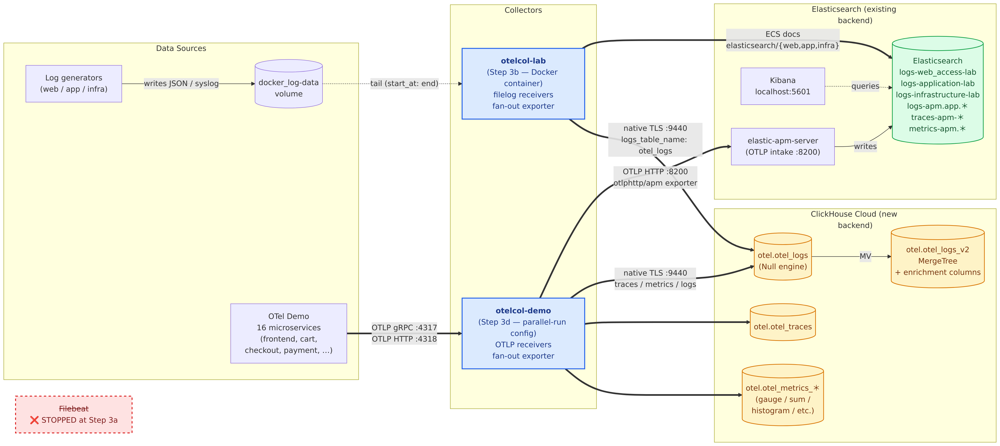

# Part 3: Execute the Migration

**Objective:** Execute the migration plan you developed in Part 2. Deploy an OTel Collector, create optimized ClickHouse tables, configure enrichment via dictionaries, validate parity with the running Elasticsearch environment, then cut over.

**Estimated time:** 120–180 minutes

**Prerequisites:** Parts 1 and 2 complete; the Part 1 Docker environment is running (Elasticsearch, Kibana, log generators, APM Server). Your ClickHouse Cloud account credentials are available.

**Files:**
```
part3/
├── README.md                        ← You are here
├── exercises/
│   ├── setup-checklist.md           ← Fill in as you work through each step
│   └── sql-exercises.md             ← 6 SQL exercises (attempt before checking solutions)
├── solutions/
│   └── sql-exercises-solution.md   ← Model answers (don't peek until you've tried!)
├── clickhouse/
│   ├── schema.sql                   ← All DDL (run first)
│   ├── dictionaries.sql             ← GeoIP dictionary DDL
│   ├── geoip-sample-data.csv        ← ~400 CIDR rows (no MaxMind account needed)
│   ├── alert-tables.sql             ← Alert pre-computation + summary MVs
│   └── validation-queries.sql       ← Spot-checks and parity queries
├── configs/
│   ├── otel-collector-config.parallel.yaml ← File-based log collector — parallel run (CH + ES dual-write)
│   ├── otel-collector-config.cutover.yaml  ← File-based log collector — cutover (CH only)
│   ├── otelcol-demo-config.parallel.yml    ← OTel Demo collector — parallel run (APM + CH)
│   └── otelcol-demo-config.cutover.yml     ← OTel Demo collector — cutover (CH only)
├── docker/
│   ├── docker-compose.otel-demo.parallel.yml  ← Compose override for parallel-run swap
│   └── docker-compose.otel-demo.cutover.yml   ← Compose override for cutover swap
├── diagrams/
│   ├── step3-architecture.mmd       ← Mermaid source — post-Step-3 architecture
│   ├── step3-architecture.png       ← Rendered PNG embedded in Step 3
│   └── render.sh                    ← Re-render *.mmd → *.png via Docker (mermaid-cli)
├── hyperdx-guide.md                 ← Step 5 walk-through: ClickStack UI, sources, search, AI Assistant
├── images/
│   └── *.png                        ← Screenshots referenced by hyperdx-guide.md
└── scripts/
    ├── swap-otelcol-demo-config.sh  ← Swap otelcol-demo config (parallel|cutover)
    ├── validate_migration.sh        ← Automated parity check
    └── validate_enrichment.sh       ← Enrichment column verification
```

---

## Step 1: Provision ClickHouse Cloud

1. Sign up at [clickhouse.cloud](https://clickhouse.cloud) (free trial — **Basic** tier is sufficient for this lab)
2. Create a new service — **Basic** tier is sufficient for this lab
3. Note your connection details: **host**, **password** (user is `default`, port is `9440` for native TLS)
4. Test connectivity:

```bash
clickhouse client \
    --host <your-host>.clickhouse.cloud \
    --port 9440 \
    --user default \
    --password <your-password> \
    --secure \
    --query "SELECT version()"
```

> **ClickHouse Cloud architecture note:** Unlike Elasticsearch, ClickHouse Cloud stores all data on object storage (S3/GCS) with automatic local caching. There is no concept of hot/warm/cold node tiers — the query engine fetches and caches data transparently. This means the entire ES ILM hot→warm→cold machinery has no equivalent in ClickHouse Cloud. You only need TTL-based deletion, which you'll configure in Step 2.

Set environment variables for the rest of the lab:

```bash
# Copy and fill in once, then source before every session
cp ../common/env.sh.example ../common/env.sh
# edit ../common/env.sh with your CH_HOST and CH_PASSWORD (from Cloud console → Connect → Native protocol)
source ../common/env.sh
```

---

## Step 2: Create Target Tables and Dictionaries

> **Database:** All Part 3 objects (tables, dictionaries, materialized views) live in a dedicated `otel` database — created automatically by `dictionaries.sql` and `schema.sql` via `CREATE DATABASE IF NOT EXISTS otel`. This keeps the lab's tables isolated from anything else in your service. Every collector config, validation script, and HyperDX source in this part is pre-configured to point at `otel`.

> **Run order:** GeoIP dictionaries (Step 2a) must be created **before** the target tables (Step 2b) because `otel_logs_v2` has MATERIALIZED columns that reference `otel.geoip_country` and `otel.geoip_city`. ClickHouse validates dictionary references at `CREATE TABLE` time.

### 2a. Load GeoIP data and create dictionaries

```bash
# 1. Create the otel database, geoip_data source table, and empty dictionaries
#    (the table must exist before you can INSERT into it)
clickhouse client \
    --host ${CH_HOST} --port 9440 \
    --user default --password ${CH_PASSWORD} --secure \
    < clickhouse/dictionaries.sql

# 2. Load sample data into the source table (note: --database otel)
clickhouse client \
    --host ${CH_HOST} --port 9440 \
    --user default --password ${CH_PASSWORD} --secure \
    --database otel \
    --query "INSERT INTO geoip_data FORMAT CSVWithNames" \
    < clickhouse/geoip-sample-data.csv

# 3. Reload dictionaries — they were created with an empty table; force reload now
clickhouse client \
    --host ${CH_HOST} --port 9440 \
    --user default --password ${CH_PASSWORD} --secure \
    --query "SYSTEM RELOAD DICTIONARY otel.geoip_country"
clickhouse client \
    --host ${CH_HOST} --port 9440 \
    --user default --password ${CH_PASSWORD} --secure \
    --query "SYSTEM RELOAD DICTIONARY otel.geoip_city"

# 4. Verify
clickhouse client \
    --host ${CH_HOST} --port 9440 \
    --user default --password ${CH_PASSWORD} --secure \
    --query "SELECT dictGet('otel.geoip_country', 'country', toIPv4('8.8.8.8'))"
# Expected: United States
```

> **Teaching point:** In Elasticsearch, the `geoip` processor is a built-in black box — you enable it and it works. In ClickHouse, you use a dictionary backed by the same MaxMind data, giving you full control over the data source, refresh interval, and lookup behavior. The `IP_TRIE` layout is purpose-built for CIDR range lookups: `dictGet()` performs a longest-prefix match over the IP range table in microseconds.

### 2b. Create tables and materialized view

```bash
clickhouse client \
    --host ${CH_HOST} --port 9440 \
    --user default --password ${CH_PASSWORD} --secure \
    < clickhouse/schema.sql
```

This creates nine objects:

| Object | Type | Purpose |
|--------|------|---------|
| `otel_logs` | Null engine | OTel Collector ingestion target; stores nothing |
| `otel_logs_v2` | MergeTree | Where data actually lives, with enrichment columns |
| `otel_logs_mv` | Materialized View | Routes `otel_logs → otel_logs_v2` with transformations |
| `otel_traces` | MergeTree | OTel trace spans |
| `otel_metrics_gauge` | MergeTree | OTel gauge metrics (replaces APM server as metrics backend) |
| `otel_metrics_sum` | MergeTree | OTel sum/counter metrics |
| `otel_metrics_histogram` | MergeTree | OTel histogram metrics |
| `otel_metrics_exponentialhistogram` | MergeTree | OTel exponential histogram metrics |
| `otel_metrics_summary` | MergeTree | OTel summary metrics |

**Why the Null → MV → target pattern?**

The Null engine accepts inserts but discards the data immediately. The attached MV fires on every insert and writes *transformed* rows to `otel_logs_v2`. This avoids storing data twice: the OTel Collector writes raw OTel schema to `otel_logs`, and only the enriched, optimized rows land in `otel_logs_v2`.

**Materialized columns replace every ES ingest pipeline processor:**

| ES processor | ClickHouse equivalent |
|---|---|
| `geoip` | `GeoCountry`, `GeoCity` MATERIALIZED via `dictGetOrDefault('otel.geoip_country', ...)` |
| `user_agent` | `BrowserFamily`, `OSFamily`, `IsBot` MATERIALIZED via `regexpExtract` / `position` |
| `script` (severity derivation) | `DerivedSeverity` MATERIALIZED via `multiIf(StatusCode >= 500, 'critical', ...)` |
| `grok`/`dissect` (field extraction) | `RequestType`, `RequestPath`, `RequestPage`, `HostName` MATERIALIZED from `LogAttributes['key']` |
| default-enrichment (`event.ingested`) | `IngestTime` DEFAULT `now()` |

### 2c. Create alert pre-computation and summary tables

```bash
clickhouse client \
    --host ${CH_HOST} --port 9440 \
    --user default --password ${CH_PASSWORD} --secure \
    < clickhouse/alert-tables.sql
```

This creates:
- `alert_error_rate` + `alert_error_rate_mv` — pre-computes 5xx rate per minute at insert time
- `logs_summary_1min` + `logs_summary_1min_mv` — AggregatingMergeTree rollup (replacement for ES transforms)

---

## Step 3: Deploy and Configure the OTel Collector

### Target architecture

By the end of this step, you will have transitioned from the Part 1 baseline (Filebeat → ES, otelcol-demo → APM only) to a **parallel run** in which two OTel Collectors fan out every signal to **both** the existing Elasticsearch stack and ClickHouse Cloud:



What changes in this step:
- **3a:** stop Filebeat (in red, lower-left in the diagram).
- **3b–3c:** start `otelcol-lab` (file-based collector) — tails the same log files Filebeat used to read, and dual-writes to ES (`logs-{web_access,application,infrastructure}-lab`) and ClickHouse (`otel.otel_logs` → MV → `otel.otel_logs_v2`).
- **3d:** swap `otelcol-demo` to its parallel-run config so the 16 OTel Demo services' OTLP traffic also fans out to both backends (APM Server + ClickHouse).

> Diagram source: [`diagrams/step3-architecture.mmd`](diagrams/step3-architecture.mmd). To re-render after edits, run `bash diagrams/render.sh` (uses `minlag/mermaid-cli` via Docker, no Node/npm required).

### 3a. Stop Filebeat

The OTel Collector you're about to start tails the same log files Filebeat is tailing **and** writes to the same ES data streams (`logs-web_access-lab`, `logs-application-lab`, `logs-infrastructure-lab`) **as well as** ClickHouse. If both Filebeat and the OTel Collector are running, every log line gets indexed twice in ES — the literal "dual-write to the same destination" problem.

Stop Filebeat so the OTel Collector becomes the single producer for those data streams:

```bash
docker compose -f ../part1/docker/docker-compose.source.yml stop filebeat
docker compose -f ../part1/docker/docker-compose.source.yml ps filebeat
# Should show: filebeat ... exited
```

> Elasticsearch, Kibana, log generators, and APM Server remain running. Only Filebeat stops. The OTel Collector takes over both backends: it ships every log line to ClickHouse (the new backend) **and** to Elasticsearch (the existing data streams), so parity comparisons remain meaningful throughout the parallel run. At cutover (Step 10a), the ES exporters get removed from the config.

### 3b. Run the OTel Collector

The log files live inside the Docker named volume `docker_log-data`. On **macOS** (and any environment where log files are inside Docker volumes), run the collector as a Docker container so it can access that volume directly:

```bash
# macOS / Docker volume approach (recommended)
docker run -d \
  --name otelcol-lab \
  --restart unless-stopped \
  --network docker_default \
  -v docker_log-data:/var/log/generators:ro \
  -v "$(pwd)/configs/otel-collector-config.parallel.yaml:/etc/otelcol-contrib/config.yaml:ro" \
  -e CH_HOST="${CH_HOST}" \
  -e CH_PASSWORD="${CH_PASSWORD}" \
  otel/opentelemetry-collector-contrib:0.146.1
```

> **Note on `dial_timeout`:** Both [otel-collector-config.parallel.yaml](configs/otel-collector-config.parallel.yaml) and [otel-collector-config.cutover.yaml](configs/otel-collector-config.cutover.yaml) set `dial_timeout=60s` on the ClickHouse endpoint URI to give the cold-start handshake enough time before the first restart kicks in. If you're on a self-hosted CH where startup is instant, you can lower this back to `10s`.

> **Linux host with direct volume access:** If you are running on Linux and have direct access to the log files on the host (not inside Docker volumes), you can use the binary instead:
>
> ```bash
> wget https://github.com/open-telemetry/opentelemetry-collector-releases/releases/download/v0.146.1/otelcol-contrib_0.146.1_linux_amd64.tar.gz
> tar -xzf otelcol-contrib_0.146.1_linux_amd64.tar.gz
> CH_HOST=${CH_HOST} CH_PASSWORD=${CH_PASSWORD} ./otelcol-contrib --config configs/otel-collector-config.parallel.yaml
> ```

### 3c. Verify startup

```bash
docker logs otelcol-lab --tail=10
```

Healthy output looks like:
```
info  Everything is ready. Begin running and processing data.
info  Started watching file  path=/var/log/generators/web-access-api-gateway.log
```

**Key config decisions in `configs/otel-collector-config.parallel.yaml` (file-based log collector — parallel-run variant):**
- **Dual-write fan-out**: every pipeline lists `[clickhouse, elasticsearch/<stream>]` so each log line is shipped to both backends during the parallel run. Step 10a removes the ES exporters at cutover.
- **One ES exporter per data stream** (`elasticsearch/web` → `logs-web_access-lab`, `elasticsearch/app` → `logs-application-lab`, `elasticsearch/infra` → `logs-infrastructure-lab`) so each pipeline writes to the same data stream Filebeat was previously writing to.
- `mapping.mode: ecs` on the ES exporters — converts OTel-format records (`Body`, `Attributes`, ...) to ECS-shaped documents that match what Filebeat used to send, so the data stream's component templates accept them.
- `create_schema: false` on the CH exporter — we already created our own optimized tables; don't let the exporter create its default schema.
- `logs_table_name: otel_logs` — writes to the Null table, which triggers the MV to `otel_logs_v2`.
- `compress=lz4` in the CH endpoint — LZ4 compression over the wire; ClickHouse Cloud decompresses on receipt.

> **Note:** The lab collector deployed above handles only file-based logs (web/app/infra). The 16 OTel Demo services emit OTLP into a *second* collector (`otelcol-demo`) that was provisioned in Part 1 and currently forwards everything to APM Server. Step 3d below swaps it to a dual-write config without editing the Part 1 baseline file.

### 3d. Swap `otelcol-demo` to parallel-run config (dual-write to APM + ClickHouse)

The `otelcol-demo` container started in Part 1 forwards OTLP traces/metrics/logs to APM Server only. To run in parallel, swap it to a Part 3 config that fans out to both APM and ClickHouse:

```bash
source ../common/env.sh   # CH_HOST, CH_PASSWORD must be set
bash scripts/swap-otelcol-demo-config.sh parallel
```

This recreates the container using `docker compose -f ... -f docker/docker-compose.otel-demo.parallel.yml up -d --force-recreate --no-deps otelcol-demo`. The Part 1 config file is **not modified** — the override mounts a Part 3 config at a different container path and overrides `command:` to load it.

Verify it started cleanly:
```bash
docker logs "$(docker ps -qf name=otelcol-demo)" --tail=10
# Expected: "Everything is ready. Begin running and processing data."
# No "Failed to start component" or "connection refused" errors.
```

> **Why a swap instead of editing the Part 1 file in place?** Editing `part1/docker/configs/otelcol-demo-config.yml` directly would mutate the baseline, so a future `cleanup.sh && start from Part 1` lands you on a config that already requires `CH_HOST`/`CH_PASSWORD`. The swap pattern keeps Part 1 self-contained and reproducible.

---

## Step 4: Validate the Parallel Run

Wait **at least 5 minutes** for data to accumulate, then run the automated validation script:

```bash
bash scripts/validate_migration.sh
```

The script checks:
- Row counts in ClickHouse vs. Elasticsearch (within 5% tolerance for recent data)
- GeoCountry enrichment coverage ≥ 20% (sample data; full MaxMind dataset gives >90%)
- Dictionary status (both `LOADED`)
- Alert and summary MVs are populating
- Metrics tables (`otel_metrics_sum`) are receiving data from the OTel Demo collector
- TTL is configured

For a detailed look at enrichment quality:

```bash
bash scripts/validate_enrichment.sh
```

**Manual parity check — Top 10 request paths:**

Run this in Elasticsearch:
```bash
curl -s "http://localhost:9200/logs-web_access-lab/_search" \
    -H "Content-Type: application/json" \
    -d '{"size":0,"aggs":{"top_paths":{"terms":{"field":"request_path.keyword","size":10}}}}' \
    | jq '.aggregations.top_paths.buckets'
```

Run this in ClickHouse:
```sql
SELECT RequestPage AS path, count() AS c
FROM otel_logs_v2
WHERE RequestType != ''
GROUP BY path
ORDER BY c DESC
LIMIT 10;
```

The top paths and their relative rankings should match.

---

## Step 5: Explore Your Data in HyperDX (ClickStack UI)

HyperDX is the built-in observability UI for ClickStack — bundled with every ClickHouse Cloud service. In this step you'll launch HyperDX, wire it to the `otel` database, and confirm logs / traces / metrics are queryable through the UI.

**→ Follow the step-by-step guide with screenshots: [hyperdx-guide.md](hyperdx-guide.md)**

The guide covers:

| | |
|---|---|
| **A. Launch ClickStack** | Open HyperDX from the Cloud console sidebar |
| **B. Create three data sources** | Bind HyperDX to `otel.otel_traces`, `otel.otel_logs_v2`, and the five `otel.otel_metrics_*` tables |
| **C. Search live logs** | Confirm data is flowing, use facets and full-text search |
| **D. Build a chart with the AI Assistant** | Translate natural language ("Error count by services for past 2 hours") into a working chart |

> **Teaching point:** HyperDX's Service Map, full-text search, and AI Assistant all run directly against the `otel.*` MergeTree tables — no separate index, no rollups, no resharding. The same operational use cases you covered in the Kibana dashboards from Part 1 are available here, but the underlying queries can also be written ad-hoc as SQL (see Step 9 SQL exercises) — something Kibana never offered.

---

## Step 6: Verify Data Lifecycle (TTL)

TTL is already configured in the `schema.sql` DDL. Verify it's in place:

```sql
SELECT name, extractAll(create_table_query, 'TTL[^\\n]+') AS ttl_clauses
FROM system.tables
WHERE database = 'otel'
  AND name IN ('otel_logs_v2', 'otel_traces',
               'otel_metrics_gauge', 'otel_metrics_sum', 'otel_metrics_histogram',
               'otel_metrics_exponentialhistogram', 'otel_metrics_summary');
```

Check partition sizes and age:

```sql
SELECT
    partition,
    sum(rows)                              AS total_rows,
    formatReadableSize(sum(bytes_on_disk)) AS disk_size,
    min(min_time)                          AS oldest_data,
    max(max_time)                          AS newest_data
FROM system.parts
WHERE database = 'otel' AND table = 'otel_logs_v2' AND active
GROUP BY partition
ORDER BY partition;
```

> **Teaching point: Why ILM becomes one line of DDL**
>
> In Part 1, you configured a 3-phase ILM policy: rollover at 5GB/1d (hot), shrink + forcemerge at 2d (warm), delete at 30d. This required hot/warm node roles, shard allocation awareness, and ILM policy JSON.
>
> In ClickHouse Cloud, the entire machinery collapses to one clause in the CREATE TABLE:
> ```sql
> TTL TimestampDate + INTERVAL 30 DAY DELETE
> SETTINGS ttl_only_drop_parts = 1
> ```
>
> - **Rollover:** Not needed. ClickHouse uses a single table with date-based partitions.
> - **Warm phase (shrink + forcemerge):** Not needed. The MergeTree engine merges parts automatically.
> - **Hot/warm/cold tiering:** Not needed. ClickHouse Cloud stores all data on object storage with automatic caching. There are no node roles.
> - **Delete phase:** Replicated exactly by `TTL ... DELETE`. `ttl_only_drop_parts = 1` drops entire partitions (the partition boundary is one day) — far more efficient than row-by-row deletion.

---

## Step 7: Aggregation Summary Table (Replaces ES Transforms)

The `logs_summary_1min` table (created in Step 2c) is an `AggregatingMergeTree` that stores partial aggregation states. Query it with `-Merge` combinators:

```sql
SELECT
    minute,
    ServiceName,
    SeverityText,
    countMerge(count)                           AS total_events,
    avgMerge(avg_run_time)                      AS avg_run_time_ms,
    quantileMerge(0.99)(p99_run_time)           AS p99_run_time_ms,
    uniqMerge(uniq_remote_addr)                 AS unique_ips
FROM logs_summary_1min
WHERE minute >= now() - INTERVAL 1 HOUR
GROUP BY minute, ServiceName, SeverityText
ORDER BY minute DESC;
```

> **Teaching point: `State` / `Merge` combinator pattern**
>
> The summary table stores *partial aggregation states*, not final values. `countState()` stores a serialized partial count; `avgState()` stores the sum + count needed to compute an average. When you query with `countMerge()`, ClickHouse combines the partial states and computes the final value.
>
> This is the key difference from Elasticsearch transforms: ES transforms re-aggregate raw data periodically. ClickHouse's AggregatingMergeTree accumulates new data incrementally without ever re-reading historical records — fundamentally more efficient at scale.

---

## Step 8: Migrate Alerting Rules

You configured two Kibana alerting rules in Part 1. Migrate them to one of:

### Option A: HyperDX Alerts (recommended)

HyperDX has a built-in **Alerts** view (left sidebar — between *Chart Explorer* and *Client Sessions*). Alerts attach to **saved searches** or **chart tiles**: you define a query, a threshold, an evaluation window, and a notification channel. Because the data sources you set up in Step 5 already point at the `otel` database, no additional plumbing is required.

> **For the exact UI flow, follow the official docs:** [ClickStack Alerts — clickhouse.com/docs](https://clickhouse.com/docs/use-cases/observability/clickstack/alerts). Use the table below for the two alerts this lab calls for; the docs walk you through *Save Search → Create Alert → Configure threshold → Notify* for each one.

| # | Alert name | HyperDX source | Search criteria (paste into Search bar before saving) | Alert condition | Window | Replaces Kibana rule |
|---|---|---|---|---|---|---|
| 1 | `web-5xx-errors` | `log` | `RequestType:* AND StatusCode:>=500` | `count() > 0` (absolute) — fires on any 5xx in the window. For a **rate** threshold instead, build a chart whose Y-axis is `countIf(StatusCode >= 500) / count()` and alert when `value > 0.05`. | 5 minutes, evaluated every 1 minute | "5xx rate > 5% over 5 minutes" |
| 2 | `heartbeat-<service>` | `log` | `ServiceName:"<service-name>"` (one saved search per service you care about, e.g. `payment-service`, `order-service`) | `count() == 0` — fires when the saved search returns zero rows over the window | 3 minutes, evaluated every 1 minute | "Service went silent for 3+ minutes" |

> **Heads-up on alert #2:** HyperDX's saved-search alerts evaluate one query, so per-service silence detection requires one saved search + alert per service. For more than ~5 services, **Option B below** (SQL `NOT IN` pattern in a single MV) is the better fit.

### Option B: Pre-computed alert table

The `alert_error_rate` table and `alert_error_rate_mv` (created in Step 2c) pre-compute the 5xx rate at insert time. An external poller checks the tiny pre-aggregated table instead of scanning millions of raw rows:

```sql
-- Poll this every 1 minute (via cron or any scheduler)
SELECT minute, error_rate
FROM alert_error_rate
WHERE minute >= now() - INTERVAL 5 MINUTE
  AND error_rate > 0.05
ORDER BY minute DESC;
```

If this query returns any rows, the alert fires.

> **Teaching point:** Elasticsearch's alerting re-aggregates raw data on every check interval. The MV-based approach shifts the expensive aggregation to insert time — the alert poll query scans a tiny table with ~1 row/minute, not millions of raw log rows.

---

## Step 9: SQL Exercises — What Wasn't Possible in Elasticsearch

Open `exercises/sql-exercises.md` and complete all 6 exercises. These demonstrate ClickHouse SQL capabilities that have no equivalent in Elasticsearch.

| Exercise | Concept | ES limitation |
|----------|---------|---------------|
| 1 | Cross-signal JOIN (logs + traces) | No JOIN in ES DSL |
| 2 | LAG() window function (anomaly detection) | No window functions in ES |
| 3 | Unbounded GROUP BY (full endpoint inventory) | Terms agg requires `size`; `max_buckets` cap |
| 4 | `sequenceMatch()` (request flow detection) | No ordered sequence matching in ES |
| 5 | `-If` combinators (multi-metric in one query) | Each conditional metric = separate nested agg |
| 6 | CTE root cause investigation | No subqueries or CTEs in ES DSL |

Try each exercise before consulting `solutions/sql-exercises-solution.md`.

---

## Step 10: Decommission Elasticsearch (Final Cut-Over)

Only proceed after `validate_migration.sh` passes cleanly.

### 10a. Swap the file-based collector to its cutover config (ClickHouse only)

The lab ships with a dedicated `configs/otel-collector-config.cutover.yaml` that drops the three ES exporters and leaves ClickHouse as the sole destination. Recreate the `otelcol-lab` container with that file mounted instead of the parallel-run one — no in-place edits required:

```bash
docker stop otelcol-lab && docker rm otelcol-lab

source ../common/env.sh
docker run -d \
  --name otelcol-lab \
  --restart unless-stopped \
  --network docker_default \
  -v docker_log-data:/var/log/generators:ro \
  -v "$(pwd)/configs/otel-collector-config.cutover.yaml:/etc/otelcol-contrib/config.yaml:ro" \
  -e CH_HOST="${CH_HOST}" \
  -e CH_PASSWORD="${CH_PASSWORD}" \
  otel/opentelemetry-collector-contrib:0.146.1
```

Verify the new container started cleanly and only has the ClickHouse exporter loaded:

```bash
docker logs otelcol-lab --tail=20 | grep -iE "ready|exporter|fail"
# Expected: "Everything is ready. Begin running and processing data."
# No `elasticsearch/web`, `elasticsearch/app`, `elasticsearch/infra` references.
```

### 10b. Final validation

```bash
bash scripts/validate_migration.sh
```

All ClickHouse checks should still pass. The ES count checks will fail (expected — ES is no longer receiving data), so confirm the ClickHouse counts are still growing.

### 10c. Verify enrichment parity

```bash
bash scripts/validate_enrichment.sh
```

Confirm GeoCountry coverage ≥ 20% (sample data), BrowserFamily populated for all web logs.

### 10d. Stop Elasticsearch stack

```bash
docker compose -f ../part1/docker/docker-compose.source.yml stop elasticsearch kibana elastic-apm-server filebeat
```

ES data will expire naturally via its ILM policy, or you can remove the volumes immediately if no retention is required.

### 10e. Swap `otelcol-demo` to cutover config (ClickHouse only)

After Step 10d stops `elastic-apm-server`, the OTel Demo collector's APM exporter starts logging queue-full errors and back-pressures the entire pipeline — including the ClickHouse exporter that fans out alongside it. Swap to a cutover config that has no APM exporter:

```bash
source ../common/env.sh
bash scripts/swap-otelcol-demo-config.sh cutover
```

This mounts `configs/otelcol-demo-config.cutover.yml` (ClickHouse-only) and recreates the container. The Part 1 baseline file remains untouched, so a fresh `cleanup.sh && start from Part 1` always lands on a clean APM-only state.

Verify metrics are flowing to ClickHouse:
```sql
SELECT table, count() AS rows
FROM system.parts
WHERE database = 'otel' AND table LIKE 'otel_metrics%' AND active
GROUP BY table ORDER BY table;
```

Expected: `otel_metrics_gauge`, `otel_metrics_sum`, and `otel_metrics_histogram` all showing rows.

**Congratulations — migration complete.**

---

## Migration Completion Checklist

| Component | Status |
|-----------|--------|
| `otel_logs_v2` receiving data | ☐ |
| `otel_traces` receiving data | ☐ |
| `otel_metrics_sum` receiving data | ☐ |
| GeoIP dictionary `LOADED`, enriching rows | ☐ |
| HyperDX sources (Traces / log / otel_metrics) configured and Search returns live data | ☐ |
| `validate_migration.sh` passed | ☐ |
| TTL configured on all tables | ☐ |
| `logs_summary_1min` AggMergeTree accumulating | ☐ |
| At least one alerting rule active (HyperDX Alerts or MV-based) | ☐ |
| All 6 SQL exercises completed | ☐ |
| ES exporter removed from OTel config | ☐ |
| ES containers stopped | ☐ |

---

## Troubleshooting

**OTel Collector exits immediately:**
- Check `CH_HOST` is set and reachable: `nc -zv ${CH_HOST} 9440`
- Verify `create_schema: false` — if the exporter tries to create its default schema it may conflict with ours
- Verify the collector config has `database: otel` and the `otel` database actually exists: `SHOW DATABASES`
- Check the `otel_logs` table exists in the `otel` database: `SHOW TABLES FROM otel LIKE 'otel_logs'`

**OTel Collector exits with `schema detection: ... i/o timeout`** (CH Cloud cold start):
- This means the startup-time schema-detection probe to ClickHouse Cloud took longer than `dial_timeout`. Most common on Basic-tier CH services that have been idle.
- Restart the container — CH is now warm: `docker start otelcol-lab && sleep 10 && docker logs otelcol-lab --tail=15`
- The Step 3b `docker run` includes `--restart unless-stopped` so this recovers automatically. If you launched without that flag, recreate the container.
- Pre-warm CH before the next launch: `clickhouse client --host "$CH_HOST" --port 9440 --user default --password "$CH_PASSWORD" --secure --query "SELECT 1"`

**GeoCountry is empty for all rows:**
- Verify the dictionary loaded: `SELECT status FROM system.dictionaries WHERE database = 'otel' AND name = 'geoip_country'`
- If `NOT_LOADED` or `FAILED`, check `geoip_data` has rows: `SELECT count() FROM otel.geoip_data`
- Run `SYSTEM RELOAD DICTIONARY otel.geoip_country` and `SYSTEM RELOAD DICTIONARY otel.geoip_city` after loading the CSV — the dictionaries are created before the CSV is loaded, so they start empty and need an explicit reload (Step 2b does this for you)

**Row counts in CH are much lower than ES:**
- Check if the OTel Collector container is running: `docker ps | grep otelcol`
- View collector logs for errors: `docker logs otelcol-lab --tail=30`
- Check Collector metrics: `curl http://localhost:8888/metrics | grep otelcol_exporter`
- Check for insert errors in the Collector logs (look for `failed to send`)

**`logs_summary_1min` is empty:**
- The MV fires on inserts into `otel.otel_logs` (the Null table), not `otel.otel_logs_v2`
- Verify data is flowing through `otel.otel_logs`: in a new terminal, run `clickhouse client --database otel --query "SELECT count() FROM otel_logs_v2"` every 30 seconds and confirm the count grows

**HyperDX Search shows no data:**
- Confirm each HyperDX data source has Database = `otel` and points to the correct table (`otel_logs_v2` for logs, `otel_traces` for traces, the five `otel_metrics_*` tables for OTEL Metrics)
- For the Log source, the **Timestamp Column** must be `TimestampTime` (not `Timestamp`) — see [hyperdx-guide.md](hyperdx-guide.md#b2--logs-source) for why
- Check the time range selector — try "Last 24 hours"
- Verify `otel_logs_v2` has rows: `clickhouse client --database otel --query "SELECT count() FROM otel_logs_v2"`

---

**Next:** [Part 4: Knowledge Validation →](../part4/README.md)
