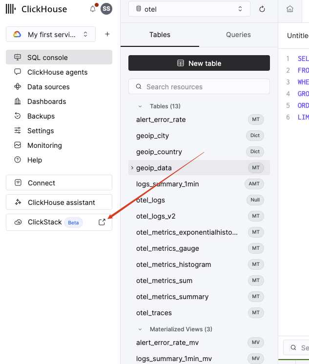
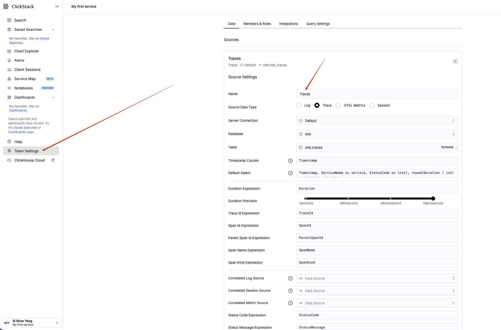
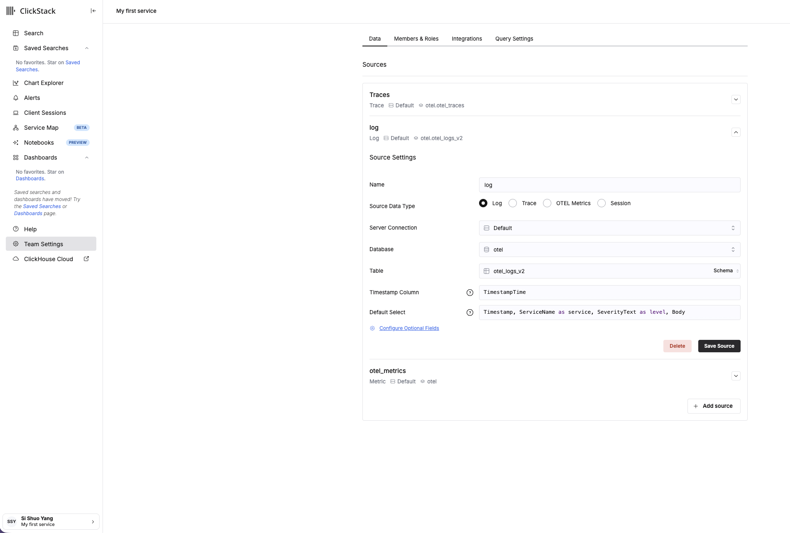
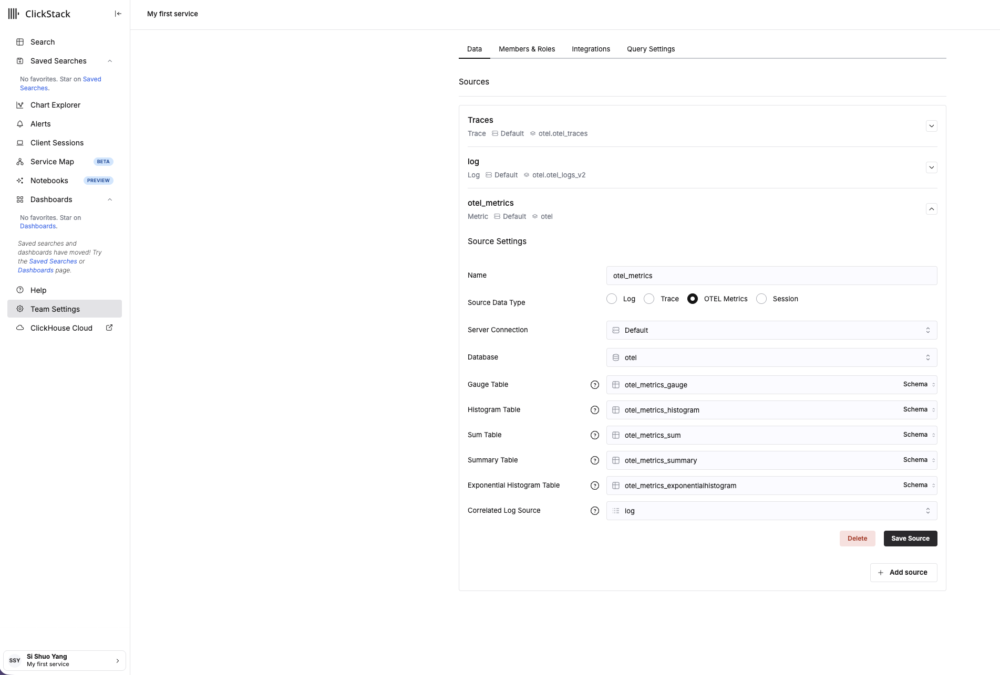
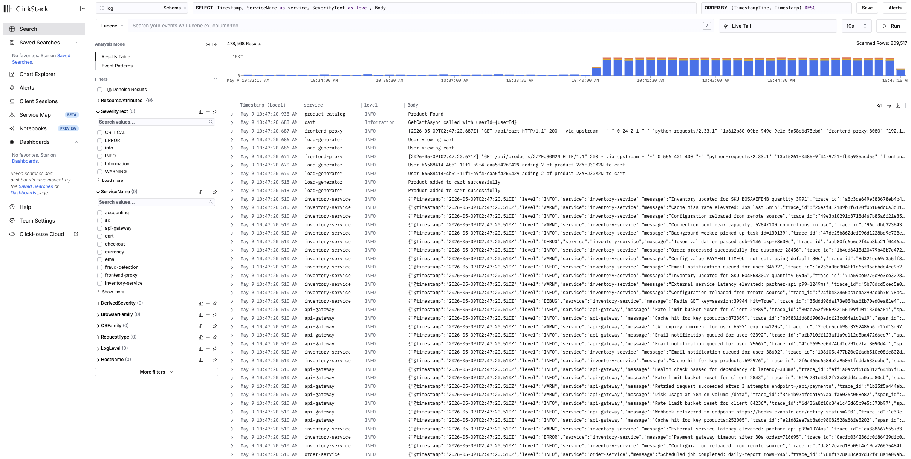
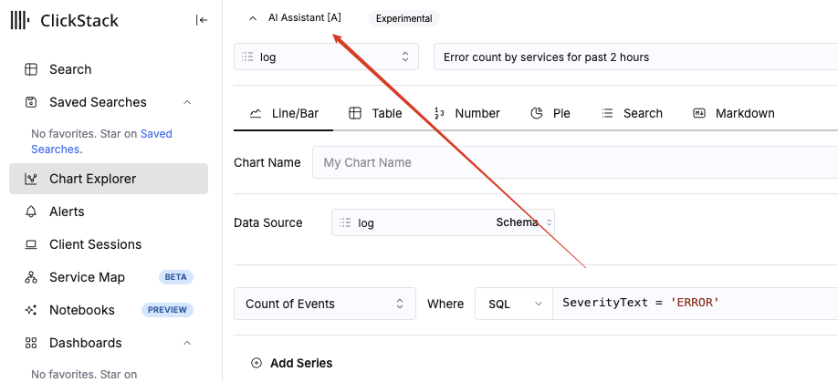

# Working with HyperDX (ClickStack UI)

HyperDX is the built-in observability UI for ClickStack — bundled with every ClickHouse Cloud service. This guide walks you through the four things you need to do in HyperDX for the migration lab:

1. **Launch ClickStack** from the Cloud console.
2. **Create three data sources** — one each for traces, logs, and OTEL metrics — pointing at the `otel` database you populated in Step 2.
3. **Search live logs** in the Search view to confirm data is flowing.
4. **Build a chart with the AI assistant** to demonstrate ad-hoc visualization without writing SQL.

> **Prerequisites:** Step 4 of [README.md](README.md) passed cleanly — `otel.otel_logs_v2`, `otel.otel_traces`, and `otel.otel_metrics_*` are all receiving data, and you can confirm with `bash scripts/validate_migration.sh`.

---

## Step A — Launch ClickStack

1. Sign in to [clickhouse.cloud](https://clickhouse.cloud) and open the service you provisioned in Step 1 of the README.
2. In the left sidebar of the SQL console, scroll to the bottom. Click the launch icon (↗) next to **ClickStack** *(Beta)*.
3. ClickStack opens in a new tab and authenticates you via Cloud SSO — no separate login.

> **What you should see in the SQL console first:** the `otel` database in the database picker (top centre) listing the 11 tables, 3 materialized views, and 2 dictionaries you created in Step 2 — `otel_logs`, `otel_logs_v2`, `otel_traces`, `otel_metrics_*` (5 tables), `geoip_data` + `geoip_country`/`geoip_city` (1 table + 2 dictionaries), `alert_error_rate*`, `logs_summary_1min*`. If any are missing, re-run `clickhouse/dictionaries.sql`, `clickhouse/schema.sql`, and `clickhouse/alert-tables.sql` before continuing.

---

## Step B — Create the three data sources

HyperDX queries ClickHouse via named "sources" that bind a UI tab (Search, Service Map, Chart Explorer, ...) to a specific table and a column-mapping convention. You'll create one source per signal type.

Open **Team Settings** in the bottom-left sidebar, then **Data → Sources**. Click **Add source** to create each of the three below.

### B.1 — Traces source

| Field | Value |
|---|---|
| Name | `Traces` |
| Source Data Type | **Trace** |
| Server Connection | `Default` |
| Database | `otel` |
| Table | `otel_traces` |
| Timestamp Column | `Timestamp` |
| Default Select | `Timestamp, ServiceName as service, StatusCode as level, round(Duration / 1e6)` |
| Duration Expression | `Duration` |
| Duration Precision | **Nanosecond** |
| Trace Id / Span Id / Parent Span Id Expression | `TraceId` / `SpanId` / `ParentSpanId` |
| Span Name / Span Kind Expression | `SpanName` / `SpanKind` |
| Status Code / Status Message Expression | `StatusCode` / `StatusMessage` |

Click **Save Source**. The `Trace`, `Default`, `otel.otel_traces` summary should appear at the top of the Sources list.

### B.2 — Logs source

Click **Add source** again and configure:

| Field | Value |
|---|---|
| Name | `log` |
| Source Data Type | **Log** |
| Server Connection | `Default` |
| Database | `otel` |
| Table | `otel_logs_v2` |
| Timestamp Column | `TimestampTime` |
| Default Select | `Timestamp, ServiceName as service, SeverityText as level, Body` |

> **Why `TimestampTime` and not `Timestamp`?** `Timestamp` is `DateTime64(9)` (nanoseconds). HyperDX's time-range picker and histogram bucketing default to `DateTime` precision; pointing it at the materialized `TimestampTime` column avoids implicit casts in every dashboard query.

### B.3 — OTEL Metrics source

Click **Add source** again and configure:

| Field | Value |
|---|---|
| Name | `otel_metrics` |
| Source Data Type | **OTEL Metrics** |
| Server Connection | `Default` |
| Database | `otel` |
| Gauge Table | `otel_metrics_gauge` |
| Histogram Table | `otel_metrics_histogram` |
| Sum Table | `otel_metrics_sum` |
| Summary Table | `otel_metrics_summary` |
| Exponential Histogram Table | `otel_metrics_exponentialhistogram` |
| Correlated Log Source | `log` |

The OTEL Metrics source spans **all five** metric tables because the OTel data model encodes different metric types into different rows/shapes. HyperDX dispatches to the right table based on the metric type you query. Setting **Correlated Log Source = `log`** lets HyperDX jump from a metric chart to the matching logs in one click.

After all three sources are saved, the Sources list should show **Traces**, **log**, and **otel_metrics** — same shape as the screenshot above (one collapsed entry per source).

---

## Step C — Search live logs

Click **Search** in the left sidebar. At the top, select the **`log`** source you just created.

You should see:

- A **histogram** of event counts over time (use the time-range picker to set "Last 15 minutes" or "Last 1 hour")
- A **table** of log rows with columns `Timestamp`, `service`, `level`, `body`
- A **facets sidebar** on the left listing high-cardinality fields like `ServiceName` (with per-service counts) and `SeverityText`

Things to try:

- **Filter to one service:** click `inventory-service` (or any service) under the `ServiceName` facet — the table reloads filtered to that service in a fraction of a second.
- **Search by string:** type `error` in the top search bar. ClickHouse's text indexes (the `text(tokenizer='sparseGrams')` skip index on `Body` in [schema.sql](clickhouse/schema.sql)) accelerate this dramatically vs. a full scan.
- **Inspect a row:** click any log row to expand the structured view — every `LogAttributes` map key becomes a clickable filter.

> **Note on time-range:** the `start_at: end` setting in the file-based collector means historical lines that existed before Step 3b are not in `otel_logs_v2`. If "Last 24 hours" looks sparse in the early hours, that's expected — the data starts when the collector did.

---

## Step D — Build a chart with the AI assistant

HyperDX's AI Assistant (currently labelled **Experimental**) translates natural-language descriptions into chart configurations.

1. Click **Chart Explorer** in the left sidebar.
2. Click the **AI Assistant [A]** toggle at the top of the chart pane.
3. With the `log` source selected, type a natural-language prompt into the input box, for example:

   > Error count by services for past 2 hours

4. Hit **Enter**. The assistant fills in the chart config below: chart type (Line/Bar), data source (`log`), aggregation (`Count of Events`), and a `Where` clause (`SeverityText = 'ERROR'`).
5. The chart renders immediately. Adjust the time range or chart type with the tabs at the top (`Line/Bar`, `Table`, `Number`, `Pie`, `Search`, `Markdown`).

Save useful charts via the **Chart Name** field and the save icon — they appear under **Saved Searches** / **Dashboards** in the sidebar for later reuse.

### Prompt library — recreate every Kibana panel from Part 1

The six Kibana dashboards from Part 1 contain 30 panels in total. The tables below give you a one-prompt-per-panel recipe so you can rebuild each chart in HyperDX. For each entry:

- **Source** — set this in the AI Assistant before sending the prompt (`log` for everything from `otel_logs_v2`, `Traces` for everything from `otel_traces`, `otel_metrics` for metrics charts).
- **Chart** — the HyperDX chart-type tab to select (or let the assistant pick) before saving. See the legend below.
- **Filter** — many Kibana panels were implicitly scoped by data stream (e.g., the Web Traffic dashboard only queried `logs-web_access-lab`). In ClickHouse you'd express that with a `Where` clause; the prompts below either include the filter inline or rely on HyperDX's source-level filter. If the AI Assistant doesn't pick up the filter, switch the chart to **SQL** mode and add the suggested `Where` expression.
- **Field-name fallback** — the AI Assistant maps natural-language terms to schema columns. If a prompt produces an empty chart, edit the generated `Where` / aggregation field manually using the column hints in the **Field hint** column.

#### HyperDX chart types — reference legend

The Chart Explorer pane has six tabs along the top (`Line/Bar`, `Table`, `Number`, `Pie`, `Search`, `Markdown`). The mapping between HyperDX chart types and the Kibana visualizations they replace:

| HyperDX tab | What it shows | Replaces these Kibana types | When to use |
|---|---|---|---|
| **Line/Bar** | A 2-D plot — line, area, or bar/column — with **time on the X-axis** when an aggregation is bucketed by a date field. The same tab handles vertical bars, horizontal bars, lines, and stacked areas; chart shape is a setting *inside* the tab, not a separate tab. | `line`, `area`, `vertical_bar`, `horizontal_bar` | Any time-series chart, "top N by count" bar chart, or stacked-by-category area chart. **30/30 of the Kibana panels except 5 pies and 4 metric numbers map to this tab.** |
| **Table** | Tabular rows with sortable columns; supports `groupBy` + multi-aggregation (`count`, `avg`, `quantile`, etc.). | `data_table`, `lens` table view | When you want exact numbers in a sortable list rather than a visual encoding (e.g., "top 100 paths with their count, p50 latency, and error rate side-by-side"). |
| **Number** | A single big-number tile — usually one aggregation (`count`, `sum`, `avg`, `quantile`). | `metric`, `goal` | Single-stat KPIs ("5xx error count", "average response time"). |
| **Pie** | Donut/pie showing the proportion of each group. | `pie` | Categorical distribution where you care about the *share* not the absolute volume (status code distribution, severity distribution, language breakdown). |
| **Search** | A live, faceted log-search panel — the same view as the **Search** sidebar but pinned into a chart slot. | Kibana **Saved Search** embedded as a panel | Drop a recent-errors stream onto a dashboard alongside time-series. |
| **Markdown** | Static text block, including links and headings. | Kibana **Markdown** visualization | Add narrative, runbooks, or links between dashboards. |

> **Where's "Histogram"?** Kibana has an explicit "Histogram" visualization (counts bucketed by a numeric or date field). HyperDX folds this into the **Line/Bar** tab — pick a date or numeric `groupBy`, choose **bar** as the shape, and you have a histogram. The standalone histogram strip you saw at the top of the Search view in [Step C](#step-c--search-live-logs) is rendered automatically and isn't a chart you build manually.

> **Key column-name differences from Kibana ECS:** `request_path` → `RequestPath` (raw) or `RequestPage` (path-only, recommended for grouping); `request_type` → `RequestType` (HTTP method); `status` → `StatusCode`; `geo.country_name` → `GeoCountry`; `user_agent_parsed.name` → `BrowserFamily`; `service` / `service.name` → `ServiceName`; `level` → `LogLevel` or `SeverityText`; `event.severity` → `SeverityText`; `hostname` → `HostName`; `event.outcome` → derived from `StatusCode` (1xx–3xx success / 4xx–5xx failure on traces); `transaction.duration.us` (μs) → `Duration` (**nanoseconds** — divide by 1000 for μs).

#### Web Traffic Overview — 8 panels

Filter all of these to web access logs only: in the AI Assistant or the chart's `Where` field, add `RequestType != ''`.

| # | Original Kibana panel | AI Assistant prompt | Source | Chart | Field hint |
|---|---|---|---|---|---|
| 1 | Requests Over Time | `Requests over time grouped by minute for the past 1 hour where RequestType is not empty` | `log` | **Line/Bar** (line) | `count()` time-bucketed |
| 2 | Status Code Distribution | `Distribution of StatusCode as a pie chart for the past 1 hour where RequestType is not empty` | `log` | **Pie** | `groupBy(StatusCode)` |
| 3 | 5xx Error Count | `Total count of events where StatusCode is greater than or equal to 500 in the past 1 hour` | `log` | **Number** | `countIf(StatusCode >= 500)` |
| 4 | Avg Response Time (s) | `Average of LogAttributes['run_time'] for the past 1 hour where RequestType is not empty` | `log` | **Number** | `avg(toFloat64OrZero(LogAttributes['run_time']))` |
| 5 | Top Request Paths | `Top 10 RequestPage by event count for the past 1 hour where RequestType is not empty` | `log` | **Line/Bar** (horizontal bar) | `groupBy(RequestPage)` desc |
| 6 | Top Countries | `Top 10 GeoCountry by event count for the past 1 hour where RequestType is not empty and GeoCountry is not empty` | `log` | **Line/Bar** (horizontal bar) | `groupBy(GeoCountry)` |
| 7 | HTTP Method Distribution | `Distribution of RequestType (GET, POST, etc.) as a pie chart for the past 1 hour` | `log` | **Pie** | `groupBy(RequestType)` |
| 8 | Top User Agents | `Top 10 BrowserFamily by event count for the past 1 hour where RequestType is not empty and BrowserFamily is not empty` | `log` | **Line/Bar** (horizontal bar) | `groupBy(BrowserFamily)` |

#### Application Health — 5 panels

Application logs are the rows where the level is set but `RequestType` is empty (web access has both). Filter: `LogLevel != '' AND RequestType = ''`.

| # | Original Kibana panel | AI Assistant prompt | Source | Chart | Field hint |
|---|---|---|---|---|---|
| 9 | Log Volume by Severity | `Log volume over time stacked by SeverityText for the past 1 hour where RequestType is empty and SeverityText is not empty` | `log` | **Line/Bar** (stacked area) | `count()` time-bucketed, `groupBy(SeverityText)` |
| 10 | Log Level Distribution | `Distribution of SeverityText as a pie chart for the past 1 hour where RequestType is empty` | `log` | **Pie** | `groupBy(SeverityText)` |
| 11 | Error Count | `Count of error logs for the past 1 hour where SeverityText equals 'ERROR' and RequestType is empty` | `log` | **Number** | `countIf(SeverityText='ERROR')` |
| 12 | Errors by Service | `Top 10 ServiceName by error count for the past 1 hour where SeverityText equals 'ERROR' and RequestType is empty` | `log` | **Line/Bar** (horizontal bar) | `groupBy(ServiceName)` of errors |
| 13 | Error Volume Over Time | `Error log volume over time grouped by minute for the past 1 hour where SeverityText equals 'ERROR' and RequestType is empty` | `log` | **Line/Bar** (line) | `count()` time-bucketed |

#### Infrastructure Overview — 4 panels

Infrastructure (syslog) rows have `ServiceName` starting with `k8s-` (the regex_parser promotes the syslog hostname to `service.name`). Filter: `ServiceName LIKE 'k8s-%'`.

| # | Original Kibana panel | AI Assistant prompt | Source | Chart | Field hint |
|---|---|---|---|---|---|
| 14 | Syslog Volume by Host | `Log volume over time stacked by ServiceName for the past 1 hour where ServiceName starts with k8s-` | `log` | **Line/Bar** (stacked area) | `ServiceName` is the host here |
| 15 | Top Processes | `Top 10 LogAttributes['process'] by event count for the past 1 hour where ServiceName starts with k8s-` | `log` | **Line/Bar** (horizontal bar) | `groupBy(LogAttributes['process'])` — switch to **SQL** mode if the assistant struggles with map-key syntax |
| 16 | Severity Distribution | `Distribution of SeverityText as a pie chart for the past 1 hour where ServiceName starts with k8s-` | `log` | **Pie** | `groupBy(SeverityText)` |
| 17 | Log Volume by Process | `Log volume over time grouped by minute and stacked by LogAttributes['process'] for the past 1 hour where ServiceName starts with k8s-` | `log` | **Line/Bar** (stacked area) | same map-key caveat as #15 |

#### OTel Demo — APM Traces — 6 panels

Traces flow into `otel.otel_traces`. Switch the AI Assistant data source to **`Traces`** before running these prompts.

| # | Original Kibana panel | AI Assistant prompt | Source | Chart | Field hint |
|---|---|---|---|---|---|
| 18 | APM Trace Volume | `Trace span volume over time grouped by minute for the past 1 hour` | `Traces` | **Line/Bar** (line) | `count()` time-bucketed |
| 19 | Trace Outcome Distribution | `Pie chart of trace outcome (StatusCode = 0 or empty as success, otherwise failure) for the past 1 hour` | `Traces` | **Pie** | SQL fallback: `if(StatusCode IN ('','STATUS_CODE_OK','STATUS_CODE_UNSET'),'success','failure')` as the group key |
| 20 | HTTP Status Codes | `Distribution of SpanAttributes['http.response.status_code'] as a pie chart for the past 1 hour` | `Traces` | **Pie** | only HTTP server spans have this attribute; add `Where SpanAttributes['http.response.status_code'] != ''` |
| 21 | Service Language Breakdown | `Pie chart of ResourceAttributes['telemetry.sdk.language'] for the past 1 hour` | `Traces` | **Pie** | The OTel demo emits this resource attribute; field name is `telemetry.sdk.language` (not `service.language.name` like ECS) |
| 22 | Top Services by Span Count | `Top 10 ServiceName by span count for the past 1 hour` | `Traces` | **Line/Bar** (horizontal bar) | `groupBy(ServiceName)` |
| 23 | Top Transaction Names | `Top 10 SpanName by event count for the past 1 hour where SpanKind equals 'SPAN_KIND_SERVER' or SpanKind equals 'Server'` | `Traces` | **Line/Bar** (horizontal bar) | `groupBy(SpanName)` filtered to server spans (Kibana's "transactions") |

#### OTel Demo — Latency — 4 panels

| # | Original Kibana panel | AI Assistant prompt | Source | Chart | Field hint |
|---|---|---|---|---|---|
| 24 | Avg Transaction Duration Over Time | `Average Duration in milliseconds over time grouped by minute for the past 1 hour where SpanKind is 'SPAN_KIND_SERVER'` | `Traces` | **Line/Bar** (line) | `avg(Duration / 1e6)` for ms (Duration is ns). Kibana showed μs — use 1e3 if you want to match |
| 25 | Avg Duration by Service | `Top 10 ServiceName by average Duration in milliseconds for the past 1 hour where SpanKind is 'SPAN_KIND_SERVER'` | `Traces` | **Line/Bar** (horizontal bar) | `avg(Duration / 1e6)` grouped by `ServiceName` |
| 26 | Failed Transactions by Service | `Top 10 ServiceName by count of spans where StatusCode equals 'STATUS_CODE_ERROR' for the past 1 hour` | `Traces` | **Line/Bar** (horizontal bar) | failure marker is `StatusCode = 'STATUS_CODE_ERROR'` |
| 27 | Failed Transactions Over Time | `Count of spans over time grouped by minute where StatusCode equals 'STATUS_CODE_ERROR' for the past 1 hour` | `Traces` | **Line/Bar** (line) | same filter as #26 |

#### OTel Demo — Logs — 3 panels

OTel Demo log records land in `otel.otel_logs_v2` from the OTel Demo services (frontend-proxy, cart, checkout, etc.). They have neither `RequestType` nor `LogLevel` materialized — distinguish them with `ServiceName NOT LIKE 'k8s-%' AND RequestType = ''`.

| # | Original Kibana panel | AI Assistant prompt | Source | Chart | Field hint |
|---|---|---|---|---|---|
| 28 | OTel Log Volume by Service | `Log volume over time stacked by ServiceName for the past 1 hour where ServiceName not like 'k8s-%' and RequestType is empty` | `log` | **Line/Bar** (stacked area) | `count()` time-bucketed, `groupBy(ServiceName)` |
| 29 | Top Services by Log Volume | `Top 10 ServiceName by log count for the past 1 hour where ServiceName not like 'k8s-%' and RequestType is empty` | `log` | **Line/Bar** (horizontal bar) | `groupBy(ServiceName)` |
| 30 | OTel Logs by Service Language | `Pie chart of ResourceAttributes['telemetry.sdk.language'] for the past 1 hour where ServiceName not like 'k8s-%' and RequestType is empty` | `log` | **Pie** | Same caveat as trace #21 — the field is `telemetry.sdk.language`, not `service.language.name` |

### Tips when the AI Assistant gets it wrong

1. **Switch to SQL mode** in the `Where` selector. The AI Assistant generates a partially-filled chart; you can edit any field manually. The schema picker (Schema button next to the data source) shows every column with type info.
2. **Pin the time range.** The Assistant respects "for the past N hours / today / yesterday" but defaults to the chart's time-range picker if you omit it. Set the range explicitly in the picker before saving.
3. **Map-typed columns** (`LogAttributes`, `ResourceAttributes`, `SpanAttributes`) are common stumbling blocks for the assistant. If it generates `WHERE process = 'kernel'` instead of `WHERE LogAttributes['process'] = 'kernel'`, fix it in SQL mode.
4. **Save the working version** with **Chart Name** filled in, then drop charts onto a HyperDX dashboard so you have a single-page view that mirrors the original Kibana dashboard.

---

## What's next

- **Service Map** (sidebar, beta) — visualizes the OTel Demo's microservice call graph from `otel_traces`. No configuration needed beyond the Traces source.
- **Alerts** — define alerts on any saved search or chart. This is what you'll use in Step 8 of the main README; see [README.md § Step 8 Option A](README.md#option-a-hyperdx-alerts-recommended) for the two recommended alerts (`web-5xx-errors`, service heartbeat).
- **Notebooks** (preview) — combine charts, queries, and Markdown commentary into shareable investigations.

When you're done exploring, return to [Step 6 of README.md](README.md#step-6-verify-data-lifecycle-ttl) to verify TTL is configured.

---

## Troubleshooting

**Sources list is empty after saving.**
HyperDX caches source definitions per browser session. Hard-reload the tab (Cmd-Shift-R / Ctrl-Shift-R). If still empty, check **Team Settings → Data → Server Connection** — it should be `Default` and resolve to the same CH Cloud service.

**Search shows no rows but `validate_migration.sh` reports thousands.**
- Check the time-range picker — default is "Last 15 minutes". Bump to "Last 24 hours" if your collector started recently.
- Confirm the `Default Select` for the source uses `TimestampTime` (not `Timestamp`). Symptom: the histogram appears but the table shows "no rows".
- Confirm the source's **Database** is `otel` (not `default`).

**AI Assistant returns "I couldn't translate that."**
The assistant is constrained to the schema of the selected source. Common fixes:
- Switch data source: trace-shaped questions ("p95 latency") need the `Traces` source, not `log`.
- Be explicit about the field: `count by ServiceName` works better than `count by service`.
