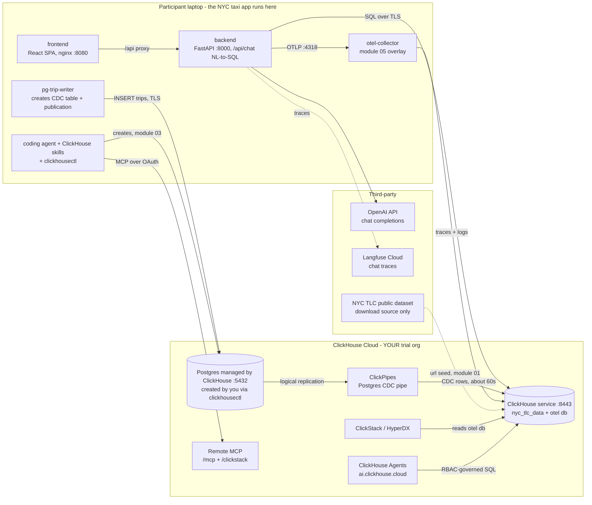
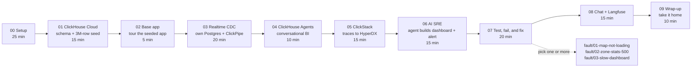
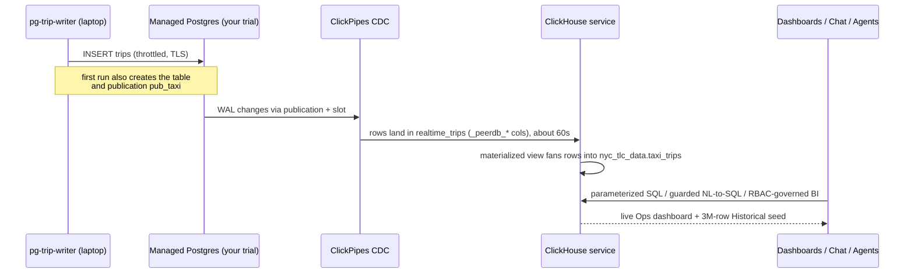
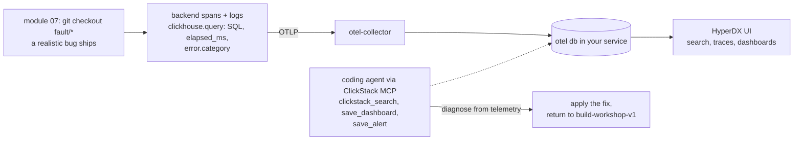

# ClickHouse BUILD Workshop ("Build AI with AI")

A three-hour, hands-on workshop: participants use their own agentic coding tool to take
an NYC-taxi ride-hailing analytics app end to end on ClickHouse Cloud — CDC ingestion
with ClickPipes, conversational BI with ClickHouse Agents, observability with ClickStack
(including an AI-built SRE dashboard), a break-and-fix incident lab diagnosed by an AI
SRE, and an in-app AI chat traced to Langfuse Cloud.

Learners clone the repository, then switch to `build-workshop-v1`. Maintainers create a
feature branch, open a PR to protected `dev-build-workshop-v1`, verify
[dev-workshop.demohouse.cloud](https://dev-workshop.demohouse.cloud), then promote
`dev-build-workshop-v1` to protected `build-workshop-v1` for
[workshop.demohouse.cloud](https://workshop.demohouse.cloud).

## Architecture

The app runs on the participant's laptop; everything stateful lives in the participant's
own ClickHouse Cloud trial (service, ClickPipes, and a Postgres instance they create
themselves with clickhousectl).



The published diagrams (the ClickHouse Cloud platform stack, the workshop architecture, the
data flow, and the module flow) are generated as clean SVGs by `docs/diagrams/gen_diagrams.py`
— edit that script and re-run it (`python3 gen_diagrams.py all`) to regenerate them, then copy
the SVGs into `playbook/public/`.

## Workflows

### The workshop journey (about 2h30 hands-on)



Every module except 07 stays on `build-workshop-v1`; the only branch switches are the
fault branches in module 07.

### How a trip row flows (live CDC path)



### Observability and the break-and-fix incident lab



## Layout

| Path | What |
|---|---|
| `app/` | The foundation app participants run locally: React frontend, FastAPI backend, Postgres + data generator, ClickStack OTel overlay. Workshop entrypoint: `preflight.sh` + `docker-compose.workshop.yml` + `.env.workshop.example`. See `app/WORKSHOP_CHANGES.md`, `app/CHAT_FEATURE.md`, `app/OBSERVABILITY.md`. |
| `playbook/` | The published follow-along playbook (Next.js + Fumadocs; dual learner/instructor tracks plus self-paced and troubleshooting pages; deploys to workshop.demohouse.cloud). Requires Node >= 22.12 to build. |
| `docs/` | `diagrams/` — the platform, architecture, data-flow, and module-flow SVGs, generated by `gen_diagrams.py`. |
| `infra/` | Instructor tooling via clickhousectl: the demo stack end-to-end run (`provision_workshop_stack.sh e2e`, which doubles as the dry run) and the shared-Postgres FALLBACK pool for participants whose orgs cannot create a managed Postgres. |

## Fault branches (module 07, break and fix)

Kept current with `build-workshop-v1`, each differs from the base by one innocent-looking
change touching one file under `app/`:

- `fault/01-map-not-loading`
- `fault/02-zone-stats-500`
- `fault/03-slow-dashboard`

The learner playbook lists the branch names and the observable symptom of each fault;
diagnosis paths and fixes live in the playbook's instructor track (module 07) and are
deliberately not documented in this directory.

## Quick start (participant)

```bash
git clone <this-repo>
cd ClickHouse_Demos
git switch build-workshop-v1
cd workshops/build_workshop/app
cp .env.workshop.example .env.workshop   # fill in your ClickHouse Cloud values
./preflight.sh                           # must print "Overall: READY"
docker compose --env-file .env.workshop -f docker-compose.workshop.yml up -d
```

Then follow the playbook from module 00 (or the self-paced page if no instructor is
around).
