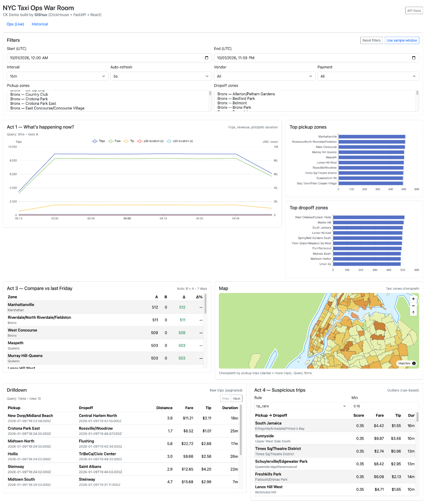
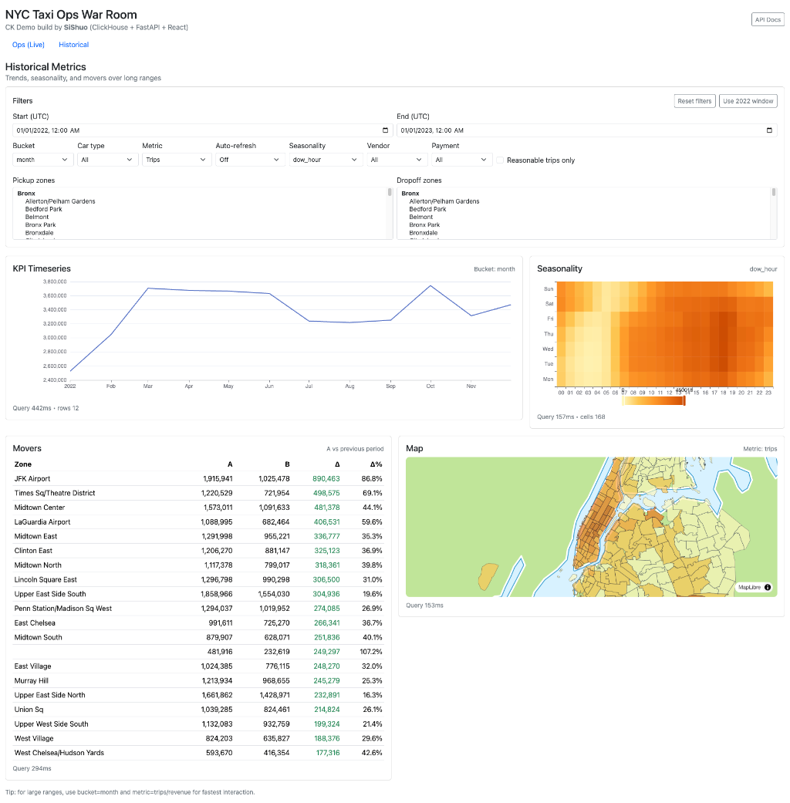
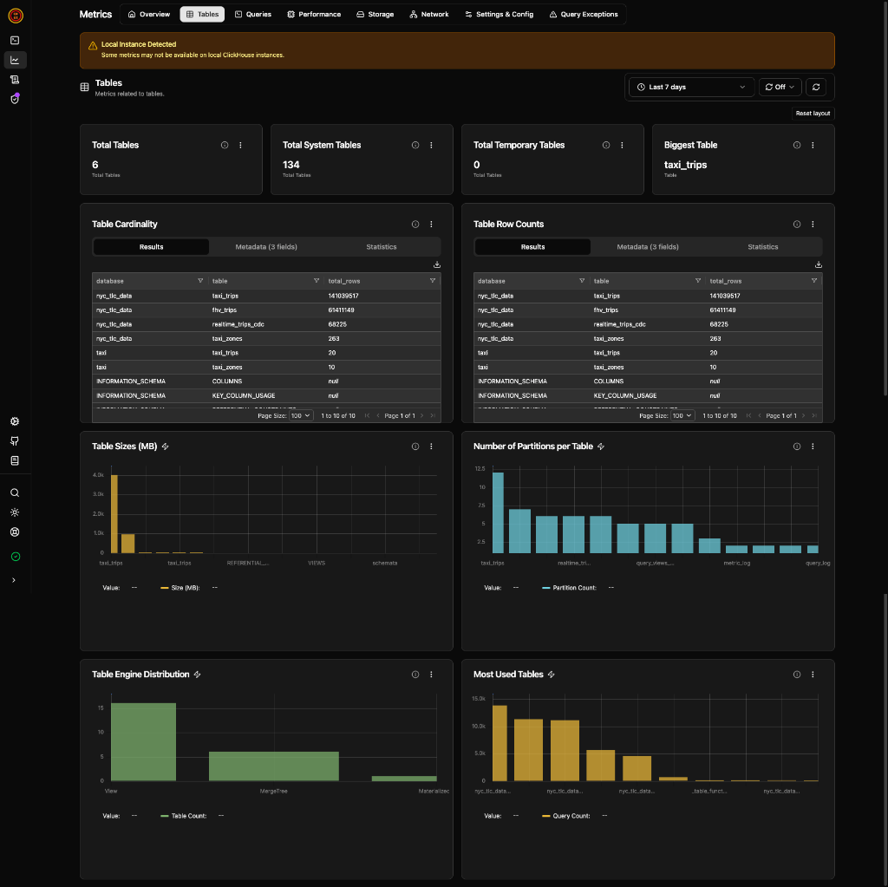
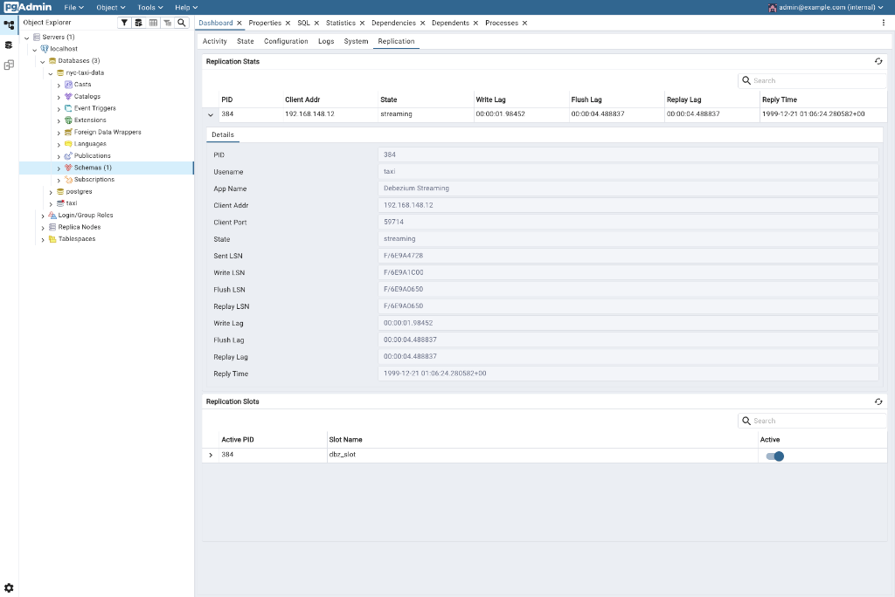

### NYC Taxi Ops War Room (ClickHouse + FastAPI + React) — Demo Stack

### 1) Project introduction
This repo is a **self-contained demo stack** built to **showcase ClickHouse’s superior analytical performance** on real-world workloads using the **NYC TLC taxi / FHV** datasets.

The goal is a presenter-friendly “war room” experience:
- interactive filters
- fast aggregations over large date ranges
- drilldowns + outlier detection
- clear “compare vs baseline” narratives
- an end-to-end reference for how a real-life, customer-facing “real-time” analytics/dashboard product can be implemented

Postgres is included as an **operational/source database** to demonstrate **CDC into ClickHouse** (Debezium → Kafka → ClickHouse sink).

It provides:
- **Frontend SPA**: Ops dashboard + Historical dashboard
- **Backend API**: FastAPI service with safe, parameterized analytics endpoints
- **ClickHouse**: Primary analytics warehouse (fast scans + aggregations)
- **Postgres + PostGIS**: Source-of-truth / CDC source (plus optional spatial workflows)
- **Kafka (KRaft) + Kafka Connect**: CDC pipeline (Debezium Postgres source + ClickHouse sink)
- **CH-UI + pgAdmin + Kafka UI**: Database + streaming UIs

#### Quickstart (run the demo)

```bash
cd nyc-taxi-demo
docker compose up -d --build
```

#### URLs
- **Frontend (Ops + Historical)**: `http://localhost:8080/`
  - 
  - Historical dashboard: `http://localhost:8080/historical`
  - 

- **Backend API (direct)**: `http://localhost:8000/`
  - Swagger docs: `http://localhost:8000/docs`
- **Backend API (via frontend proxy)**: `http://localhost:8080/api/`
  - Swagger docs: `http://localhost:8080/api/docs`
- **ClickHouse HTTP**: `http://localhost:8123/`
- **CH-UI (ClickHouse UI)**: `http://localhost:5521/`
  - 
- **Kafka UI**: `http://127.0.0.1:8089/`
- **Kafka Connect REST**: `http://localhost:8083/`
- **Kafka broker**: `localhost:9092` (inside compose, use `broker:29092`)
- **Postgres**: `localhost:5432` (service hostname inside compose: `postgres`)
- **pgAdmin (Postgres UI)**: `http://127.0.0.1:5050/`
  - Default login: `admin@example.com` / `admin`
  - When registering a server in pgAdmin, use host **`postgres`** (the Docker Compose service hostname), not `localhost`.
  - 

#### Run backend integration tests

```bash
docker compose -f docker-compose.yml -f docker-compose.test.yml --profile test up --build --abort-on-container-exit backend-tests
```

---

### 2) Architecture (Mermaid)

The architecture diagram is generated from `docs/architecture.mmd` and checked in as an SVG image for reliable rendering on GitHub.

- **Edit the diagram**: `docs/architecture.mmd`
- **Re-render**:

```bash
bash scripts/render_mermaid.sh
```



---

### 3) Technical components

#### Frontend (React/Vite/TypeScript)
- **Location**: `frontend/`
- **UI**: Bootstrap 5
- **Data fetching**: TanStack Query
- **Charts**: Apache ECharts
- **Map**: MapLibre GL
- **Routes**
  - `/` “Ops (Live-ish)” dashboard
  - `/historical` historical aggregated metrics dashboard

#### Backend (FastAPI)
- **Location**: `backend/`
- **Service**: FastAPI + Uvicorn
- **ClickHouse driver**: `clickhouse-connect`
- **API design**: strict enums + bounded outputs; no raw SQL from browser
- **Safety**: timeouts and scan limits (configurable via env in `docker-compose.yml`)

#### ClickHouse schema
- **Init SQL**: `db/init/001_schema.sql` + seed `db/init/002_sample_data.sql`
- **Database**: `nyc_tlc_data`
- **Key tables** (demo uses):
  - `taxi_trips`
  - `taxi_zones`
  - `fhv_trips` (optional)
  - plus convenience views like `taxi_trips_expanded`
- **To load full taxi dataset**: See [here](/nyc_taxi_data/readme.md)

#### Postgres + PostGIS
- **Container**: `postgis/postgis:16-3.4`
- **Init**: `db/postgres/init/000_postgis.sql` enables PostGIS on first init (fresh volume)
- **Two common schemas in this repo**
  - **Demo schema** in DB `taxi`: `db/postgres/init/001_schema.sql` (small seed in `002_sample_data.sql`)
  - **Full-data loader schema** in DB `nyc-taxi-data`: created by `nyc_taxi_data/setup_files/create_nyc_taxi_schema.sql`

#### Kafka + Kafka Connect (CDC)
- **Kafka broker**: `broker` (KRaft combined mode)
- **Kafka Connect**: `connect` (installs connectors via Confluent Hub)
  - Debezium Postgres source (captures changes from `postgres`)
  - ClickHouse Kafka Connect sink (writes into ClickHouse landing table)
- **Realtime landing + publish model in ClickHouse**
  - Kafka Connect writes to `nyc_tlc_data.realtime_trips_cdc` (staging; TTL cleanup)
  - ClickHouse materialized view inserts into `nyc_tlc_data.taxi_trips` (adds `filename='realtime_cdc'`)
- **Kafka UI**: `kafka-ui` (browse topics/consumer groups)

#### CH-UI
- **Service**: `ch-ui` (reads ClickHouse via HTTP)
- Useful for quickly inspecting ClickHouse tables and running ad-hoc queries.

#### pgAdmin
- **Service**: `pgadmin`
- **Persistence**: `pgadmin_data` volume is mounted at `/var/lib/pgadmin` so saved server connections survive restarts.

---

### 4) Frontend dashboards (what each chart does + ClickHouse SQL)
The frontend is a presenter-oriented SPA with two pages:
- **Ops (Live-ish)**: `http://localhost:8080/`
- **Historical**: `http://localhost:8080/historical`

All charts call the backend API, which builds **safe parameterized SQL** in `backend/app/query_builders.py`.
Below are the equivalent ClickHouse query templates (placeholders are passed as parameters).

#### 4.1 Ops dashboard (`/`)

##### Act 1 — KPI Timeseries (Trips / Fare / Tip / p50+p95 duration)
- **Purpose**: “What’s happening now?” trend lines over a short window.
- **Endpoint**: `GET /api/metrics/timeseries`
- **SQL (ClickHouse)**:

```sql
SELECT
  toStartOfInterval(pickup_datetime, INTERVAL {interval} ) AS ts,
  count() AS trips,
  sum(fare_amount) AS fare,
  sum(tip_amount) AS tip,
  quantileTDigest(0.50)(dateDiff('second', pickup_datetime, dropoff_datetime)) AS p50_duration_s,
  quantileTDigest(0.95)(dateDiff('second', pickup_datetime, dropoff_datetime)) AS p95_duration_s
FROM taxi_trips
WHERE pickup_datetime >= {start:DateTime}
  AND pickup_datetime <  {end:DateTime}
  -- optional filters:
  -- AND vendor_id = {vendor_id:UInt16}
  -- AND payment_type = {payment_type:UInt16}
  -- AND pickup_location_id IN {pickup_zone_ids:Array(UInt16)}
  -- AND dropoff_location_id IN {dropoff_zone_ids:Array(UInt16)}
GROUP BY ts
ORDER BY ts;
```

##### Top pickup / dropoff zones (bar charts)
- **Purpose**: “Where is demand concentrated?” ranked zones by trips (or fare/tip/p95).
- **Endpoint**: `GET /api/metrics/top_zones`
- **SQL (ClickHouse)**:

```sql
SELECT
  z.location_id AS zone_id,
  z.zone AS zone,
  z.borough AS borough,
  value
FROM (
  SELECT
    {pickup_or_dropoff_location_id} AS zone_id,
    {metric_expr} AS value
  FROM taxi_trips
  WHERE pickup_datetime >= {start:DateTime}
    AND pickup_datetime <  {end:DateTime}
  GROUP BY zone_id
  ORDER BY value DESC
  LIMIT {limit:UInt16}
) t
INNER JOIN taxi_zones z ON z.location_id = t.zone_id
ORDER BY value DESC;
```

##### Compare vs last Friday (delta table)
- **Purpose**: “Is this unusual?” compare two windows (A vs B) and rank by absolute delta.
- **Endpoint**: `GET /api/compare/period`
- **SQL (ClickHouse)**:

```sql
WITH
  a AS (
    SELECT {pickup_or_dropoff_location_id} AS zone_id, {metric_expr} AS a_value
    FROM taxi_trips
    WHERE pickup_datetime >= {a_start:DateTime} AND pickup_datetime < {a_end:DateTime}
    GROUP BY zone_id
  ),
  b AS (
    SELECT {pickup_or_dropoff_location_id} AS zone_id, {metric_expr} AS b_value
    FROM taxi_trips
    WHERE pickup_datetime >= {b_start:DateTime} AND pickup_datetime < {b_end:DateTime}
    GROUP BY zone_id
  )
SELECT
  z.location_id AS zone_id,
  z.zone AS zone,
  z.borough AS borough,
  ifNull(a.a_value, 0) AS a_value,
  ifNull(b.b_value, 0) AS b_value,
  (ifNull(a.a_value, 0) - ifNull(b.b_value, 0)) AS delta,
  if(ifNull(b.b_value, 0) = 0, NULL, (ifNull(a.a_value, 0) - ifNull(b.b_value, 0)) / b.b_value) AS delta_pct
FROM taxi_zones z
LEFT JOIN a ON a.zone_id = z.location_id
LEFT JOIN b ON b.zone_id = z.location_id
ORDER BY abs(delta) DESC
LIMIT {limit:UInt16};
```

##### Map (taxi zone choropleth by pickup trips)
- **Purpose**: “Where is the pain?” show geographic intensity by zone.
- **Endpoint**: `GET /api/metrics/zone_stats` (map uses the `trips` output)
- **SQL (ClickHouse)**:

```sql
SELECT
  z.location_id AS zone_id,
  z.zone AS zone,
  z.borough AS borough,
  trips,
  p50_duration_s,
  p95_duration_s,
  avg_fare
FROM (
  SELECT
    pickup_location_id AS zone_id,
    count() AS trips,
    quantileTDigest(0.50)(dateDiff('second', pickup_datetime, dropoff_datetime)) AS p50_duration_s,
    quantileTDigest(0.95)(dateDiff('second', pickup_datetime, dropoff_datetime)) AS p95_duration_s,
    avg(fare_amount) AS avg_fare
  FROM taxi_trips
  WHERE pickup_datetime >= {start:DateTime}
    AND pickup_datetime <  {end:DateTime}
  GROUP BY zone_id
) s
INNER JOIN taxi_zones z ON z.location_id = s.zone_id
ORDER BY trips DESC;
```

##### Drilldown (raw trips table, paginated)
- **Purpose**: “Show me the underlying records” for credibility + debugging.
- **Endpoint**: `GET /api/trips`
- **SQL (ClickHouse)**:

```sql
SELECT
  t.pickup_datetime,
  t.dropoff_datetime,
  zp.zone AS pickup_zone,
  zd.zone AS dropoff_zone,
  ifNull(t.passenger_count, 0) AS passenger_count,
  ifNull(t.trip_distance, 0) AS trip_distance,
  ifNull(t.fare_amount, 0) AS fare_amount,
  ifNull(t.tip_amount, 0) AS tip_amount,
  ifNull(t.payment_type, 0) AS payment_type,
  ifNull(t.vendor_id, 0) AS vendor_id,
  dateDiff('second', t.pickup_datetime, t.dropoff_datetime) AS duration_s
FROM taxi_trips t
INNER JOIN taxi_zones zp ON zp.location_id = t.pickup_location_id
INNER JOIN taxi_zones zd ON zd.location_id = t.dropoff_location_id
WHERE pickup_datetime >= {start:DateTime}
  AND pickup_datetime <  {end:DateTime}
ORDER BY {sort_expr} {ASC_or_DESC}
LIMIT {limit:UInt16}
OFFSET {offset:UInt32};
```

##### Act 4 — Suspicious trips (rule-based outliers)
- **Purpose**: “What looks weird?” rank trips by a chosen outlier score.
- **Endpoint**: `GET /api/anomalies/fare_outliers`
- **SQL (ClickHouse)**:

```sql
SELECT
  t.pickup_datetime,
  t.dropoff_datetime,
  zp.zone AS pickup_zone,
  zd.zone AS dropoff_zone,
  t.trip_distance,
  t.fare_amount,
  t.tip_amount,
  dateDiff('second', t.pickup_datetime, t.dropoff_datetime) AS duration_s,
  score
FROM (
  SELECT
    *,
    {score_expr} AS score  -- e.g. tip_amount / nullIf(fare_amount, 0)
  FROM taxi_trips
  WHERE pickup_datetime >= {start:DateTime}
    AND pickup_datetime <  {end:DateTime}
) t
INNER JOIN taxi_zones zp ON zp.location_id = t.pickup_location_id
INNER JOIN taxi_zones zd ON zd.location_id = t.dropoff_location_id
WHERE isFinite(score) AND score >= {min_threshold:Float64}
ORDER BY score DESC
LIMIT {limit:UInt16};
```

#### 4.2 Historical dashboard (`/historical`)

##### KPI Timeseries (bucketed day/week/month)
- **Purpose**: “What changed over time?” long-range trends with larger buckets.
- **Endpoint**: `GET /api/historical/timeseries`
- **SQL (ClickHouse)**:

```sql
SELECT
  toStartOfMonth(pickup_datetime) AS ts,   -- or day/week depending on bucket
  count() AS trips,
  sum(ifNull(total_amount, ifNull(fare_amount, 0) + ifNull(tip_amount, 0))) AS revenue,
  sum(ifNull(tip_amount, 0)) AS tip,
  quantileTDigest(0.50)(dateDiff('second', pickup_datetime, dropoff_datetime)) AS p50_duration_s,
  quantileTDigest(0.95)(dateDiff('second', pickup_datetime, dropoff_datetime)) AS p95_duration_s
FROM taxi_trips
WHERE pickup_datetime >= {start:DateTime}
  AND pickup_datetime <  {end:DateTime}
  -- optional: AND car_type = {car_type:String}
GROUP BY ts
ORDER BY ts;
```

##### Seasonality heatmap (dow×hour or month×dow)
- **Purpose**: “When is it busy?” visualize seasonality patterns.
- **Endpoint**: `GET /api/historical/seasonality`
- **SQL (ClickHouse)** (dow×hour mode):

```sql
SELECT
  toHour(pickup_datetime) AS x,
  toDayOfWeek(pickup_datetime) - 1 AS y,
  {metric_expr} AS value
FROM taxi_trips
WHERE pickup_datetime >= {start:DateTime}
  AND pickup_datetime <  {end:DateTime}
GROUP BY x, y
ORDER BY y, x;
```

##### Movers table (A vs previous period)
- **Purpose**: “Which zones moved the most?” ranked by absolute delta for selected metric.
- **Endpoint**: `GET /api/historical/movers`
- **SQL (ClickHouse)** (conceptually; implemented as FULL OUTER JOIN of A and B aggregates in `query_builders.py`):

```sql
-- A: aggregate by pickup_location_id over [a_start, a_end)
-- B: aggregate by pickup_location_id over [b_start, b_end)
-- FULL OUTER JOIN on zone_id, compute delta and delta_pct, order by abs(delta) desc
```

##### Historical map (choropleth by selected metric)
- **Purpose**: “Where are long-term hotspots?” visualize a metric by pickup zone.
- **Endpoint**: `GET /api/historical/map`
- **SQL (ClickHouse)**:

```sql
SELECT
  pickup_location_id AS zone_id,
  {metric_expr} AS value
FROM taxi_trips
WHERE pickup_datetime >= {start:DateTime}
  AND pickup_datetime <  {end:DateTime}
GROUP BY zone_id
ORDER BY value DESC;
```

---

### 5) Realtime CDC (Postgres → Kafka → ClickHouse) + loading the full dataset

#### 5.1 Realtime CDC demo (Postgres → Kafka → ClickHouse → Dashboard)
This repo includes a simple CDC pipeline so you can watch **new trips appear in ClickHouse** and show up on the **Ops dashboard** in near real-time.

What happens:
- `pg-trip-writer` continuously inserts realistic rows into Postgres table `realtime_trips`
- Debezium (Kafka Connect) captures Postgres changes and publishes to Kafka topic `nyc.public.realtime_trips`
- ClickHouse Kafka Connect sink writes those rows into ClickHouse landing table `nyc_tlc_data.realtime_trips_cdc` (staging; TTL cleanup)
- A ClickHouse materialized view inserts into `nyc_tlc_data.taxi_trips` and marks rows with `filename = 'realtime_cdc'`

How to inspect:
- Kafka topic/messages: `http://127.0.0.1:8089/` (Kafka UI)
- Connector status: `http://localhost:8083/connectors`
- ClickHouse rows:
  - `SELECT count() FROM nyc_tlc_data.taxi_trips WHERE filename = 'realtime_cdc';`

#### 5.2 Load full data into ClickHouse (`nyc_tlc_data`)
The recommended flow is the scripts under `nyc_taxi_data/clickhouse/`.

How to load:
- Follow the step-by-step guide in `nyc_taxi_data/clickhouse/README.md` (download → fix parquet → init schema → load).
- Loader SQL files live in `nyc_taxi_data/clickhouse/setup_files/` (e.g., `load_yellow_trips.sql`, `load_green_trips.sql`, `load_fhv_trips.sql`).
- In Docker, `nyc_taxi_data/` is mounted into ClickHouse at:
  - `/var/lib/clickhouse/user_files/nyc_taxi_data`
  so ClickHouse `file()` reads can reference `nyc_taxi_data/data/...` under `user_files`.

#### 5.3 Load full data into Postgres (`nyc-taxi-data`)

**Prereqs on your host** (because the import scripts run locally and connect to the container):

```bash
brew install libpq
brew link --force libpq
brew install postgis   # provides shp2pgsql on macOS
```

**Initialize the Postgres full-data schema and (optionally) load shapefiles**

```bash
cd nyc_taxi_data
./initialize_database.sh
```

Notes:
- The script connects to the container by default (`PGHOST=127.0.0.1`, `PGPORT=5432`, `PGUSER=taxi`, `PGPASSWORD=taxi`).
- If PostGIS is enabled in that DB, shapefile imports will work (requires `shp2pgsql` on the host).

**Enable PostGIS in `nyc-taxi-data` DB (recommended)**

```bash
docker compose exec -T postgres psql -U taxi -d nyc-taxi-data -c "CREATE EXTENSION IF NOT EXISTS postgis;"
```

Note: `db/postgres/init/000_postgis.sql` only runs on a **fresh** Postgres volume. If you already had `postgres_data` created before enabling PostGIS, either:
- run the command above once, or
- reset volumes with `docker compose down -v` (destructive) and re-run `docker compose up -d`.

**Import trip data (parquet → csv → COPY → populate)**
How to load:
- Use the import scripts in `nyc_taxi_data/`:
  - `import_green_taxi_trip_data.sh`
  - `import_yellow_taxi_trip_data.sh`
  - `import_fhv_trip_data.sh` (optional)
  - `import_fhvhv_trip_data.sh` (optional)
- These scripts connect to the **Postgres container** by default via `PGHOST/PGPORT/PGUSER/PGPASSWORD/PGDATABASE`.
- They convert parquet → CSV, bulk load into staging tables, then populate the final tables using SQL in `nyc_taxi_data/setup_files/`.

---

### 6) Example analytics SQL (ClickHouse)
Below are common “dashboard-style” analyses you can run in ClickHouse (the backend uses the same tables/columns).

Assumptions:
- ClickHouse tables: `nyc_tlc_data.taxi_trips`, `nyc_tlc_data.taxi_zones`

#### 6.1 Trips per day (time series)

ClickHouse:

```sql
SELECT
  toDate(pickup_datetime) AS d,
  count() AS trips
FROM nyc_tlc_data.taxi_trips
WHERE pickup_datetime >= toDateTime('2022-07-01 00:00:00')
  AND pickup_datetime <  toDateTime('2022-08-01 00:00:00')
GROUP BY d
ORDER BY d;
```

#### 6.2 Revenue per day

ClickHouse:

```sql
SELECT
  toDate(pickup_datetime) AS d,
  sum(ifNull(total_amount, ifNull(fare_amount, 0) + ifNull(tip_amount, 0))) AS revenue
FROM nyc_tlc_data.taxi_trips
WHERE pickup_datetime >= toDateTime('2022-07-01 00:00:00')
  AND pickup_datetime <  toDateTime('2022-08-01 00:00:00')
GROUP BY d
ORDER BY d;
```

#### 6.3 Top pickup zones by trips

ClickHouse:

```sql
SELECT
  z.borough,
  z.zone,
  count(*) AS trips
FROM nyc_tlc_data.taxi_trips t
JOIN nyc_tlc_data.taxi_zones z ON z.location_id = t.pickup_location_id
WHERE t.pickup_datetime >= toDateTime('2022-07-02 20:00:00')
  AND t.pickup_datetime <  toDateTime('2022-07-02 22:00:00')
GROUP BY z.borough, z.zone
ORDER BY trips DESC
LIMIT 10;
```

#### 6.4 p95 trip duration by pickup zone

ClickHouse:

```sql
SELECT
  z.zone,
  quantileTDigest(0.95)(dateDiff('second', pickup_datetime, dropoff_datetime)) AS p95_duration_s
FROM nyc_tlc_data.taxi_trips t
JOIN nyc_tlc_data.taxi_zones z ON z.location_id = t.pickup_location_id
WHERE t.pickup_datetime >= toDateTime('2022-07-01 00:00:00')
  AND t.pickup_datetime <  toDateTime('2022-08-01 00:00:00')
GROUP BY z.zone
ORDER BY p95_duration_s DESC
LIMIT 20;
```

#### 6.5 “Suspicious trips”: high tip ratio

ClickHouse:

```sql
SELECT
  pickup_datetime,
  dropoff_datetime,
  pickup_location_id,
  dropoff_location_id,
  fare_amount,
  tip_amount,
  (tip_amount / nullIf(fare_amount, 0)) AS tip_ratio
FROM nyc_tlc_data.taxi_trips
WHERE pickup_datetime >= toDateTime('2022-07-02 20:00:00')
  AND pickup_datetime <  toDateTime('2022-07-02 22:00:00')
  AND fare_amount > 0
  AND (tip_amount / fare_amount) >= 2
ORDER BY tip_ratio DESC
LIMIT 50;
```

---

### Resetting data (volumes)
- **ClickHouse**: `clickhouse_data` volume
- **Postgres**: `postgres_data` volume
- **pgAdmin**: `pgadmin_data` volume (stores server registrations)

To fully reset Postgres/ClickHouse data (destructive):

```bash
docker compose down -v
```